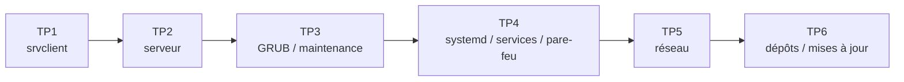

# Tutos Administration Linux (M02)

Tutoriels pas à pas des ateliers du module *Administration d'un système Linux* (ENI, Oracle Linux / RHEL).

| TP | Sujet | Machine(s) | Tuto |
|---|---|---|---|
| 1 | Installer Oracle Linux avec bureau GNOME | `srvclient` | [TP1](tp1-installation-graphique.md) |
| 2 | Installer Oracle Linux en mode serveur | `serveur` | [TP2](tp2-installation-serveur.md) |
| 3 | GRUB et démarrage en mode maintenance | `srv-gui` | [TP3](tp3-grub-mode-maintenance.md) |
| 4 | Démarrage, services (`sshd`, `crond`) et pare-feu | `srv-gui` | [TP4](tp4-demarrage-et-services.md) |
| 5 | Gestion réseau (IP statique, connectivité, DNS) | `srv-gui` + `srv-cli` | [TP5](tp5-gestion-reseau.md) |
| 6 | Dépôts, mises à jour, compilation et RPM | `srv-gui` | [TP6](tp6-depots-mises-a-jour.md) |

!!! tip "Pour aller plus loin"
    La [fiche de révision](../fiche-revision-admin-linux.md) reprend tout le cours (schémas, commandes, questions d'auto-évaluation).

!!! info "Conventions"
    - `$` : prompt d'un utilisateur standard. `#` : prompt root.
    - Les blocs **Piège** signalent les erreurs classiques rencontrées en TP.
    - À partir du TP3, `srvclient` est appelé `srv-gui` (VM graphique) et `serveur` est appelé `srv-cli` (VM sans interface graphique), selon la terminologie des énoncés officiels.
