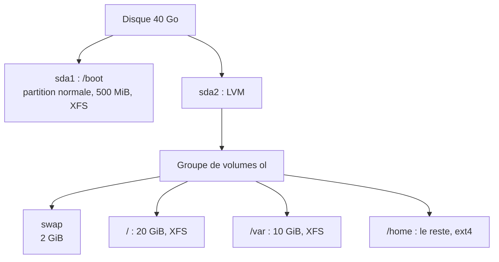

# TP1 : Installer Oracle Linux avec bureau GNOME (`srvclient`)

!!! abstract "En bref"
    **Objectif** : installer un Oracle Linux **graphique** dans une machine virtuelle, avec un partitionnement manuel (`/boot` classique, le reste en LVM).
    **Prérequis** : une solution de virtualisation (VirtualBox, VMware...) et l'image ISO d'Oracle Linux.
    **Durée** : 30 à 45 min.

!!! info "Ce qui vient du cours, et ce qui n'en vient pas"
    Le **contenu technique** (taille du swap recommandée, `/boot` hors LVM, écoles du `su`/`sudo`) vient directement du cours (chapitres 2-3). Le **déroulé écran par écran de l'installateur Anaconda** (noms de boutons, ordre des menus) n'est pas détaillé dans ton cours : c'est une connaissance générale de l'installateur Red Hat/Oracle Linux, à ajuster si l'interface diffère légèrement selon la version.

## Ce que demande l'énoncé

| Paramètre | Valeur |
|---|---|
| Nom de la VM | `srvclient` |
| Disque | 40 Go |
| RAM | 4096 Mo |
| Carte réseau | **Bridge** (accès direct au réseau) |
| Langue | Français |
| Logiciels | Bureau **GNOME** |
| Utilisateur | Un utilisateur **non administrateur** |

Partitionnement manuel :

| Point de montage | Type | Taille | Système de fichiers |
|---|---|---|---|
| `/boot` | Partition **normale** (`sda1`) | 500 MiB | XFS |
| swap | LVM | Taille conseillée | swap |
| `/` | LVM | 20 GiB | XFS |
| `/var` | LVM | 10 GiB | XFS |
| `/home` | LVM | **Le reste** du disque | ext4 |



!!! question "Pourquoi `/boot` est-il en partition normale et pas en LVM ?"
    C'est là que se trouve la fin du chargeur d'amorçage (GRUB) : il doit être sur une partition **primaire** pour des raisons de compatibilité. Le reste peut être en LVM, ce qui permet d'agrandir les volumes plus tard.

## Étape 1 : créer la machine virtuelle

1. Crée une nouvelle VM nommée **`srvclient`**, type Linux (Oracle Linux 64 bits / Red Hat 64 bits).
2. **RAM** : 4096 Mo.
3. **Disque dur** : 40 Go.
4. **Réseau** : mode **Bridge** (accès par pont).
5. Insère l'**ISO** d'Oracle Linux dans le lecteur virtuel, puis démarre la VM.

## Étape 2 : lancer l'installation

1. Dans le menu de démarrage, choisis **Install Oracle Linux** (touche Entrée).
2. Choisis la langue **Français**, puis Continuer.

L'écran de résumé de l'installation s'affiche : c'est le centre de contrôle. Il faut passer dans les rubriques une par une.

## Étape 3 : le partitionnement manuel

1. Clique sur **Destination de l'installation**, sélectionne ton disque de 40 Go, puis choisis **Personnalisé** et clique sur **Terminé**.
2. Dans la liste déroulante du schéma de partitionnement, choisis **LVM**.
3. Crée les points de montage avec le bouton **+**. Pour chacun : indique le point de montage, la capacité, puis valide.

| Point de montage | Capacité | Après création, régler |
|---|---|---|
| `/boot` | `500 MiB` | Type de périphérique : **Partition standard** ; système de fichiers : **xfs** |
| `swap` | `2 GiB` | (type LVM) |
| `/` | `20 GiB` | Système de fichiers : **xfs** |
| `/var` | `10 GiB` | Système de fichiers : **xfs** |
| `/home` | **laisser la capacité vide** | Système de fichiers : **ext4** (ce qui reste est utilisé) |

!!! tip "La taille du swap"
    Le cours indique : RAM ≤ 2 Go donne swap = RAM ; RAM > 2 Go donne swap = **2 Go ou plus**. Avec 4096 Mo de RAM, **2 GiB** est cohérent avec le cours. L'installateur peut aussi te proposer une valeur « recommandée ».

!!! warning "Piège : le type de périphérique"
    Vérifie le **type de périphérique** de chaque ligne : `/boot` doit être en **Partition standard**, et tous les autres en **LVM**. Si `/boot` est passé en LVM par erreur, change-le dans la fiche de droite.

4. Clique sur **Terminé**, puis **Accepter les changements**.

## Étape 4 : le réseau et le nom de la machine

1. Clique sur **Réseau et nom d'hôte**.
2. Active l'interface réseau (interrupteur en haut à droite : **Activé**).
3. Tape le nom d'hôte **`srvclient`** en bas à gauche, puis **Appliquer**.

## Étape 5 : les logiciels

1. Clique sur **Sélection des logiciels**.
2. Choisis **Serveur avec interface graphique** (bureau GNOME), puis **Terminé**.

## Étape 6 : root et l'utilisateur

1. **Mot de passe root** : définis un mot de passe. C'est l'*école du `su`*, et c'est **indispensable pour les TP suivants** (mode maintenance).
2. **Création d'un utilisateur** : donne un nom et un mot de passe. **Ne coche pas** « Faire de cet utilisateur un administrateur » : l'énoncé demande un utilisateur **non administrateur**.

## Étape 7 : installer

1. Clique sur **Commencer l'installation**, attends la fin, puis **Redémarrer**.
2. Retire l'ISO si l'hyperviseur ne le fait pas.
3. Au premier démarrage, accepte la licence (écran d'accueil) si elle est demandée, puis connecte-toi avec ton utilisateur.

## Étape 8 : vérifier que tout est conforme

Ouvre un terminal et passe root avec `su -` :

```bash
$ su -
# lsblk
# df -h
# cat /etc/redhat-release
# free -h
# id ton_utilisateur
```

Résultat attendu de `lsblk` (les tailles peuvent varier légèrement) :

```text
sda            40G  disk
├─sda1        500M  part /boot
└─sda2       ~39G   part
  ├─ol-root    20G  lvm  /
  ├─ol-swap     2G  lvm  [SWAP]
  ├─ol-var     10G  lvm  /var
  └─ol-home    ...  lvm  /home
```

| Vérification | Commande | Résultat attendu |
|---|---|---|
| Partitions et LVM | `lsblk` | `sda1` en `/boot`, le reste en `lvm` |
| Types de systèmes de fichiers | `lsblk -f` | `xfs` pour `/boot`, `/`, `/var` ; `ext4` pour `/home` |
| Utilisateur non admin | `id ton_utilisateur` | **Pas** de groupe `wheel` dans la liste |
| Cible de démarrage | `systemctl get-default` | `graphical.target` |

## À retenir

- Le partitionnement manuel se fait dans **Destination de l'installation**, en mode **Personnalisé**.
- `/boot` en **partition standard**, le reste en **LVM**.
- Laisser la capacité de `/home` **vide** revient à lui donner tout l'espace restant.
- Un utilisateur non administrateur n'est **pas dans le groupe `wheel`**.
