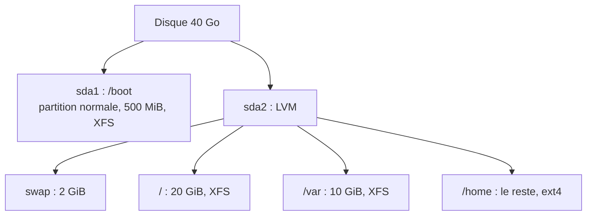

# TP2 : Installer Oracle Linux en mode serveur, sans interface graphique (`serveur`)

!!! abstract "En bref"
    **Objectif** : installer un Oracle Linux **serveur** (uniquement en ligne de commande), avec le **même partitionnement** que le TP1.
    **Prérequis** : une solution de virtualisation, l'ISO d'Oracle Linux, et avoir fait le [TP1](tp1-installation-graphique.md) (les étapes sont presque identiques).
    **Durée** : 25 à 35 min.

## Ce que demande l'énoncé

| Paramètre | Valeur |
|---|---|
| Nom de la VM | `serveur` |
| Disque | 40 Go |
| RAM | **2048 Mo** |
| Carte réseau | **Bridge** |
| Langue | Français |
| Logiciels | **Pas d'environnement graphique** |
| Utilisateur | Un utilisateur **non administrateur** |

## Ce qui change par rapport au TP1

| | TP1 (`srvclient`) | TP2 (`serveur`) |
|---|---|---|
| RAM | 4096 Mo | **2048 Mo** |
| Sélection des logiciels | Serveur avec interface graphique | **Serveur** ou **Installation minimale** |
| Swap conseillé | 2 GiB (« 2 Go ou plus ») | **2 GiB** (RAM ≤ 2 Go donne swap = RAM) |
| Cible de démarrage | `graphical.target` | `multi-user.target` |

Le partitionnement reste **strictement le même** :



## Étapes

Suis les étapes du **TP1** avec ces différences :

1. **Création de la VM** : nom `serveur`, **2048 Mo** de RAM, disque 40 Go, réseau en **Bridge**.
2. **Langue** : Français.
3. **Partitionnement** : personnalisé, schéma **LVM**, puis les mêmes lignes qu'au TP1 (`/boot` en partition standard de 500 MiB xfs ; swap ; `/` 20 GiB xfs ; `/var` 10 GiB xfs ; `/home` avec la capacité vide en ext4).
4. **Réseau et nom d'hôte** : active l'interface et mets le nom d'hôte `serveur`.
5. **Sélection des logiciels** : choisis **Serveur** ou **Installation minimale**, **sans** interface graphique.
6. **Root et utilisateur** : définis un mot de passe root et crée un utilisateur **sans** le cocher comme administrateur.
7. Lance l'installation, puis redémarre.

!!! tip "Installation minimale ou Serveur ?"
    « Installation minimale » installe le strict minimum (plus léger). « Serveur » ajoute des outils d'administration courants. Les deux respectent l'énoncé (« pas d'environnement graphique »).

## Ce que tu vois au premier démarrage

Pas de bureau : un **écran de connexion en mode texte** :

```text
Oracle Linux Server 8.x
Kernel 5.15.0-... on an x86_64

serveur login: _
```

Tape ton nom d'utilisateur, puis ton mot de passe (**rien ne s'affiche pendant la saisie**, c'est normal).

## Vérifications

```bash
$ su -
# lsblk
# df -h
# systemctl get-default
# free -h
# ip a
```

| Vérification | Résultat attendu |
|---|---|
| `lsblk` | Même schéma qu'au TP1 (`/boot` en partition, le reste en LVM) |
| `systemctl get-default` | `multi-user.target` (pas de graphique installé) |
| `free -h` | Environ 2 Go de RAM ; swap de 2 Go |
| `ip a` | L'interface réseau a une adresse IP (Bridge) |

!!! note "Piège : le clavier"
    En installation minimale, le clavier de la console est parfois en QWERTY jusqu'à sa configuration. Vérifie avec `localectl status` ; `localectl set-keymap fr` le corrige.

## À retenir

- Un **serveur** n'a pas d'interface graphique : on l'administre en **ligne de commande** (`multi-user.target`).
- Mêmes règles de partitionnement que le TP1, seuls la RAM, le nom et la sélection des logiciels changent.
- Ces deux VM (`srvclient` et `serveur`) servent de base pour les TP suivants.
