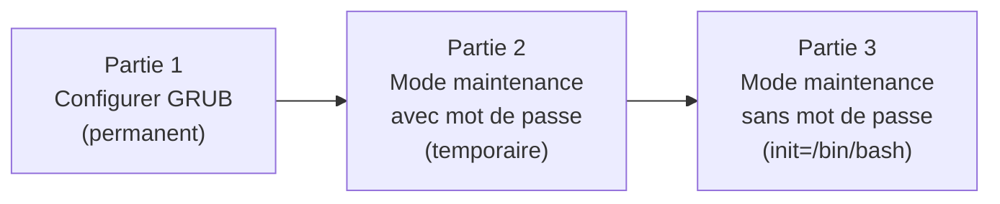
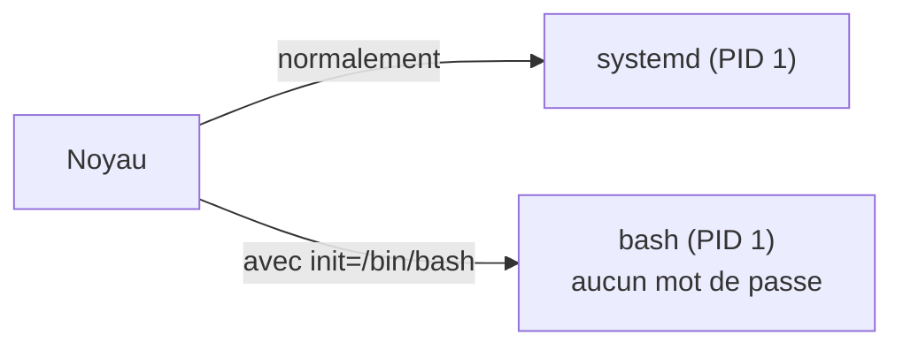

# TP3 : Configurer GRUB et démarrer en mode maintenance

!!! abstract "En bref"
    **Objectifs** : gérer le chargeur d'amorçage **GRUB** et le démarrage du système.
    **Prérequis** : avoir terminé les TP1 et 2.
    **Machine** : la VM graphique (nommée `srv-gui` dans l'énoncé, c'est ton `srvclient`).
    **Durée** : 30 à 45 min.

Ce TP a **trois parties** :



!!! info "Rappel : le chemin du démarrage"
    BIOS/UEFI, puis **GRUB**, puis le **noyau** (vmlinuz + initramfs), puis **systemd** (PID 1), puis une **cible** (graphical, multi-user...).

---

## Partie 1 : afficher le menu GRUB au moins 3 secondes

**Consigne** : le menu de GRUB doit apparaître obligatoirement à chaque redémarrage pendant au moins 3 secondes.

C'est une modification **permanente** : elle se fait dans `/etc/default/grub`, **jamais** dans `/boot/grub2/grub.cfg` (ce dernier est régénéré automatiquement).

1. Passe root : `$ su -`
2. Ouvre le fichier :

```bash
# vi /etc/default/grub
```

3. Vérifie ou ajoute ces deux lignes :

```ini
GRUB_TIMEOUT=5
GRUB_TIMEOUT_STYLE=menu
```

| Ligne | Rôle |
|---|---|
| `GRUB_TIMEOUT=5` | Le menu reste affiché 5 secondes (au moins 3 requises) |
| `GRUB_TIMEOUT_STYLE=menu` | Force l'affichage du menu (au lieu de le cacher) |

!!! note "Le menu s'affichait peut-être déjà"
    Sur Oracle Linux 8, le menu s'affiche par défaut avec `GRUB_TIMEOUT=5`. Ajouter `GRUB_TIMEOUT_STYLE=menu` **garantit** simplement le comportement demandé. Ne touche pas à `GRUB_DISABLE_SUBMENU` : il n'a rien à voir avec la consigne.

4. **Enregistre** (dans `vi` : `Échap`, puis `:wq`, puis Entrée ; dans `nano` : `Ctrl+O`, Entrée, `Ctrl+X`).
5. **Régénère** la configuration :

```bash
# grub2-mkconfig -o /boot/grub2/grub.cfg
```

!!! warning "Piège : `grub2-mkconfig`"
    Le cours écrit `grub-mkconfig`, mais sur Oracle Linux / RHEL la commande est **`grub2-mkconfig`**. Ce chemin est valable en BIOS ; en UEFI, `grub.cfg` est sous `/boot/efi/EFI/...`.

6. **Vérifie** (avant même de redémarrer) :

```bash
# grep -E "^GRUB_TIMEOUT" /etc/default/grub
# grep -E "timeout" /boot/grub2/grub.cfg
```

7. Redémarre avec `reboot`.

**Résultat attendu** : un écran noir avec la liste des noyaux et, en bas, le décompte :

```text
The selected entry will be started automatically in 5s.
```

---

## Partie 2 : démarrer en mode maintenance (temporaire)

**Consigne** : modifier interactivement le lancement du noyau pour démarrer directement en mode maintenance.

« **Interactivement** » veut dire **depuis le menu GRUB**, avec la touche `e`. Cette modification n'est valable que pour **ce démarrage**.

1. Redémarre la VM. Dès que le menu GRUB s'affiche, **appuie sur une touche** pour arrêter le décompte.
2. Sélectionne l'entrée à démarrer (flèches `↑` `↓`), puis appuie sur **`e`** (edit).
3. Repère la ligne qui commence par **`linux`** (elle est longue, elle passe sur plusieurs lignes à l'écran).
4. À la **fin** de cette ligne :
    - **retire** `rhgb quiet` (s'ils sont présents) ;
    - **ajoute** `single`.

```text
linux ($root)/vmlinuz-... root=/dev/mapper/ol-root ro crashkernel=auto resume=/dev/mapper/ol-swap rd.lvm.lv=ol/root rd.lvm.lv=ol/swap single
```

5. Appuie sur **`Ctrl+x`** pour démarrer avec cette ligne.

!!! warning "Piège : le clavier est en QWERTY"
    À ce stade, le clavier est en QWERTY. Vérifie ce que tu tapes avant de lancer.

6. Le système démarre en mode maintenance (`rescue.target`) et demande le **mot de passe root** (« Give root password for maintenance »). Saisis-le.

**Résultat attendu** : un prompt `#` en mode texte, sans interface graphique, sans réseau ni services.

7. Pour **sortir** du mode maintenance et reprendre le démarrage normal : **`Ctrl+d`**.

!!! tip "Pour vérifier que la modification était bien temporaire"
    Redémarre normalement : le système revient à `graphical.target` (`systemctl get-default`). La ligne du noyau n'a **pas** été modifiée définitivement.

!!! note "Pourquoi `single` ?"
    Le paramètre `single` indique au noyau de lancer systemd sur la cible de maintenance (`rescue.target`) au lieu de la cible par défaut.

---

## Partie 3 : intervenir sans connaître le mot de passe root

**Scénario** : tu ne connais **aucun mot de passe** de la VM. Le but est d'obtenir un accès pour modifier le système de fichiers racine **sans mot de passe**.

La méthode `single` (partie 2) est **impossible** ici : elle demande le mot de passe root. On utilise la méthode « brutale » : remplacer le **premier processus** par un simple **shell**.



### Étape 1 : modifier la ligne du noyau

1. Redémarre, arrête le décompte GRUB, sélectionne l'entrée, touche **`e`**.
2. Sur la ligne `linux ...`, **retire** `rhgb quiet` (ou au moins `quiet`) et **ajoute** à la fin :

```text
init=/bin/bash
```

!!! warning "Attention à l'orthographe"
    Écris **exactement** `init=/bin/bash` : `init` en **minuscules**, avec le `/` devant `bin`. Avec `init=bin/bash` ou `INIT=/bin/bash`, le système ne trouve pas le shell et tombe dans le shell d'**urgence** de l'initramfs (voir plus bas).

3. **`Ctrl+x`** pour démarrer, puis **Entrée** quand le démarrage est terminé pour obtenir le prompt.

### Étape 2 : remonter la racine en écriture

Au départ, la racine est en **lecture seule** (`ro` sur la ligne du noyau). Sans cette étape, aucune écriture n'est possible.

```bash
# /usr/sbin/load_policy -i
# mount -o remount,rw /
```

| Commande | Rôle |
|---|---|
| `load_policy -i` | Charge la politique **SELinux** (sans systemd, elle n'est pas chargée) pour que les fichiers créés aient la bonne étiquette |
| `mount -o remount,rw /` | Remonte `/` en **lecture-écriture** sans le démonter |

!!! note "Le tiret de l'énoncé"
    L'énoncé écrit `mount –o remount,rw /` avec un tiret long copié-collé. Tape un tiret normal : `mount -o remount,rw /`.

### Étape 3 : créer un fichier dans `/root`

```bash
# touch /root/test.txt
# ls -l /root
```

`ls -l /root` doit montrer `test.txt`.

### Étape 4 : terminer proprement

```bash
# touch /.autorelabel
# sync
```

| Commande | Rôle |
|---|---|
| `touch /.autorelabel` | Demande à SELinux de **recalculer les étiquettes** de tout le système au prochain démarrage |
| `sync` | **Écrit sur le disque** ce qui est encore dans le cache RAM |

### Étape 5 : redémarrer

Comme systemd n'est pas lancé, `reboot` ne fonctionne pas normalement. Comme l'indique le cours : **extinction forcée** de la VM depuis l'hyperviseur, puis redémarrage normal.

!!! info "Le premier démarrage est plus long"
    À cause de `/.autorelabel`, SELinux **relabellise** tout le disque, puis la machine redémarre **toute seule** une seconde fois. Laisse-la faire.

### Les deux questions de l'énoncé

**« Cela a-t-il fonctionné ? »** Juste après `touch`, `ls -l /root` montre le fichier : oui, l'écriture a réussi. Mais le fichier n'est **réellement sur le disque** que si `sync` a été fait avant l'extinction forcée.

**« Pouvez-vous afficher le fichier créé, en tant que root ? »** Connecte-toi normalement en root (`su -` ou connexion root) et lance :

```bash
# ls -l /root
# ls -Z /root/test.txt
```

Si tu as fait `sync`, le fichier est là. Sans `sync`, il risque d'avoir disparu : c'est ce que l'énoncé veut te faire constater.

### Si tu arrives dans « Entering emergency mode »

Prompt `:/#`, message « Entering emergency mode. Exit the shell to continue » et `touch: command not found` : tu es dans le shell d'**urgence de l'initramfs**, pas dans le vrai système. La ligne `init=` était sûrement mal écrite.

Solution rapide (la vraie racine est dans `/sysroot`) :

```bash
# ls /sysroot
# mount -o remount,rw /sysroot
# chroot /sysroot
# touch /root/test.txt
# touch /.autorelabel
# exit
```

Sinon, redémarre et relis bien la ligne dans l'éditeur GRUB avant `Ctrl+x`.

## À retenir

- On modifie **`/etc/default/grub`**, puis on régénère avec **`grub2-mkconfig`**. Jamais `grub.cfg` à la main.
- Touche **`e`** dans GRUB : modification **temporaire** de la ligne du noyau (`Ctrl+x` pour démarrer).
- **`single`** : mode maintenance avec mot de passe root. **`init=/bin/bash`** : accès sans mot de passe.
- Après `init=/bin/bash` : `mount -o remount,rw /`, puis `sync`, et extinction forcée.
- Sans mot de passe root dans GRUB, n'importe qui avec un accès **physique** à la machine peut la prendre en main : c'est pour ça que l'accès physique est un enjeu de sécurité.
