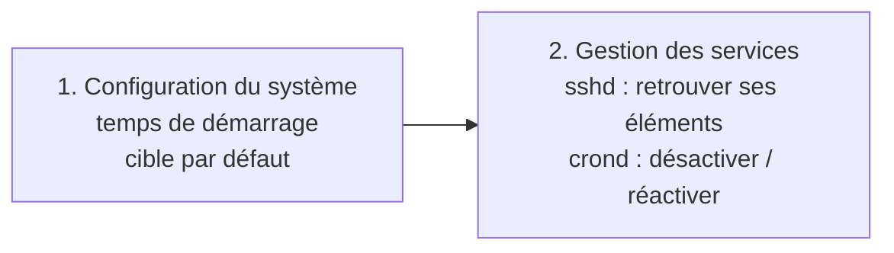
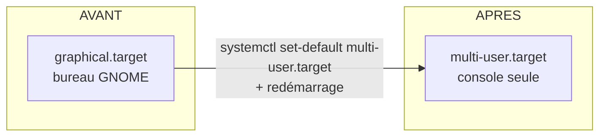
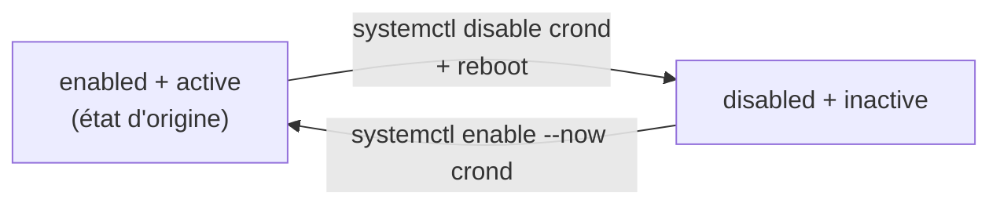

# TP4 : Gestion du démarrage et des services

!!! abstract "En bref"
    **Objectifs** : mesurer le temps de démarrage, changer la cible de démarrage par défaut, et gérer des services avec `systemctl` (`sshd` et `crond`).
    **Prérequis** : avoir terminé le TP3.
    **Machine** : la VM graphique (`srv-gui` dans l'énoncé = ton `srvclient`).
    **Durée** : 30 à 40 min.

Ce TP a **deux parties** :



---

## Partie 1 : configuration du système

### Question 1 : en combien de temps le système a-t-il démarré ?

```bash
# systemd-analyze
```

Exemple de résultat :

```text
Startup finished in 1.2s (kernel) + 2.5s (initrd) + 18.3s (userspace) = 22.0s
graphical.target reached after 17.9s in userspace
```

| Élément | Signification |
|---|---|
| `kernel` | Temps du **noyau** pour s'initialiser |
| `initrd` | Temps de l'**initramfs** (mini-système temporaire) |
| `userspace` | Temps de **systemd** et des services |
| Total | Somme des trois |

Pour savoir **quels services** ralentissent le plus le démarrage :

```bash
# systemd-analyze blame
```

!!! tip "Note ce temps **avant** de continuer"
    Tu vas changer la cible de démarrage : garde la valeur pour la **comparer** après.

!!! note "Ce que le chiffre ne compte pas"
    `systemd-analyze` ne compte ni l'**arrêt** du système, ni les secondes d'attente sur le **menu GRUB**. Pour mesurer le redémarrage complet, utilise un chronomètre (et retire les secondes de GRUB).

### Question 2 : démarrer par défaut en `multi-user.target`

D'abord, regarde la cible actuelle :

```bash
# systemctl get-default
graphical.target
```

Puis change-la :

```bash
# systemctl set-default multi-user.target
Removed /etc/systemd/system/default.target.
Created symlink /etc/systemd/system/default.target → /usr/lib/systemd/system/multi-user.target.
```

Vérifie :

```bash
# systemctl get-default
multi-user.target
```

Redémarre pour valider :

```bash
# reboot
```

**Résultat attendu** : un écran de connexion **en mode texte**, sans le bureau GNOME. Relance ensuite `systemd-analyze` et compare : le démarrage est en général un peu plus rapide, car l'interface graphique n'est plus lancée.



!!! warning "Piège : `set-default` ≠ `isolate`"
    - `systemctl set-default multi-user.target` : change la cible **à chaque démarrage** (modifie le lien `/etc/systemd/system/default.target`). **C'est ce que demande l'énoncé.**
    - `systemctl isolate multi-user.target` : change la cible **maintenant**, mais on revient à l'ancienne au prochain redémarrage.

!!! tip "Revenir au bureau"
    `systemctl set-default graphical.target` remet le mode graphique par défaut. Pour y passer tout de suite : `systemctl isolate graphical.target`.

### Question 3 : exécuter l'environnement graphique sans changer la cible par défaut ni redémarrer

C'est exactement le rôle d'`isolate`, qui change l'état **immédiat** sans toucher à ce qui est utilisé au démarrage :

```bash
# systemctl isolate graphical.target
```

Le bureau GNOME doit apparaître tout de suite. Vérifie ensuite que la cible par défaut n'a **pas** changé :

```bash
# systemctl get-default
multi-user.target
```

`get-default` doit toujours répondre `multi-user.target` : la consigne demande bien de ne pas modifier cette valeur, seulement de lancer le graphique ponctuellement.

!!! note "Pourquoi ça marche même si le paquet graphique n'a pas été réinstallé"
    Passer la cible par défaut à `multi-user.target` (question 2) ne **désinstalle** aucun paquet lié à GNOME : ça change seulement quelle cible démarre au boot. Les paquets graphiques restent présents, donc `isolate graphical.target` peut les relancer à tout moment.

---

## Partie 3 : le pare-feu natif d'Oracle Linux

**Question** : existe-t-il un pare-feu natif sur Oracle Linux ? Quel est son nom ? Quel est son fichier de configuration systemd ?

!!! info "Cette partie ne vient pas du cours"
    Le pare-feu n'est traité nulle part dans ton support de cours : la réponse ci-dessous vient entièrement de connaissances générales sur RHEL/Oracle Linux, pas d'une section du cours que tu pourrais retrouver et relire. Garde ça en tête si tu veux citer une source à l'écrit.

Oui : Oracle Linux (comme RHEL) intègre **firewalld** par défaut.

```bash
# systemctl status firewalld
```

| Élément demandé | Réponse |
|---|---|
| **Nom du service** | `firewalld` |
| **Fichier de configuration systemd** | `/usr/lib/systemd/system/firewalld.service` |

On retrouve ce chemin avec la même méthode que pour `sshd` au chapitre précédent :

```bash
# systemctl show -p FragmentPath firewalld
FragmentPath=/usr/lib/systemd/system/firewalld.service
```

!!! note "Ne pas confondre avec sa configuration de zones"
    `firewalld.service` est le fichier **systemd** qui décrit comment lancer le service (ce que demande la question). La configuration des règles elles-mêmes (zones, ports autorisés) est ailleurs, dans `/etc/firewalld/`, et se manipule surtout avec la commande `firewall-cmd` plutôt qu'en éditant ces fichiers à la main.

```bash
# firewall-cmd --state              # actif ou non
# firewall-cmd --get-default-zone   # zone appliquée par défaut
# firewall-cmd --list-all           # règles de la zone active
```

---

## Partie 2 : gestion des services

### Le service SSH (`sshd`) : retrouver ses éléments

SSH permet la **connexion sécurisée à distance**. Sous Oracle Linux, le service s'appelle **`sshd`** (et non `ssh` comme sous Debian).

| À trouver | Commande | Résultat |
|---|---|---|
| **Le fichier de configuration systemd du service** | `systemctl status sshd` (ligne `Loaded:`) ou `systemctl show -p FragmentPath sshd` | `/usr/lib/systemd/system/sshd.service` |
| **Le nom du binaire exécuté** | `systemctl cat sshd` puis la ligne `ExecStart=` | `/usr/sbin/sshd` |
| **Le fichier de configuration du démon** | `rpm -qc openssh-server` ou `man sshd` (section FILES) | `/etc/ssh/sshd_config` |

Exemple :

```bash
# systemctl show -p FragmentPath sshd
FragmentPath=/usr/lib/systemd/system/sshd.service

# grep ExecStart /usr/lib/systemd/system/sshd.service
ExecStart=/usr/sbin/sshd -D $OPTIONS

# rpm -qc openssh-server
/etc/ssh/sshd_config
/etc/sysconfig/sshd
...
```

!!! warning "Ne pas confondre"
    - **`/etc/ssh/sshd_config`** configure le **serveur** SSH (le démon).
    - `/etc/ssh/ssh_config` configure le **client** `ssh`.
    - `/etc/sysconfig/sshd` ne contient que des options de lancement (`$OPTIONS`).

!!! info "Et si on veut modifier le fichier systemd ?"
    Le fichier d'origine dans `/usr/lib/systemd/system` **ne se modifie pas**. Un fichier de **même nom** dans `/etc/systemd/system` est **prioritaire** : on copie le fichier là-bas (ou `systemctl edit --full sshd`), on le modifie, puis `systemctl daemon-reload`. Par défaut, ce fichier prioritaire n'existe pas.

### Le service cron (`crond`) : désactiver puis restaurer

`cron` est le **planificateur de tâches**. Sous Oracle Linux, il s'appelle **`crond`**.

#### Étape 1 : est-il lancé automatiquement au démarrage ?

```bash
# systemctl is-enabled crond
enabled

# systemctl status crond
```

`enabled` signifie qu'il démarre avec le système. Dans `status`, la ligne `Active: active (running)` indique qu'il tourne en ce moment.

#### Étape 2 : désactiver son démarrage automatique

```bash
# systemctl disable crond
Removed /etc/systemd/system/multi-user.target.wants/crond.service.

# systemctl is-enabled crond
disabled
```

!!! warning "Piège : `disable` n'arrête pas le service"
    `disable` supprime seulement le lien qui le lançait **au démarrage**. Le service **continue de tourner** jusqu'au redémarrage. Pour l'arrêter maintenant : `systemctl stop crond`.

!!! note "« Totalement » : `disable` ou `mask` ?"
    `disable` empêche le lancement au boot, mais on peut encore le démarrer à la main ou via une dépendance. `systemctl mask crond` le bloque **complètement** (lien vers `/dev/null`). Le cours ne présente que `enable`/`disable`, donc `disable` est sans doute la réponse attendue. Si tu utilises `mask`, il faudra `systemctl unmask crond` avant de le réactiver.

#### Étape 3 : redémarrer et valider

```bash
# reboot
```

Après la reconnexion :

```bash
# systemctl status crond
# systemctl is-enabled crond
# ps aux | grep crond
```

**Résultat attendu** : `inactive (dead)`, `disabled`, et `ps aux` ne montre que la ligne du `grep` lui-même. Cela prouve que `crond` n'a pas démarré tout seul.

#### Étape 4 : restaurer le comportement par défaut

La façon la plus précise de répondre à « restaurer les paramètres **par défaut** de démarrage » est d'utiliser le **preset constructeur** du service, plutôt que de ré-activer à la main :

```bash
# systemctl preset crond
# systemctl start crond
```

`preset` remet l'activation du service (`enabled`/`disabled`) à sa valeur d'**origine définie par la distribution**, visible dans la ligne `vendor preset:` de `systemctl status` — sans que tu aies besoin de connaître toi-même cette valeur à l'avance.

!!! note "`systemctl default crond` n'existe pas"
    `default` désigne une **cible** (`default.target`), pas une action applicable à un service précis. `systemctl default crond` ne ferait rien de ce que tu attends ici — la commande correcte est bien `preset`.

!!! tip "Alternative équivalente dans ce cas précis"
    Puisque tu sais déjà que `crond` était `enabled` à l'origine (vérifié à l'étape 1), ré-activer directement donne le même résultat :
    ```bash
    # systemctl enable --now crond
    ```
    `preset` reste la méthode à privilégier si tu ne connaissais pas l'état d'origine du service.

Vérifie :

```bash
# systemctl is-enabled crond
enabled
# systemctl status crond
```

Tu dois voir `enabled` et `active (running)`.



### Tableau récapitulatif de `systemctl`

| Je veux... | Commande |
|---|---|
| Voir l'état d'un service | `systemctl status <service>` |
| Le démarrer / l'arrêter **maintenant** | `systemctl start` / `systemctl stop <service>` |
| Le redémarrer | `systemctl restart <service>` |
| Le lancer **au démarrage** / ne plus le lancer | `systemctl enable` / `systemctl disable <service>` |
| Savoir s'il démarre au boot | `systemctl is-enabled <service>` |
| Faire `enable` + `start` en une fois | `systemctl enable --now <service>` |

!!! warning "Piège : `start` ≠ `enable`"
    - `start` / `stop` : agissent **maintenant**, sont oubliés au redémarrage.
    - `enable` / `disable` : agissent **au prochain démarrage**, sans démarrer ni arrêter le service tout de suite.

## À retenir

- `systemd-analyze` : temps de démarrage ; `systemd-analyze blame` : les services les plus lents.
- **`set-default`** modifie la cible au démarrage ; **`isolate`** change seulement l'état actuel.
- Les fichiers de service d'origine sont dans `/usr/lib/systemd/system` ; la copie dans `/etc/systemd/system` est **prioritaire**.
- Sous Oracle Linux : `sshd` (SSH), `crond` (cron) et `firewalld` (pare-feu natif).
- **`enable`/`disable`** gèrent le démarrage automatique, **`start`/`stop`** gèrent l'état immédiat.
- `isolate` permet de lancer une cible (ex. `graphical.target`) sans jamais toucher à `set-default`.
