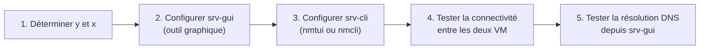

# TP5 : Gestion réseau

!!! abstract "En bref"
    **Objectifs** : configurer une adresse IPv4 **statique** sur tes deux VM, tester la connectivité entre elles, puis tester la résolution de noms.
    **Prérequis** : avoir terminé l'atelier 4.
    **Machines** : `srv-gui` (ta VM graphique, l'ancien `srvclient`) et `srv-cli` (ta VM sans interface graphique, l'ancien `serveur`).
    **Durée** : 30 à 45 min.



## Ce que demande l'énoncé

Les deux VM doivent avoir une **adresse IP fixe** (statique), sur le réseau `10.y.x.0/16` :

| Variable | Signification |
|---|---|
| `y` | Le numéro du réseau de ta salle (donné par ton formateur) |
| `x` | Ton numéro de stagiaire = le **dernier octet** de l'adresse IP de ta machine hôte ENI |

| Machine | Adresse IP à donner |
|---|---|
| `srv-gui` | `10.y.x.1` |
| `srv-cli` | `10.y.x.11` |

Passerelle et DNS : **identiques à ceux de ton poste physique** (l'ordinateur ENI sur lequel tournent tes VM).

!!! warning "Piège : `/16` ne veut pas dire masque `255.255.255.0`"
    Le réseau est en `/16`, donc le masque est **`255.255.0.0`**, pas `255.255.255.0` (`/24`). Avec le mauvais masque, tes deux VM ne se considéreront pas sur le même réseau local, même si les 3 premiers chiffres de leurs IP se ressemblent.

---

## Étape 0 : trouver `y` et `x`, et récupérer passerelle/DNS

Ces informations dépendent de **ta machine hôte**, pas de tes VM. Il faut donc regarder du côté de Windows (ou du système hôte), pas dans Oracle Linux.

**Sur un hôte Windows**, ouvre une invite de commandes et tape :

```cmd
ipconfig /all
```

Repère, pour la carte réseau active (souvent « Ethernet » ou « Wi-Fi ») :

| Information cherchée | Ligne à lire dans `ipconfig /all` |
|---|---|
| Ton adresse IP hôte (donne `y` et `x`) | `Adresse IPv4` |
| Passerelle par défaut | `Passerelle par défaut` |
| Serveur DNS | `Serveurs DNS` |

Exemple : si ton adresse IPv4 hôte est `10.3.42.17`, alors `y = 3` et `x = 17`. Tes VM auront donc `10.3.17.1` (`srv-gui`) et `10.3.17.11` (`srv-cli`).

!!! note "Vérifie l'énoncé exact de ta salle"
    La façon exacte de lire `y` et `x` peut légèrement varier selon le plan d'adressage réellement utilisé par ton centre de formation. En cas de doute sur la valeur de `y`, demande confirmation à ton formateur plutôt que de deviner.

---

## Étape 1 : configurer `srv-gui` avec l'outil graphique

L'énoncé impose l'outil **graphique** pour cette machine.

1. Ouvre les **Paramètres** (ou **Activités** → **Réseau**, comme vu dans la fiche de révision).
2. Clique sur la roue dentée ⚙️ à côté de ta connexion filaire (souvent nommée « Câblé » ou `Wired`).
3. Va dans l'onglet **IPv4**.
4. Passe la méthode de **Automatique (DHCP)** à **Manuel**.
5. Renseigne :

| Champ | Valeur |
|---|---|
| Adresse | `10.y.x.1` |
| Masque de réseau (Netmask) | `255.255.0.0` |
| Passerelle | celle de ton poste physique |
| Serveurs DNS | celui de ton poste physique |

6. Clique sur **Appliquer**.
7. **Redémarre la connexion** pour que le changement soit pris en compte : bascule l'interrupteur en haut de la fenêtre sur **Désactivé** puis à nouveau sur **Activé** (un simple « Appliquer » ne suffit pas toujours).

Vérifie en terminal :

```bash
$ ip a
```

Tu dois voir l'adresse `10.y.x.1/16` sur ton interface (`ens33` ou équivalent).

---

## Étape 2 : configurer `srv-cli` sans interface graphique

L'énoncé ne précise pas d'outil pour cette machine : comme elle n'a pas de bureau, on utilise `nmtui` (menus dans le terminal) ou `nmcli` (ligne de commande), vus dans la fiche de révision (chapitre 5).

### Méthode avec `nmtui` (la plus simple visuellement)

```bash
# nmtui
```

1. Choisis **Edit a connection**.
2. Sélectionne ta connexion (souvent `Wired connection 1`), **Edit**.
3. Dans **IPv4 CONFIGURATION**, passe de `<Automatic>` à **`<Manual>`**.
4. Va sur **Show** puis **Add** pour ajouter une adresse :
   - **Address** : `10.y.x.11/16` (le `/16` remplace le masque ici)
   - **Gateway** : celle de ton poste physique
   - **DNS servers** : celui de ton poste physique
5. **OK**, puis **Back**, puis **Quit**.
6. Relance la connexion :

```bash
# nmcli connection down "Wired connection 1"
# nmcli connection up "Wired connection 1"
```

(remplace `"Wired connection 1"` par le nom réel de ta connexion, visible avec `nmcli connection show`.)

### Méthode équivalente avec `nmcli` en une fois

```bash
$ nmcli connection show                                   # trouver le nom exact de la connexion
# nmcli connection modify "Wired connection 1" ipv4.addresses 10.y.x.11/16
# nmcli connection modify "Wired connection 1" ipv4.gateway <passerelle_du_poste>
# nmcli connection modify "Wired connection 1" ipv4.dns <dns_du_poste>
# nmcli connection modify "Wired connection 1" ipv4.method manual
# nmcli connection up "Wired connection 1"
```

!!! warning "Piège : oublier `ipv4.method manual`"
    Sans cette dernière ligne, NetworkManager continue de chercher une adresse en DHCP et **ignore** l'adresse statique que tu viens de définir. C'est l'erreur la plus fréquente avec `nmcli`.

Vérifie :

```bash
$ ip a
```

Tu dois voir `10.y.x.11/16`.

---

## Étape 3 : tester la connectivité entre les deux VM

Depuis `srv-gui`, ping `srv-cli` :

```bash
$ ping -c4 10.y.x.11
```

Et inversement, depuis `srv-cli` :

```bash
$ ping -c4 10.y.x.1
```

**Résultat attendu** : dans les deux sens, tu dois voir des réponses (`64 bytes from 10.y.x.x: icmp_seq=1 ttl=64 time=0.XXX ms`) et `0% packet loss` à la fin.

!!! warning "Si le ping ne passe pas"
    Vérifie dans l'ordre :

    1. **Le masque** : `ip a` doit afficher `/16` des deux côtés (pas `/24`).
    2. **La carte réseau des deux VM est bien en mode Bridge** dans les paramètres de l'hyperviseur (vu au TP1/TP2), pas en NAT : sinon les deux VM ne sont pas sur le même réseau que le poste physique.
    3. **Le pare-feu** : `firewalld` (vu au TP4) autorise le ping par défaut sur la zone standard, mais si tu as modifié ses règles, vérifie avec `firewall-cmd --list-all` sur la machine qui ne répond pas.

---

## Étape 4 : tester la résolution du nom d'hôte `www.github.com` depuis `srv-gui`

La résolution de noms (DNS) dépend du serveur DNS renseigné à l'étape 1. Teste avec :

```bash
$ getent hosts www.github.com
```

Cette commande interroge le système de résolution de noms configuré (via `/etc/resolv.conf`, lui-même mis à jour par NetworkManager) et affiche l'adresse IP correspondante si elle a été trouvée.

!!! tip "Autres façons de tester, si `getent` ne suffit pas"
    ```bash
    $ ping -c2 www.github.com
    ```
    Si le nom se résout mais qu'aucune réponse ping n'arrive, c'est un problème de connectivité vers Internet (ou un blocage), pas de DNS : dans ce cas, la ligne `PING www.github.com (adresse_IP)` s'affiche quand même, preuve que la résolution, elle, a fonctionné.

    Si les outils `nslookup` ou `dig` sont installés :
    ```bash
    $ nslookup www.github.com
    ```

**Pour vérifier la configuration DNS utilisée** :

```bash
$ cat /etc/resolv.conf
```

Tu dois y retrouver la ligne `nameserver <adresse_dns_du_poste>`, celle que tu as renseignée à l'étape 1.

!!! warning "Si la résolution échoue"
    Vérifie que le DNS renseigné est bien **exactement** celui de ton poste physique (`ipconfig /all`), et que ta VM a bien accès à Internet via la passerelle (teste d'abord `ping -c2 <adresse_de_la_passerelle>`, puis `ping -c2 8.8.8.8` pour vérifier l'accès Internet par IP, avant d'accuser le DNS).

---

## À retenir

- `/16` = masque **`255.255.0.0`**, pas `255.255.255.0`.
- `y` (réseau de salle) et `x` (numéro de stagiaire) se lisent sur **la machine hôte**, pas dans la VM : `ipconfig /all` sous Windows.
- **`srv-gui`** (avec bureau) se configure via l'outil graphique **Paramètres → Réseau**.
- **`srv-cli`** (sans bureau) se configure via **`nmtui`** (menus) ou **`nmcli`** (ligne de commande) ; ne pas oublier `ipv4.method manual` avec `nmcli`.
- Un changement d'IP demande de **redémarrer la connexion** (bascule Désactivé/Activé, ou `nmcli connection down`/`up`) pour être pris en compte immédiatement.
- **`getent hosts <nom>`** teste la résolution DNS ; **`cat /etc/resolv.conf`** montre le serveur DNS utilisé.
