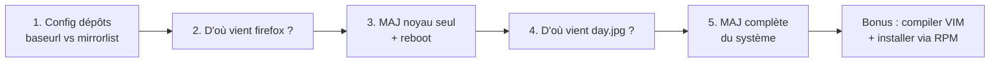
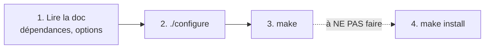

# TP6 : Dépôts, mises à jour et installation de logiciels

!!! abstract "En bref"
    **Objectifs** : configurer les dépôts dnf, identifier l'origine de paquets, mettre à jour le noyau seul puis tout le système, et (en bonus) installer un logiciel par compilation et par RPM.
    **Prérequis** : avoir terminé l'atelier 5.
    **Durée** : 45 min à 1 h, bonus compris.

Ce TP mélange plusieurs notions déjà vues séparément (chapitre 6 de la fiche de révision : dnf, rpm, dépôts). Ici on les combine, avec des pièges concrets rencontrés en TP.



---

## 1. Faire pointer les dépôts vers l'URL par défaut (pas les miroirs)

### Comprendre la différence

Un dépôt dnf peut être interrogé de deux façons, jamais les deux en même temps dans un même fichier :

| Ligne dans le `.repo` | Rôle |
|---|---|
| `mirrorlist=...` | Pointe vers une **liste** de serveurs miroirs ; dnf en choisit un |
| `baseurl=...` | Pointe **directement** vers **un** serveur précis (l'« URL par défaut ») |

### Où regarder

Les dépôts sont déclarés dans des fichiers `.repo` sous `/etc/yum.repos.d/`.

```bash
$ ls /etc/yum.repos.d/
```

Pour savoir lesquels utilisent encore `mirrorlist` :

```bash
# grep -l mirrorlist /etc/yum.repos.d/*.repo
```

- **Si cette commande renvoie des noms de fichiers** : ouvre chacun (`vi` ou `nano`), commente la ligne `mirrorlist=...` (ajoute un `#` devant) et vérifie/ajoute une ligne `baseurl=...` active en dessous.
- **Si elle ne renvoie rien** (aucun résultat) : c'est que tes dépôts n'utilisent déjà **que** `baseurl`. Sur Oracle Linux, c'est le cas par défaut : les fichiers `oracle-linux-ol8.repo` etc. pointent nativement vers `baseurl=https://yum.oracle.com/...`. La consigne peut donc déjà être respectée sans rien changer.

Pour vérifier concrètement le contenu d'un fichier avant de conclure quoi que ce soit :

```bash
# cat /etc/yum.repos.d/oracle-linux-ol8.repo
```

!!! warning "Piège : `grep -A1` regarde la mauvaise ligne"
    Si tu essaies de vérifier avec `grep -A1 '^\[' fichier.repo | grep baseurl`, sache que `-A1` n'affiche que **la ligne juste après** chaque `[section]`, qui est en général `name=`, pas `baseurl=`. Pour chercher `baseurl` correctement dans tout le fichier, fais simplement :
    ```bash
    # grep -n baseurl /etc/yum.repos.d/oracle-linux-ol8.repo
    ```

Une fois les modifications faites (ou l'absence de modification confirmée), vide le cache et recharge la liste des dépôts pour vérifier qu'il n'y a pas d'erreur :

```bash
# dnf clean all
# dnf repolist
```

!!! danger "Piège vécu en TP : ne pas confondre `http` et `https`"
    La consigne parle de `mirrorlist` vers `baseurl`, **pas** de changer le protocole. Une commande comme :
    ```bash
    # sed -i 's/https:/http:/g' /etc/yum.repos.d/*.repo
    ```
    change **tous** les `https:` en `http:` dans **tous** les fichiers `.repo`, ce qui n'a rien à voir avec la consigne et peut casser l'accès aux dépôts (serveur qui refuse le `http` non chiffré). Si tu as fait ça par erreur, reviens en arrière :
    ```bash
    # sed -i 's/http:/https:/g' /etc/yum.repos.d/*.repo
    ```
    puis revérifie avec `dnf repolist`.

---

## 2. Trouver de quel dépôt vient `firefox`

```bash
$ dnf info firefox
```

Cherche la ligne **`Dépôt`** (`Repo` en anglais) dans le résultat : c'est le nom du dépôt d'où provient ce paquet (par exemple `ol8_appstream`). Si `firefox` est déjà installé, la ligne peut s'appeler `From repo` à la place.

---

## 3. Mettre à jour uniquement le noyau, puis redémarrer

### Avant de commencer : noter la version actuelle

```bash
$ uname -r
```

**Note cette valeur quelque part** (papier, notes) : après le redémarrage sur le nouveau noyau, tu ne pourras plus la retrouver aussi simplement avec cette seule commande.

### Mettre à jour seulement le noyau

```bash
# dnf upgrade kernel
```

!!! warning "Piège : le nom du paquet peut être `kernel-uek`"
    Sur Oracle Linux, il existe deux familles de noyaux : le noyau **UEK** (`kernel-uek`, celui d'Oracle) et le noyau **compatible RHEL** (`kernel`). Si `dnf upgrade kernel` ne trouve rien à faire, vérifie lequel est utilisé :
    ```bash
    $ rpm -qa | grep -i kernel
    ```
    et adapte la commande (`dnf upgrade kernel-uek` si besoin).

### Redémarrer

```bash
# reboot
```

!!! danger "Piège vécu en TP : le réseau peut tomber au redémarrage"
    Si après le redémarrage `dnf` affiche une erreur de connexion aux dépôts, ce n'est **pas forcément lié au noyau** : vérifie d'abord l'état de la carte réseau.
    ```bash
    $ nmcli device status
    $ nmcli connection show
    ```
    Si la connexion est bien détectée mais ne s'active pas toute seule, regarde son paramètre `autoconnect` :
    ```bash
    $ nmcli -f connection.autoconnect connection show "nom_de_la_connexion"
    ```
    S'il est à `no`, la connexion ne se relance pas automatiquement au démarrage — c'est un réglage NetworkManager indépendant du noyau, qui peut passer inaperçu jusqu'à ce qu'un redémarrage (n'importe lequel, pas spécialement celui du noyau) le révèle. Corrige avec :
    ```bash
    # nmcli connection modify "nom_de_la_connexion" connection.autoconnect yes
    # nmcli connection up "nom_de_la_connexion"
    ```

### Répondre aux questions de l'énoncé

**« Quelle était la version du noyau original ? »**

Si l'ancien noyau n'a pas été supprimé (le cas le plus courant, `dnf upgrade` garde les anciennes versions par sécurité), tu peux comparer directement :

```bash
$ rpm -qa | grep -i kernel
```

Tu verras deux versions de la même famille, par exemple :

```text
kernel-4.18.0-553.el8_10.x86_64            ← original (numéro de révision le plus bas)
kernel-4.18.0-553.164.1.el8_10.x86_64      ← après mise à jour (revision .164.1 ajoutée)
```

Le nombre après le dernier point (`.164.1`) est un numéro de **révision** : plus il est élevé, plus la version est récente. La plus petite valeur est donc l'original.

**« De quel dépôt venait-il ? »**

```bash
$ dnf list installed kernel-4.18.0-553.el8_10*
```

La dernière colonne indique la provenance. Elle affiche souvent `@anaconda`, ce qui signifie que ce paquet a été posé par **l'installateur** (Anaconda) au moment de l'installation du système, pas téléchargé depuis un dépôt dnf classique par la suite.

---

## 4. Quel paquet fournit `day.jpg` ? Peut-il être mis à jour ?

```bash
$ dnf provides "*/day.jpg"
```

### Comprendre la sortie (souvent longue et déroutante)

`dnf provides` liste **toutes** les versions du paquet concerné qu'il connaît, installées ou non :

```text
oracle-backgrounds-84.5-1.0.2.el8.noarch : ...
Dépôt : @System              ← c'est la version INSTALLÉE sur ta machine
...
oracle-backgrounds-84.5-1.0.2.el8.noarch : ...
Dépôt : ol8_baseos_latest    ← la même version, DISPONIBLE dans le dépôt
...
oracle-backgrounds-80.5-1.0.3.el8.noarch : ...
Dépôt : ol8_baseos_latest    ← une ANCIENNE version, non installée
```

- La ligne avec **`Dépôt : @System`** te dit quelle version tu as **actuellement**.
- Toutes les autres lignes avec un nom de dépôt (`ol8_baseos_latest`...) montrent les versions **disponibles**, pas forcément installées.

Le paquet qui fournit `day.jpg` est ici **`oracle-backgrounds`**.

### Peut-il être mis à jour ?

Compare le numéro de ta version installée avec toutes celles listées : si c'est la **plus grande** de toutes, aucune mise à jour n'est possible. Vérifie-le directement :

```bash
$ dnf check-upgrade oracle-backgrounds
```

!!! success "Orthographe confirmée par le cours"
    Ton cours utilise littéralement `dnf check-upgrade` (pas `check-update`, contrairement à ce que j'avais affirmé à tort plus tôt dans la conversation). `dnf` traite `update` et `upgrade` comme des synonymes sur la plupart de ses sous-commandes, donc les deux orthographes fonctionnent en pratique, mais retiens celle du cours pour rester cohérent.

!!! warning "Piège : vérifie le nom exact du paquet"
    Si le nom du paquet est mal complété (par exemple `oracle-backgrounds-8` avec un chiffre en trop collé par une autocomplétion Tab malheureuse), corrige-le avant de conclure quoi que ce soit — la commande s'exécute sans erreur même sur un nom de paquet inexistant, elle affiche juste « aucune mise à jour » par défaut.

    Une absence totale de sortie après la ligne « Dernière vérification... » est normale et signifie : **aucune mise à jour disponible**.

---

## 5. Mettre à jour tout le système

```bash
# dnf upgrade
```

Confirme avec `o` (ou `y`) quand demandé. À la fin, dnf affiche un résumé :

```text
Upgraded:
  paquet1-1.2-3.el8.x86_64
  paquet2-4.5-6.el8.x86_64
  ...
Complete!
```

### Compter les paquets mis à jour

Compte directement les lignes sous `Upgraded:`, ou repasse par l'historique juste après :

```bash
$ dnf history
```

La transaction la plus récente en haut de liste indique le nombre d'actions effectuées. Pour le détail complet, paquet par paquet :

```bash
$ dnf history info <numéro_de_transaction>
```

---

## Bonus 1 : compiler VIM depuis les sources (sans l'installer)

### Pourquoi ces étapes, et comment les retrouver soi-même

Le cours (chapitre 7.3.4.5) donne 4 étapes pour installer un logiciel depuis ses sources. On s'arrête à la 3ᵉ, car l'énoncé demande explicitement de **ne pas installer**.



!!! danger "Règle absolue du cours"
    Toujours compiler avec un **utilisateur normal**, jamais en root. Seule l'étape `make install` (qu'on ne fait pas ici) se fait en root.

### Étape 1 : récupérer les sources

VIM est un logiciel connu, dont le dépôt officiel se trouve sur GitHub (le cours cite justement GitHub et SourceForge comme sources possibles). `git` est l'outil universel pour télécharger (« cloner ») un dépôt GitHub, quel que soit le projet — ce n'est pas une commande spécifique à VIM.

```bash
# dnf install git
$ cd ~
$ git clone https://github.com/vim/vim.git
$ cd vim/src
```

`cd vim/src` : `git clone` crée un dossier du nom du dépôt (`vim`) ; le code à compiler se trouve dans son sous-dossier `src`.

### Étape 2 : installer les outils de compilation

Deux catégories, décrites au chapitre 7.3.4.3-4.4 du cours :

| Catégorie | Rôle | Exemple pour VIM |
|---|---|---|
| **Outils de compilation** | Nécessaires pour compiler n'importe quel logiciel en C | `gcc` (compilateur), `make` |
| **Dépendances de compilation** | Bibliothèques propres au logiciel, souvent nommées `xxx-devel` | `ncurses-devel` (gestion de l'affichage terminal) |

```bash
# dnf install gcc make ncurses-devel
```

!!! tip "Si tu ne connais pas ces noms à l'avance (le cas le plus honnête)"
    Tu n'es pas censé les deviner. La vraie méthode est de lancer directement `./configure` sans rien installer, et de réagir aux erreurs qu'il affiche. Par exemple :
    ```text
    configure: error: no acceptable C compiler found in $PATH
    ```
    Ce message dit clairement qu'il manque un **compilateur C** : tu sais alors qu'il faut `gcc`. Le cours décrit exactement ce processus (« le programme de compilation affichera des messages du type *Couldn't find superlib.so* ») : chaque message d'erreur oriente vers la dépendance suivante à installer, avec au besoin :
    ```bash
    $ dnf provides "*/nom_du_fichier_manquant"
    ```
    C'est normal de procéder par essais-erreurs successifs ; le cours dit lui-même que c'est « souvent nécessaire plusieurs fois par compilation ».

### Étape 3 : configurer

```bash
$ ./configure
```

Vérifie l'architecture, la présence d'un compilateur et des bibliothèques nécessaires, puis génère un `Makefile`. Relance cette commande après chaque dépendance installée, jusqu'à ce qu'elle se termine sans erreur.

### Étape 4 : compiler

```bash
$ make
```

C'est l'étape la plus longue : elle transforme le code source en exécutable. À la fin, un fichier `vim` doit exister dans le dossier courant (`vim/src`).

### Étape 5 : vérifier, sans installer

```bash
$ ./vim --version
```

!!! note "Le `./` est indispensable"
    Sans lui, le shell chercherait un `vim` déjà installé dans ton `$PATH`, pas celui que tu viens de compiler dans ce dossier précis.

!!! danger "Ne pas faire `make install`"
    C'est la 4ᵉ étape du cours (copie des fichiers dans l'arborescence système, en root). L'énoncé demande de s'arrêter avant.

### Et `make test` ?

Ce n'est **pas une étape du cours** ni demandée par l'énoncé. C'est une commande optionnelle de VIM qui fait tourner sa suite de tests internes.

```bash
$ make test
```

Si elle échoue, ce n'est **pas grave** dans la plupart des cas, et ça ne remet pas en cause la compilation principale faite par `make`. Deux cas vécus en TP :

- `libtool : commande introuvable` en testant `libvterm` (bibliothèque interne pour l'émulation de terminal) : outil manquant, sans rapport avec le cœur de VIM.
- Un seul test en échec sur plusieurs milliers, avec le message `Flaky test failed too often, giving up` (par exemple `Test_autocmd_SafeState`) : ce sont des tests connus pour être instables, sensibles au timing et à la vitesse de la machine (souvent le cas sur une VM). VIM lui-même réessaie plusieurs fois avant d'abandonner. Une poignée d'échecs de ce type sur un très grand nombre de tests réussis (des milliers) n'indique pas un problème de compilation.

Vérifie simplement que le binaire existe :

```bash
$ ls -l vim
$ ./vim --version
```

Si les deux répondent correctement, l'objectif du bonus est atteint, que `make test` passe entièrement ou non.

---

## Bonus 2 : installer TurboVNC depuis un paquet RPM

### Étape 1 : trouver le fichier RPM

Ton cours ne connaît pas TurboVNC nommément : il faut chercher toi-même son site (une recherche « TurboVNC download » suffit), en général hébergé sur SourceForge. TurboVNC ne propose qu'**un seul** fichier `.rpm` pour toutes les distributions basées sur RPM (RHEL, Oracle Linux, Fedora...) : il n'y a pas de version spécifique par distribution, contrairement à ce qu'on pourrait imaginer.

```text
turbovnc-3.1.x86_64.rpm
```

### Étape 2 : télécharger sur la VM

```bash
$ cd ~
$ wget https://sourceforge.net/projects/turbovnc/files/3.1/turbovnc-3.1.x86_64.rpm/download -O turbovnc-3.1.x86_64.rpm
```

Le `-O turbovnc-3.1.x86_64.rpm` fixe le nom du fichier téléchargé, car SourceForge redirige parfois vers une URL moins lisible.

(`# dnf install wget` si la commande n'existe pas encore.)

!!! tip "Si `srv-gui` n'a pas encore accès à Internet, ou si tu préfères passer par ton navigateur habituel"
    Télécharge le fichier depuis ton PC hôte, puis transfère-le vers la VM : dossier partagé de l'hyperviseur, ou `scp` si `srv-gui` a une IP fixe (TP5) :
    ```powershell
    scp turbovnc-3.1.x86_64.rpm utilisateur@10.y.x.1:/home/utilisateur/
    ```

### Étape 3 : installer avec `rpm`

C'est ici qu'on applique directement la méthode du cours (chapitre 7.3.3.3.1) :

```bash
# rpm -Uvh turbovnc-3.1.x86_64.rpm
```

| Option | Rôle |
|---|---|
| `-U` | Installe **ou** met à jour (recommandé par Red Hat plutôt que `-i`) |
| `-v` | Mode détaillé |
| `-h` | Barre de progression |

!!! note "L'ordre des lettres n'a pas d'importance"
    `rpm -Uvh` et `rpm -vUh` (celui écrit dans le cours) sont **strictement équivalents** : ce sont les mêmes options, juste dans un ordre différent après le tiret.

!!! warning "Si des dépendances manquent"
    `rpm`, contrairement à `dnf`, **ne télécharge rien** : il affiche seulement ce qui manque.
    ```text
    error: Failed dependencies:
        libXext.so.6()(64bit) is needed by turbovnc-...
    ```
    Trouve le paquet correspondant et installe-le via `dnf`, puis relance la commande `rpm` :
    ```bash
    # dnf provides "*/libXext.so.6"
    # dnf install <nom_du_paquet_trouvé>
    # rpm -Uvh turbovnc-3.1.x86_64.rpm
    ```

### Étape 4 : vérifier que `vncviewer` fonctionne

```bash
$ which vncviewer
$ vncviewer -help
```

### Étape 5 : si la commande n'est pas trouvée

Le paquet est installé, mais son dossier n'est pas dans ton `$PATH` (la liste des dossiers où le shell cherche les commandes). Retrouve où le binaire a été placé :

```bash
$ rpm -ql turbovnc | grep bin
```

Deux solutions, selon le chemin trouvé (souvent `/opt/TurboVNC/bin`) :

- **Temporaire** (le temps de la session) :
  ```bash
  $ export PATH=$PATH:/opt/TurboVNC/bin
  ```
- **Permanente**, via un lien vers un dossier déjà dans le `$PATH` :
  ```bash
  # ln -s /opt/TurboVNC/bin/vncviewer /usr/local/bin/vncviewer
  ```

Refais `which vncviewer` pour confirmer.

---

## À retenir

- Un dépôt utilise **`mirrorlist` OU `baseurl`**, jamais les deux en même temps.
- **`dnf info <paquet>`** donne le dépôt d'origine (ligne `Dépôt`/`Repo`).
- **`dnf upgrade <paquet>`** cible un seul paquet ; sur Oracle Linux, le noyau peut s'appeler `kernel` ou `kernel-uek`.
- `dnf upgrade` **garde l'ancien noyau** par défaut : compare les versions avec `rpm -qa | grep kernel` plutôt que de chercher une trace disparue.
- **`dnf provides "*/fichier"`** retrouve le paquet propriétaire d'un fichier ; la ligne `@System` dans le résultat indique la version installée.
- Compiler depuis les sources : **lire la doc → dépendances → `./configure` → `make`**, jamais en root ; `make install` (en root) est la seule étape à faire à part, et `make test` reste optionnel.
- Installer un `.rpm` : **`rpm -Uvh fichier.rpm`** ; en cas de dépendance manquante, l'installer via `dnf` puis relancer `rpm`.
