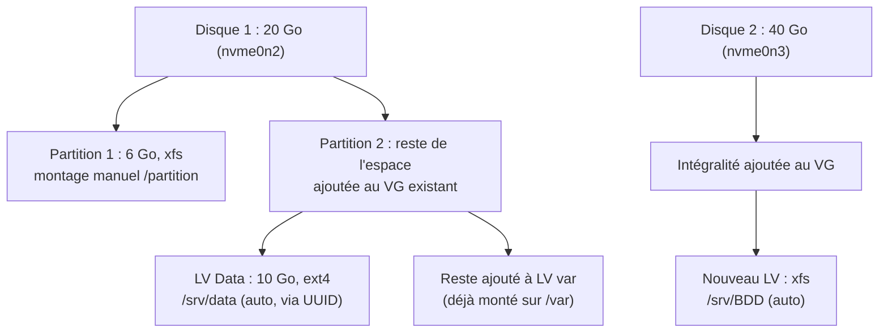

# TP7 : Gestion du stockage

!!! abstract "En bref"
    **Objectifs** : ajouter des disques, les partitionner, les intégrer à LVM, créer des volumes logiques et les monter automatiquement.
    **Prérequis** : avoir terminé l'atelier 6 (implicite, pas précisé dans l'énoncé).
    **Machine** : `srv-cli`.
    **Durée** : 45 min à 1 h.

!!! danger "Avant de commencer : fais un snapshot de ta VM"
    L'énoncé le demande explicitement. Dans ton hyperviseur (VirtualBox : clic droit sur la VM → **Prendre un instantané** ; VMware : **VM → Snapshot → Take Snapshot**), fais une sauvegarde de l'état actuel **avant** de toucher aux disques. Le partitionnement et le formatage sont des opérations qui peuvent mal tourner (mauvais disque sélectionné, mauvaise partition supprimée) ; un snapshot te permet de revenir en arrière en quelques secondes.

## Adapter le TP aux disques NVMe

L'énoncé demande des disques en **SCSI**, mais si tu as ajouté les tiens en **NVMe** (contrôleur différent, plus rapide, courant sur les hyperviseurs récents), la seule vraie différence est le **nommage des périphériques**.

| | SCSI/SATA | NVMe |
|---|---|---|
| Disque | `/dev/sdb`, `/dev/sdc`... | `/dev/nvme1n1`, `/dev/nvme2n1`... |
| Partition | `/dev/sdb1`, `/dev/sdb2`... | `/dev/nvme1n1p1`, `/dev/nvme1n1p2`... |

!!! warning "Piège : le nommage NVMe peut surprendre (`nvme0n2` plutôt que `nvme1n1`)"
    Deux disques NVMe distincts peuvent apparaître comme deux **contrôleurs** différents (`nvme0n1`, `nvme1n1`) **ou** comme deux **namespaces** du même contrôleur (`nvme0n1`, `nvme0n2`), selon la façon dont l'hyperviseur les attache à la VM. Ne pars donc pas du principe que ton second disque s'appellera forcément `nvme1n1` : vérifie toujours avec `lsblk` avant de lancer `fdisk`, et adapte le nom en conséquence. Dans tout ce tuto, remplace `nvme1n1`/`nvme2n1` par les noms réellement affichés chez toi (par exemple `nvme0n2`, `nvme0n3`...).

!!! warning "Piège : ne pas oublier le `p` avant le numéro de partition"
    Sur un disque `sdb`, la partition 1 s'appelle `sdb1` (pas de séparateur). Sur un disque NVMe, il **faut** un `p` avant le numéro : `nvme0n2p1`. Sans ce `p`, la commande cible un périphérique qui n'existe pas.

Toutes les commandes ci-dessous utilisent la syntaxe NVMe ; remplace simplement les noms par les tiens (vérifiés avec `lsblk` à chaque étape).



---

## Partie 1 : premier disque de 20 Go

### Étape 0 : ajouter le disque dans l'hyperviseur

Dans les paramètres de la VM `srv-cli` (VM éteinte ou disque à chaud selon ton hyperviseur), ajoute un nouveau disque dur de **20 Go**, sur un contrôleur NVMe.

Redémarre si besoin, puis identifie le nouveau disque :

```bash
$ lsblk
```

Le nouveau disque apparaît sans partition (pas de point de montage), par exemple `nvme0n2` avec une taille de 20G. Si un disque NVMe ajouté à chaud n'apparaît pas, un redémarrage résout presque toujours le problème.

### Étape 1 : créer les deux partitions avec `fdisk`

```bash
# fdisk /dev/nvme0n2
```

Dans l'invite interactive de `fdisk` :

1. `n` (nouvelle partition), `p` (primaire), `1` (numéro), Entrée (début par défaut), `+6G` (taille de la première partition).
2. `n` à nouveau, `p`, `2`, Entrée, **Entrée** (jusqu'à la fin du disque, pour prendre tout le reste).
3. `p` pour vérifier visuellement les deux partitions créées.
4. `w` pour **écrire** les changements sur le disque (rien n'est fait avant ce `w`).

```bash
$ partprobe                # force le noyau à relire la table de partitions sans redémarrer
$ lsblk
```

Tu dois voir `nvme0n2p1` (6G) et `nvme0n2p2` (le reste, environ 14G).

### Étape 2a : la première partition (6 Go, xfs, montage manuel)

```bash
# mkfs.xfs /dev/nvme0n2p1
# mkdir /partition
# mount /dev/nvme0n2p1 /partition
```

Vérifie :

```bash
$ df -h /partition
```

!!! note "« Tester manuellement » = pas d'entrée dans `/etc/fstab`"
    L'énoncé demande de **tester le montage manuellement**, pas de le rendre permanent. Ne touche donc pas à `/etc/fstab` pour cette partition : un simple `mount` suffit à répondre à la consigne. Si tu redémarres la VM, ce montage disparaîtra, ce qui est normal ici.

### Étape 2b : la deuxième partition, ajoutée au groupe de volumes existant

D'abord, identifie le nom de ton groupe de volumes (créé à l'installation, généralement `ol`) :

```bash
$ vgs
```

Prépare la partition pour LVM, puis intègre-la au groupe existant :

```bash
# pvcreate /dev/nvme0n2p2
# vgextend ol /dev/nvme0n2p2
```

(remplace `ol` et `nvme0n2p2` par les noms réels affichés chez toi.)

!!! tip "Sur les versions récentes de LVM, `vgextend` peut créer le PV tout seul"
    Si tu lances directement `vgextend ol /dev/nvme0n2p2` **sans** avoir fait `pvcreate` avant, LVM peut détecter que le périphérique n'est pas encore un volume physique et le créer lui-même au passage (tu verras alors les deux messages `Physical volume "..." successfully created` et `Volume group "ol" successfully extended` à la suite, pour une seule commande tapée). Les deux méthodes donnent le même résultat ; faire `pvcreate` séparément reste utile pour bien comprendre l'étape, mais n'est plus strictement obligatoire selon ta version de LVM2.

Vérifie que l'espace disponible dans le groupe a bien augmenté :

```bash
$ vgs
$ vgdisplay ol
```

### Étape 3 : créer le volume logique « Data » (10 Go, ext4, montage automatique par UUID)

```bash
# lvcreate -n Data -L 10G ol
# mkfs.ext4 /dev/ol/Data
# mkdir -p /srv/data
```

Récupère l'**UUID** du nouveau système de fichiers :

```bash
$ blkid /dev/ol/Data
```

Copie la valeur après `UUID="..."`, puis ajoute une ligne dans `/etc/fstab` :

```bash
# vi /etc/fstab
```

```text
UUID=xxxxxxxx-xxxx-xxxx-xxxx-xxxxxxxxxxxx   /srv/data   ext4   defaults   0   0
```

!!! warning "Piège : tester avant de redémarrer"
    Comme vu dans la fiche de révision, ne redémarre pas tout de suite pour vérifier. Teste d'abord avec :
    ```bash
    # mount /srv/data
    ```
    (uniquement le point de montage, pas `mount -a`). Si aucune erreur ne s'affiche, la ligne est correcte. Vérifie avec `df -h /srv/data`.

### Étape 4 : ajouter l'espace restant du groupe à `/var`, sans interruption ni perte de données

Après avoir créé le LV `Data` de 10 Go, il reste environ 4 Go disponibles dans le groupe de volumes (14 Go de la partition 2, moins les 10 Go de `Data`). L'énoncé demande de donner **tout ce qui reste** au volume logique déjà monté sur `/var`.

**Agrandir le volume logique** (à chaud, sans démonter `/var`) :

```bash
$ vgs                          # vérifier l'espace libre restant dans le VG
# lvextend -l +100%FREE /dev/ol/var
```

`-l +100%FREE` prend **tout** l'espace libre restant du groupe, quel qu'il soit — plus fiable que de calculer une taille en Go à la main.

**Agrandir le système de fichiers**, sans démonter ni interrompre l'accès (c'est justement ce que permet XFS, comme vu dans la fiche de révision) :

```bash
# xfs_growfs /var
```

!!! danger "Piège : `resize2fs` ne fonctionne pas sur XFS"
    D'après le partitionnement des TP1/TP2, `/var` a été créé en **XFS**. Utilise donc **`xfs_growfs`**, avec le **point de montage** en argument (`/var`), pas le nom du périphérique. `resize2fs` est réservé aux systèmes de fichiers `ext2/3/4` ; l'utiliser ici renverrait une erreur.

**Vérifier que la nouvelle taille est bien prise en compte** (demandé explicitement par l'énoncé) :

```bash
$ df -h /var
```

La taille affichée doit refléter l'ajout de l'espace libre, sans qu'aucune interruption de service n'ait été nécessaire : `/var` est resté monté et accessible pendant toute l'opération.

---

## Partie 2 : deuxième disque de 40 Go, dédié à une base de données

### Étape 0 : ajouter le disque

Ajoute un second disque NVMe de **40 Go** à `srv-cli`, puis identifie-le :

```bash
$ lsblk
```

Il apparaît par exemple sous le nom `nvme0n3`.

### Étape 1 : intégrer l'intégralité du disque au groupe de volumes

L'énoncé précise que **toute** la capacité du disque doit rejoindre le VG. Deux approches possibles :

**Option simple** : utiliser le disque entier comme volume physique, sans le partitionner :

```bash
# pvcreate /dev/nvme0n3
# vgextend ol /dev/nvme0n3
```

**Option avec partition** (si tu préfères garder l'habitude de toujours partitionner avant d'utiliser LVM, comme à la partie 1) :

```bash
# fdisk /dev/nvme0n3
# n, p, 1, Entrée, Entrée (toute la capacité)
# t, 8e (type Linux LVM)
# w
# pvcreate /dev/nvme0n3p1
# vgextend ol /dev/nvme0n3p1
```

Les deux méthodes remplissent la consigne « l'intégralité de l'espace sera intégrée au groupe de volumes existant ». Vérifie ensuite :

```bash
$ vgs
```

### Étape 2 : créer le volume logique pour la base de données

Comme ce disque est **entièrement dédié** à ce volume, prends directement tout l'espace disponible plutôt que de viser une taille fixe en Go :

```bash
# lvcreate -n BDD -l 100%FREE ol
```

!!! danger "Piège : `-L 40G` peut échouer de justesse"
    Si tu demandes une taille fixe avec `-L` (majuscule) correspondant exactement à la taille du disque, LVM peut répondre :
    ```text
    Volume group "ol" has insufficient free space (10239 extents): 10240 required.
    ```
    C'est normal : LVM découpe l'espace en petites unités appelées **extensions physiques** (4 Mio chacune en général), et une infime partie du disque est réservée aux métadonnées LVM dès qu'il devient un volume physique. Il manque donc quelques Mio pour atteindre pile 40G. Utilise `-l 100%FREE` (minuscule, en pourcentage) plutôt que `-L 40G` (majuscule, taille absolue) pour éviter ce calcul : LVM prend alors tout ce qui est réellement disponible, sans arrondi problématique.

    Si tu tiens à fixer une taille précise malgré tout : `lvcreate -n BDD -l 10239 ol` (en donnant directement le nombre d'extensions restantes, visible avec `vgdisplay ol`), ou vise très légèrement en dessous (`-L 39.98G`).

```bash
# mkfs.xfs /dev/ol/BDD
# mkdir -p /srv/BDD
```

### Étape 3 : montage automatique

Même méthode qu'à la partie 1 (UUID + `/etc/fstab`) :

```bash
$ blkid /dev/ol/BDD
# vi /etc/fstab
```

```text
UUID=xxxxxxxx-xxxx-xxxx-xxxx-xxxxxxxxxxxx   /srv/BDD   xfs   defaults   0   0
```

Teste avant de redémarrer :

```bash
# mount /srv/BDD
$ df -h /srv/BDD
```

---

## Question : quelle taille fait le dossier `/etc` ?

!!! danger "Piège classique : `ls -l` ne donne PAS la taille d'un dossier"
    `ls -l /etc` n'affiche que la taille de l'**inode** du dossier lui-même (quelques Ko), pas celle de son contenu. Il faut utiliser **`du`**, comme vu dans la fiche de révision.

```bash
$ du -sh /etc
```

- `-s` : total uniquement (pas le détail fichier par fichier).
- `-h` : unités lisibles (Ko, Mo...).

Si tu veux le détail par sous-dossier pour comprendre ce qui pèse le plus lourd :

```bash
$ du -h --max-depth=1 /etc | sort -rh | head
```

`sort -rh` trie du plus gros au plus petit, `head` limite l'affichage aux premières lignes.

---

## Vérification finale

```bash
$ lsblk
$ df -h
$ vgs
$ lvs
$ cat /etc/fstab
```

`lsblk` doit montrer l'arborescence complète : les deux nouveaux disques, leurs partitions, les volumes logiques (`Data`, `var` agrandi, `BDD`) et leurs points de montage respectifs (`/srv/data`, `/var`, `/srv/BDD`), plus `/partition` monté manuellement sur la première partition du premier disque.

---

## À retenir

- Sur un disque **NVMe**, les partitions s'appellent `nvme<X>n1p<Y>` (avec un `p`), contrairement à `sdX<Y>` en SCSI/SATA.
- « Tester manuellement » = un simple `mount`, **pas** de ligne dans `/etc/fstab`.
- « Montage automatique » = une ligne dans `/etc/fstab`, testée avec `mount /point` (jamais `mount -a`) avant de redémarrer.
- **`lvextend -l +100%FREE`** prend tout l'espace libre restant du groupe de volumes, sans calcul manuel.
- **`xfs_growfs <point_de_montage>`** agrandit un système de fichiers XFS **à chaud**, sans démonter ; `resize2fs` est réservé à ext2/3/4.
- Intégrer un disque entier à LVM ne demande pas forcément de le partitionner d'abord : `pvcreate` peut cibler directement le disque brut (`/dev/nvme0n3`).
- **`du -sh <dossier>`** donne la taille réelle d'un dossier et de son contenu ; `ls -l` ne donne que la taille de l'inode du dossier.
