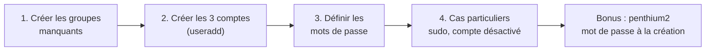

# TP8 : Gestion des utilisateurs

!!! abstract "En bref"
    **Objectifs** : créer des groupes, puis des comptes utilisateurs avec des caractéristiques précises (shell, répertoire personnel, mot de passe, groupes, sudo, compte désactivé).
    **Prérequis** : avoir terminé l'atelier 7.
    **Durée** : 30 à 45 min.



## Ce que demande l'énoncé

| | Pierre | Paul | Jean-Jacques |
|---|---|---|---|
| Login | `pierre` | `paul` | `jjacques` (adapté pour éviter le tiret de « Jean-Jacques ») |
| Shell | `ksh` | `bash` | `bash` |
| Répertoire personnel | `/home/pierre` | `/home/paul` | `/home/jjacques` |
| Mot de passe | `password` | `Pa$$w0rd` | *non renseigné* |
| Groupe principal | `adm` | *(par défaut)* | *(par défaut)* |
| Groupes secondaires | `stagiaires`, `documentation` | `vip` | `stagiaires`, `documentation` |
| Particularité | Accès `sudo` complet (root) | Compte **complètement désactivé** | Aucun mot de passe défini |

!!! note "Pourquoi le login de Jean-Jacques est `jjacques`"
    L'énoncé précise : « le login pourra être adapté pour éviter les fautes de frappe ». Un login avec un tiret (`jean-jacques`) reste tapable, mais `jjacques` est plus court et moins sujet aux erreurs de saisie répétées (connexions, `su`, scripts...). C'est ce nom qui est utilisé dans tout ce tuto.

---

## Étape 1 : créer les groupes nécessaires

Avant de créer les utilisateurs, il faut que les groupes qu'on va leur assigner existent déjà (consigne explicite de l'énoncé).

```bash
$ getent group adm
```

`adm` est un groupe **système** déjà présent par défaut sur Oracle Linux (utilisé pour l'accès à certains fichiers de logs) : pas besoin de le créer. Vérifie avec la commande ci-dessus — si elle affiche une ligne, il existe déjà.

En revanche, `stagiaires`, `documentation` et `vip` sont des groupes propres à ce TP, à créer :

```bash
# groupadd stagiaires
# groupadd documentation
# groupadd vip
```

Vérifie :

```bash
$ cat /etc/group | grep -E "stagiaires|documentation|vip|adm"
```

---

## Étape 2 : créer les comptes utilisateurs

### Pierre

```bash
# useradd -m -d /home/pierre -s /bin/ksh -g adm -G stagiaires,documentation pierre
```

| Option | Rôle |
|---|---|
| `-m` | Crée le répertoire personnel (sur RHEL il est créé par défaut, mais l'écrire explicitement ne fait pas de mal) |
| `-d /home/pierre` | Fixe le chemin du répertoire personnel |
| `-s /bin/ksh` | Shell de connexion |
| `-g adm` | Groupe **principal** (un seul, en minuscule `-g`) |
| `-G stagiaires,documentation` | Groupes **secondaires**, séparés par des virgules (majuscule `-G`) |

!!! warning "Piège : `ksh` n'est pas toujours installé par défaut"
    Si la commande échoue avec une erreur du type `invalid shell`, c'est que le paquet `ksh` n'est pas présent :
    ```bash
    # dnf install ksh
    ```
    puis relance `useradd`. Tu peux vérifier qu'un shell est bien reconnu par le système avec `cat /etc/shells`.

### Paul

```bash
# useradd -m -d /home/paul -s /bin/bash -G vip paul
```

Pas de `-g` ici : sans cette option, `useradd` crée (sur certaines configurations) un groupe principal du même nom que l'utilisateur, ou utilise le groupe par défaut du système — l'énoncé ne précise rien pour Paul, donc on laisse le comportement par défaut.

### Jean-Jacques

```bash
# useradd -m -d /home/jjacques -s /bin/bash -G stagiaires,documentation jjacques
```

Même logique, avec les deux groupes secondaires demandés.

---

## Étape 3 : définir les mots de passe

### Pierre : `password`

```bash
# passwd pierre
```

Tape `password` deux fois quand demandé. `passwd` interroge toujours l'utilisateur de façon interactive, pour éviter qu'un mot de passe traîne en clair dans l'historique du terminal.

### Paul : `Pa$$w0rd`

Même commande, mais attention à un piège si tu veux l'automatiser :

```bash
# passwd paul
```

Tape `Pa$$w0rd` (le `$` ne pose pas de problème ici, car `passwd` ne passe jamais par une interprétation du shell — ce n'est un souci que si tu utilises une méthode non interactive, voir la note ci-dessous).

!!! warning "Piège si tu automatises avec `chpasswd`"
    La méthode non interactive existe aussi :
    ```bash
    # echo "paul:Pa\$\$w0rd" | chpasswd
    ```
    Avec des guillemets doubles (`"`), le `$` doit être échappé (`\$`), sinon le shell essaie de l'interpréter comme une variable et le mot de passe réellement défini serait tronqué. Avec des guillemets simples (`'...'`), pas besoin d'échapper :
    ```bash
    # echo 'paul:Pa$$w0rd' | chpasswd
    ```
    Pour ce TP, la méthode interactive (`passwd paul`) reste la plus sûre et évite ce piège.

### Jean-Jacques : pas de mot de passe

L'énoncé dit « non renseigné » : ne lance **aucune** commande `passwd` pour lui. Par défaut, `useradd` crée le compte avec un champ mot de passe **verrouillé** (`!!` dans `/etc/shadow`), donc Jean-Jacques ne peut pas se connecter par mot de passe tant que personne n'en définit un — c'est exactement ce que demande l'énoncé, sans action supplémentaire.

Vérifie :

```bash
# grep jjacques /etc/shadow
```

Tu dois voir `jjacques:!!:...` (ou `jjacques:!:...` selon la version).

---

## Étape 4 : les cas particuliers

### Pierre : accès sudo avec tous les droits root

Le groupe `wheel` donne tous les privilèges sudo (vu dans la fiche de révision, chapitre 8.4). Il n'était pas dans la liste des groupes secondaires demandés à l'étape 2, car c'est un besoin **sudo**, distinct des groupes métier :

```bash
# usermod -aG wheel pierre
```

!!! danger "Piège : ne pas oublier `-a`"
    `usermod -G wheel pierre` (sans `-a`) **remplacerait** tous les groupes secondaires de Pierre par `wheel` seul, effaçant `stagiaires` et `documentation`. Toujours utiliser **`-aG`** (*append* + *Groups*) pour ajouter un groupe sans perdre les autres.

Vérifie :

```bash
$ id pierre
$ groups pierre
```

Teste :

```bash
$ su - pierre
$ sudo -l           # liste ce que pierre peut faire en sudo
$ sudo whoami        # doit répondre "root"
```

### Paul : compte complètement désactivé

!!! success "Méthode exactement donnée par le cours"
    Le cours (chapitre 9.2.3.2, note sous `usermod -L`) l'indique noir sur blanc : *« pour verrouiller le compte (et pas seulement l'accès au compte par un mot de passe), il est également nécessaire de placer DATE_FIN_VALIDITÉ à 1 »*. C'est exactement la combinaison utilisée ci-dessous.

« Complètement désactivé » va plus loin qu'un simple mot de passe verrouillé : il faut empêcher **toute** méthode de connexion, y compris par clé SSH ou par date d'expiration.

```bash
# passwd -l paul
```

Verrouille le mot de passe (ajoute un `!` devant le hash dans `/etc/shadow`).

```bash
# usermod -e 1 paul
```

Fixe une date d'**expiration du compte** dans le passé (`1` = 1er janvier 1970 + 1 jour, donc une date largement dépassée). Résultat : même avec un mot de passe ou une clé SSH valide, le compte refuse toute connexion, car il est expiré.

Vérifie :

```bash
$ passwd -S paul
$ chage -l paul
```

`passwd -S` doit afficher `L` (locked) pour le statut du mot de passe. `chage -l` doit montrer une date d'expiration du compte dans le passé.

!!! tip "Pourquoi deux actions et pas une seule"
    `passwd -l` seul bloquerait la connexion par mot de passe, mais pas forcément d'autres méthodes (clé SSH si Paul en avait une, par exemple). `usermod -e 1` bloque la connexion **au niveau du compte lui-même**, quelle que soit la méthode d'authentification utilisée. Combiner les deux correspond à « complètement désactivé ».

---

## Bonus : penthium2, mot de passe initialisé à la création

**Consigne** : shell bash, répertoire `/home/p2`, mot de passe `iop` **initialisé dès la création** de l'utilisateur (pas avec un `passwd` après coup).

!!! info "Cette méthode ne vient pas du cours"
    Ton cours décrit `useradd` et `passwd` comme deux commandes séparées (créer le compte, puis définir son mot de passe), sans option permettant de combiner les deux en une seule commande. La méthode ci-dessous (option `-p` de `useradd` combinée à `openssl passwd`) est une technique générale Linux, pas une section de ton support de cours — utile ici car c'est la seule façon de respecter littéralement « mot de passe initialisé **à la création** ».

`useradd` seul ne permet pas de donner un mot de passe en clair directement : il faut lui fournir le mot de passe déjà **chiffré** (haché), via l'option `-p`. On génère ce hash à part, avec `openssl` :

```bash
$ openssl passwd -6 iop
```

`-6` demande un hash au format **SHA-512** (celui utilisé par `/etc/shadow`, comme vu dans la fiche de révision chapitre 8.2). La commande affiche une chaîne du type :

```text
$6$xxxxxxxxxxxxxxxx$yyyyyyyyyyyyyyyyyyyyyyyyyyyyyyyyyyyyyyyyyyyyyyyyyyyyyyyyyyyyyyyyyyyyyyyyyyyyyyyyyy
```

Copie cette chaîne **entière**, puis utilise-la dans `useradd` :

```bash
# useradd -m -d /home/p2 -s /bin/bash -p '$6$xxxxxxxxxxxxxxxx$yyyyyyyyyy...' penthium2
```

!!! danger "Piège : toujours entourer le hash de guillemets simples"
    Le hash contient des caractères (`$`, parfois `/`) que le shell pourrait mal interpréter sans guillemets **simples** (`'...'`). Avec des guillemets doubles, le `$` risquerait d'être pris pour le début d'une variable.

Vérifie que le mot de passe fonctionne :

```bash
$ su - penthium2
```

Tape `iop` : la connexion doit réussir immédiatement, sans qu'aucune commande `passwd` n'ait été lancée après la création du compte.

---

## Vérification finale

```bash
$ cat /etc/passwd | grep -E "pierre|paul|jjacques|penthium2"
$ id pierre
$ id paul
$ id jjacques
$ groups pierre
$ passwd -S paul
```

| Test | Résultat attendu |
|---|---|
| `su - pierre` puis `sudo whoami` | Répond `root` |
| `su - paul` | Connexion refusée (compte désactivé) |
| `su - jjacques` | Connexion par mot de passe impossible (aucun défini) |
| `su - penthium2`, mot de passe `iop` | Connexion réussie |

## À retenir

- `-g` (minuscule) = groupe **principal**, un seul. `-G` (majuscule) = groupes **secondaires**, séparés par des virgules.
- `usermod -aG` (avec `-a`) **ajoute** un groupe secondaire ; sans `-a`, `-G` **remplace** tous les groupes secondaires existants.
- Sans `passwd`, un compte créé par `useradd` est verrouillé par défaut (aucune connexion par mot de passe possible).
- « Compte complètement désactivé » = `passwd -l` (verrouille le mot de passe) **+** `usermod -e 1` (expire le compte), pas l'un sans l'autre.
- Pour fixer un mot de passe **dès la création**, génère un hash avec `openssl passwd -6` et passe-le à `useradd -p` entre guillemets simples.
