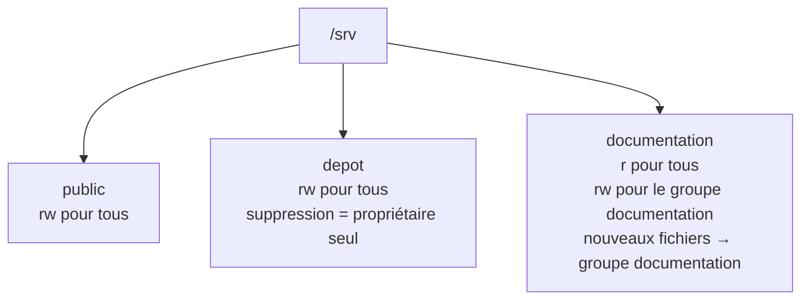

# TP9 : Gestion des permissions

!!! abstract "En bref"
    **Objectifs** : créer une arborescence partagée (public, dépôt, documentation) avec les bons droits, y compris des droits spéciaux.
    **Prérequis** : avoir terminé l'atelier 8.
    **Durée** : 30 à 40 min.



## Ce que demande l'énoncé

| Répertoire | Lecture | Écriture | Particularité |
|---|---|---|---|
| **public** | Tous | Tous | — |
| **depot** | Tous | Tous | Seul le propriétaire d'un fichier peut le **supprimer** |
| **documentation** | Tous | Groupe `documentation` seulement | Les nouveaux fichiers appartiennent **automatiquement** au groupe `documentation` |

L'énoncé ajoute deux contraintes transversales : l'arborescence doit être **pertinente selon le FHS**, et certains répertoires ont besoin de **droits spéciaux**.

---

## Où placer cette arborescence (FHS)

!!! info "Le FHS n'est pas expliqué dans ton cours"
    L'énoncé te demande une arborescence « pertinente du point de vue du FHS », mais ton cours ne définit ce standard nulle part — c'est une connaissance externe que l'énoncé suppose acquise. Le FHS (*Filesystem Hierarchy Standard*) prévoit `/srv` pour les **données servies par le système** à ses utilisateurs, ce qui correspond bien à des espaces de partage entre utilisateurs comme ici.

    Un indice tout de même présent dans ton cours : son propre exemple sur `/etc/fstab` (chapitre 8.5) utilise justement `/srv/data` comme point de montage de démonstration — une coïncidence qui va dans le même sens, cohérente aussi avec `/srv/data` et `/srv/BDD` déjà créés au TP7.

```bash
# mkdir -p /srv/public /srv/depot /srv/documentation
```

```bash
# mkdir -p /srv/public /srv/depot /srv/documentation
```

`-p` crée aussi `/srv` au passage s'il n'existait pas encore (normalement déjà présent sur un système RHEL/Oracle Linux standard).

!!! note "D'autres choix défendables"
    `/home/partage` ou `/opt` pourraient aussi se justifier selon l'angle choisi, mais `/srv` est le plus directement aligné avec sa définition FHS pour ce cas d'usage précis (espace de partage de fichiers entre comptes). Si ton formateur attend un autre emplacement, la logique des droits ci-dessous reste identique, seul le chemin change.

---

## Répertoire `public` : lecture/écriture pour tous

Aucune restriction de suppression n'est demandée ici, contrairement à `depot`. Un `777` classique suffit :

```bash
# chmod 777 /srv/public
```

| Chiffre | Signification |
|---|---|
| `7` (user) | `rwx` pour le propriétaire |
| `7` (group) | `rwx` pour le groupe propriétaire |
| `7` (others) | `rwx` pour tout le monde |

Vérifie :

```bash
$ ls -ld /srv/public
```

Tu dois voir `drwxrwxrwx`.

!!! tip "Remarque de sécurité (hors consigne stricte)"
    Un répertoire `777` sans aucune restriction permet à n'importe qui de supprimer les fichiers des autres (rappel de la fiche de révision : le droit `w` sur un **répertoire** autorise à supprimer/renommer son contenu, même les fichiers appartenant à quelqu'un d'autre). L'énoncé ne demande cette protection que pour `depot`, donc on s'en tient à `777` simple pour `public`. Si un vrai usage en production l'exigeait aussi pour `public`, le sticky bit (vu juste en dessous) s'appliquerait de la même façon.

---

## Répertoire `depot` : écriture pour tous, suppression réservée au propriétaire

C'est exactement la situation que le **sticky bit** est fait pour résoudre (fiche de révision, chapitre 9.3) — le même mécanisme que `/tmp` sur un système Linux standard.

```bash
# chmod 1777 /srv/depot
```

Le premier chiffre (`1`) ajoute le sticky bit, en plus des droits classiques `777` (rwx pour tous).

Autre syntaxe possible, symbolique :

```bash
# chmod 777 /srv/depot
# chmod +t /srv/depot
```

Vérifie :

```bash
$ ls -ld /srv/depot
```

Tu dois voir `drwxrwxrwt` — le `t` final (minuscule) confirme que le sticky bit est actif **et** que le droit d'exécution `x` est présent pour les autres (une majuscule `T` signifierait sticky bit actif mais sans `x`, ce qui casserait l'accès au dossier).

---

## Répertoire `documentation` : lecture pour tous, écriture pour un groupe, héritage de groupe

Trois besoins combinés ici : des droits différents selon qui accède, et un **héritage automatique** du groupe sur les nouveaux fichiers — exactement le rôle du **SetGID** sur un répertoire (fiche de révision, chapitre 9.3).

### Étape 1 : rattacher le répertoire au groupe `documentation`

```bash
# chgrp documentation /srv/documentation
```

(Le groupe `documentation` existe déjà, créé au TP8.)

### Étape 2 : poser les bons droits + le SetGID

```bash
# chmod 2775 /srv/documentation
```

| Chiffre | Signification |
|---|---|
| `2` (spécial) | **SetGID** |
| `7` (user) | `rwx` pour le propriétaire (en général root ou un administrateur) |
| `7` (group) | `rwx` pour le groupe `documentation` : lecture **et écriture** |
| `5` (others) | `r-x` pour tout le monde : lecture et traversée, **pas** d'écriture |

Vérifie :

```bash
$ ls -ld /srv/documentation
```

Tu dois voir `drwxrwsr-x` — le `s` (minuscule) à la place du `x` du groupe confirme le SetGID actif (comme pour le sticky bit, une majuscule `S` signifierait SetGID actif mais sans `x` pour le groupe, ce qui est à éviter ici).

!!! note "Pourquoi `others` a besoin de `x`, pas seulement `r`"
    Lire le **contenu** d'un fichier dans `/srv/documentation` suppose d'abord de pouvoir **entrer** dans le dossier : le `x` sur un répertoire sert à le traverser (`cd`), le `r` à en lister le contenu (`ls`). Sans `x`, même avec `r`, `ls /srv/documentation` fonctionnerait mais on ne pourrait pas ouvrir les fichiers qu'il contient. D'où `r-x` et pas `r--` pour les autres.

### Pourquoi le SetGID règle le dernier point de la consigne

Normalement, un fichier créé par un utilisateur hérite du **groupe principal de cet utilisateur** (son `-g` à la création du compte), pas du groupe propriétaire du dossier. Le **SetGID sur un répertoire** change ce comportement : tout nouveau fichier créé à l'intérieur hérite **automatiquement** du groupe du répertoire lui-même, quel que soit le groupe principal de son créateur. C'est exactement ce que demande l'énoncé (« faire en sorte que tout nouveau fichier créé dans ce répertoire appartienne au groupe documentation »), sans avoir besoin de faire un `chgrp` manuel après chaque création.

---

## Tester avec différents comptes

L'énoncé demande explicitement de tester avec plusieurs types de comptes. Les utilisateurs créés au TP8 sont pratiques ici : **Pierre** et **Jean-Jacques** sont déjà dans le groupe `documentation`, **Paul** n'y est pas.

### Avec root

```bash
$ su -
# touch /srv/public/test-root.txt
# touch /srv/depot/test-root.txt
# touch /srv/documentation/test-root.txt
$ ls -l /srv/documentation/test-root.txt
```

Root peut tout faire partout (normal, c'est root). Vérifie quand même que `test-root.txt` dans `documentation` appartient bien au groupe `documentation` (grâce au SetGID), même si le groupe principal de root est `root`.

### Avec Paul (pas dans le groupe `documentation`)

!!! warning "Rappel : le compte de Paul est désactivé (TP8)"
    Si tu as suivi le TP8 à la lettre, `su - paul` échouera (compte expiré). Pour tester ses droits malgré tout, utilise temporairement `su` sans connexion complète pour exécuter une commande ponctuelle, ou bascule ce test sur un autre compte non membre de `documentation`. Une solution simple : réactiver Paul temporairement (`usermod -e "" paul` pour retirer l'expiration, puis la remettre après le test avec `usermod -e 1 paul`), ou utiliser un compte de test dédié si tu en as un.

```bash
$ su - paul                       # (après réactivation temporaire si besoin)
$ touch /srv/public/test-paul.txt      # doit réussir
$ touch /srv/depot/test-paul.txt       # doit réussir
$ touch /srv/documentation/test-paul.txt   # doit ÉCHOUER (Permission denied)
```

### Avec Pierre ou Jean-Jacques (dans le groupe `documentation`)

```bash
$ su - pierre
$ touch /srv/documentation/test-pierre.txt   # doit réussir
$ ls -l /srv/documentation/test-pierre.txt
```

Vérifie que le fichier appartient bien au groupe `documentation`, **et non** au groupe principal de Pierre (`adm`) :

```text
-rw-rw-r--. 1 pierre documentation ... test-pierre.txt
```

C'est la preuve que le SetGID fonctionne.

### Tester la restriction de suppression dans `depot`

```bash
$ su - paul
$ touch /srv/depot/fichier-de-paul.txt
$ exit
$ su - pierre
$ rm /srv/depot/fichier-de-paul.txt    # doit ÉCHOUER (Operation not permitted)
```

Même si Pierre a le droit d'écriture sur `/srv/depot`, le sticky bit l'empêche de supprimer un fichier qui ne lui appartient pas.

---

## Vérification finale

```bash
$ ls -ld /srv/public /srv/depot /srv/documentation
```

Résultat attendu :

```text
drwxrwxrwx. ...  root root          ... /srv/public
drwxrwxrwt. ...  root root          ... /srv/depot
drwxrwsr-x. ...  root documentation ... /srv/documentation
```

## À retenir

- Le **FHS** place les espaces de partage de fichiers servis par le système sous `/srv`.
- `777` = tout le monde peut tout faire, y compris supprimer les fichiers des autres.
- **Sticky bit** (`+t`, chiffre `1` en tête) : chacun peut créer/modifier, mais seul le propriétaire (et root) peut supprimer — utilisé sur `/tmp` par défaut.
- **SetGID** sur un répertoire (`+s` côté groupe, chiffre `2` en tête) : tout nouveau fichier créé dedans hérite du **groupe du répertoire**, pas du groupe principal du créateur.
- `s`/`S` (SetUID/SetGID) et `t`/`T` (sticky) en minuscule = le droit spécial est actif **avec** `x` ; en majuscule = actif **sans** `x` (à éviter pour un répertoire).
- Toujours tester avec plusieurs comptes réels (root, membre du groupe concerné, non-membre) pour valider concrètement chaque règle, pas seulement se fier à `ls -l`.
