# Administration Linux : fiche de révision

Module **M02 : Administration d'un système Linux** (ENI, Oracle Linux / RHEL).
Cette fiche reprend tout le cours dans l'ordre, avec des schémas, les commandes à connaître et les pièges rencontrés en atelier.

!!! info "Comment lire cette fiche"
    - **Prompt `$`** : utilisateur standard. **Prompt `#`** : compte root (administrateur).
    - Syntaxe d'une commande : `commande [options] <argument>` (`[ ]` = facultatif, `< >` = à remplacer).
    - Les blocs **Piège** signalent une erreur classique (cours ou TP).
    - Les blocs **Bonus** ajoutent une commande qui n'est pas dans le cours mais qui est très utile.

**Sommaire**

1. [Histoire de RHEL et de ses dérivés](#1-histoire-de-rhel-et-de-ses-derives)
2. [Installer le système](#2-installer-le-systeme)
3. [Le démarrage : GRUB, noyau, systemd](#3-le-demarrage-grub-noyau-systemd)
4. [Le mode maintenance](#4-le-mode-maintenance)
5. [Le réseau](#5-le-reseau)
6. [Les paquets (dnf, rpm)](#6-les-paquets-dnf-rpm)
7. [Le stockage : partitions, LVM, systèmes de fichiers, montage](#7-le-stockage)
8. [Utilisateurs et groupes](#8-utilisateurs-et-groupes)
9. [Droits sur les fichiers](#9-droits-sur-les-fichiers)
10. [Services et journaux (systemd, journald, rsyslog)](#10-services-et-journaux)
11. [Analyser le système](#11-analyser-le-systeme)
12. [Aide-mémoire final et auto-évaluation](#12-aide-memoire-final-et-auto-evaluation)

---

## 1. Histoire de RHEL et de ses dérivés

**RHEL** (Red Hat Enterprise Linux) est la distribution Linux d'entreprise de Red Hat, pensée pour les **serveurs** et les postes de travail. Elle est **payante** (abonnement) et supportée **10 ans**. L'accent est mis sur la **stabilité** : on préfère des logiciels éprouvés aux dernières nouveautés (environ 10 000 paquets seulement).

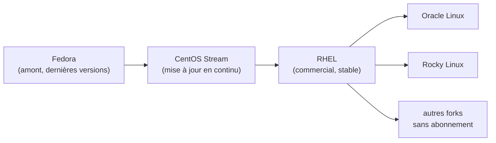

| Année | Événement |
|---|---|
| 1993 | Fondation de Red Hat |
| 1994 | Marc Ewing crée Red Hat Linux |
| 2000 – 2003 | Naissance de **RHEL** (avec support LTS, *Long Term Support*) |
| 2003 | Red Hat abandonne la version grand public, qui devient **Fedora** |
| 2014 | Red Hat rachète **CentOS** |
| 2018 | **IBM** rachète Red Hat |
| fin 2021 | Fin de CentOS 8, remplacé par **CentOS Stream** ; création de **Rocky Linux** |

!!! note "À retenir"
    - **Fedora** : gratuite, très à jour, sert de terrain de test (*upstream*).
    - **CentOS Stream** : étape intermédiaire entre Fedora et RHEL.
    - **Oracle Linux** et **Rocky Linux** sont des **forks** de RHEL : quasiment identiques, mais **sans abonnement**. C'est Oracle Linux qu'on installe en atelier.

---

## 2. Installer le système

### 2.1 Les modes d'installation

| Mode | Principe |
|---|---|
| **CD / DVD** | Le plus répandu (image ISO) |
| **Clé USB** | Clé bootable créée à partir de l'ISO (ex : unetbootin) |
| **Boot réseau (PXE)** | Le BIOS demande une IP (BOOTP), puis télécharge un fichier en **TFTP** |
| **Automatisé / clonage** | FAI, CD préconfigurés, Clonezilla, Acronis... pour déployer beaucoup de machines |

Avant d'installer, on vérifie la compatibilité matérielle avec la **HCL** (*Hardware Compatibility List*) de Red Hat. On télécharge aussi l'image adaptée à l'architecture (**x86_64** pour les PC Intel/AMD récents).

### 2.2 Le partitionnement à l'installation

Minimum recommandé : une partition pour la racine `/` et une pour le **swap** (espace d'échange, utilisé quand la RAM est pleine). Sous Linux, le swap est une partition, pas un fichier comme sous Windows.

| RAM | Taille conseillée du swap |
|---|---|
| < 1 Go | RAM × 1,5 |
| ≤ 2 Go | = RAM |
| > 2 Go | 2 Go ou plus selon le besoin |

Points importants :

- Le système de fichiers par défaut sur RHEL est **XFS**.
- `/boot` doit être sur une **partition primaire normale** (pas dans LVM) : c'est là que se trouve la fin du chargeur d'amorçage.
- Le reste est géré en **LVM** (voir [partie 7](#7-le-stockage)).

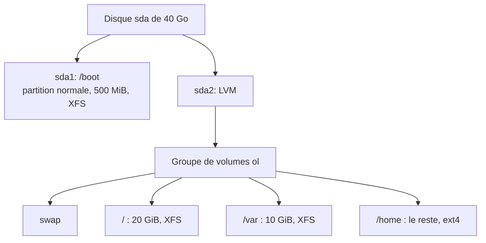

C'est le partitionnement des **ateliers 1 et 2** (VM `srvclient` graphique et VM `serveur` sans bureau).

### 2.3 Root : l'école du `su` et l'école du `sudo`

À l'installation, on choisit comment administrer la machine :

| | École du **su** | École du **sudo** |
|---|---|---|
| Configuration | On **définit un mot de passe root** | On **laisse root sans mot de passe** |
| Pour devenir admin | `su -` puis mot de passe **de root** | `sudo -i` puis mot de passe **de l'utilisateur** |
| Mode maintenance | Possible | **Impossible** si un seul utilisateur a le sudo |

!!! warning "Piège"
    Le cours déconseille fortement de ne créer **qu'un seul utilisateur avec sudo et pas de mot de passe root** : le système ne pourra plus démarrer en mode maintenance. Correction possible après coup : `sudo passwd root` (active le compte root).

---

## 3. Le démarrage : GRUB, noyau, systemd

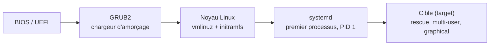

### 3.1 GRUB2 : le chargeur d'amorçage

C'est le **premier programme** lancé par le BIOS/UEFI. Sa mission : **charger le noyau** (ou proposer un choix entre plusieurs noyaux/systèmes).

| Fichier / dossier | Rôle |
|---|---|
| `/boot/grub2/grub.cfg` | Configuration finale. **Ne jamais l'éditer** : il est régénéré (mise à jour du noyau...) |
| `/etc/default/grub` | Paramètres globaux (c'est **ici** qu'on modifie) |
| `/etc/grub.d/` | Scripts de configuration (détection d'autres OS...) |
| `/boot/loader/entries/` | Fichiers qui construisent les entrées du menu |

Après modification de `/etc/default/grub`, on **régénère** la configuration :

```bash
# grub2-mkconfig -o /boot/grub2/grub.cfg
```

!!! warning "Piège"
    Le cours écrit `grub-mkconfig`, mais sur Oracle Linux / RHEL la commande s'appelle **`grub2-mkconfig`**. Ce chemin est valable en BIOS legacy ; en UEFI, `grub.cfg` est sous `/boot/efi/EFI/...`.

**Atelier 3, partie 1 : afficher le menu GRUB au moins 3 secondes**

Dans `/etc/default/grub` :

```ini
GRUB_TIMEOUT=5
GRUB_TIMEOUT_STYLE=menu
```

- `GRUB_TIMEOUT` : durée d'affichage en secondes.
- `GRUB_TIMEOUT_STYLE=menu` : rend l'affichage explicite. Sur Oracle Linux 8, le menu s'affichait déjà par défaut ; la ligne ne fait que le garantir.

Puis `grub2-mkconfig -o /boot/grub2/grub.cfg` et redémarrage. Tu dois voir le décompte « The selected entry will be started automatically in Ns ».

### 3.2 Le noyau Linux

Le **noyau** (*kernel*) fait le lien entre le matériel et le système : il gère les systèmes de fichiers, le chiffrement, les pilotes, et lance **systemd**. Il est **modulaire** (plusieurs fichiers). Deux fichiers sont indispensables dans `/boot` :

| Fichier | Contenu |
|---|---|
| `vmlinuz-<version>` | Le noyau lui-même |
| `initramfs-<version>.img` | Mini-système temporaire chargé en RAM, avec les pilotes nécessaires pour **trouver et monter la vraie racine** (LVM, RAID, chiffrement...) ; régénéré à chaque mise à jour |

Le menu GRUB propose plusieurs noyaux (4 maximum par défaut) et une entrée **rescue** de secours. Sur Oracle Linux tu as deux familles : le noyau **UEK** (Oracle) et le noyau compatible RHEL.

### 3.3 La ligne de lancement du noyau

En appuyant sur `e` dans le menu GRUB, on peut **modifier temporairement** cette ligne (jusqu'au prochain redémarrage) :

```text
linux ($root)/vmlinuz-4.18.0-240.15.1.el8_3.x86_64 root=/dev/mapper/ol-root ro crashkernel=auto
resume=/dev/mapper/ol-swap rd.lvm.lv=ol/root rd.lvm.lv=ol/swap rhgb quiet
```

| Élément | Signification |
|---|---|
| `vmlinuz-...` | Image du noyau à charger |
| `root=/dev/mapper/ol-root` | Où se trouve la racine `/` |
| `ro` | Racine montée en **lecture seule** au départ (ne pas changer) |
| `crashkernel=auto` | Active kdump (copie de la mémoire en cas de plantage) |
| `resume=/dev/mapper/ol-swap` | Emplacement pour la mise en veille prolongée |
| `rd.lvm.lv=ol/root` et `ol/swap` | Active les volumes LVM concernés |
| `rhgb` | Démarrage graphique (Plymouth) |
| `quiet` | Démarrage silencieux (pas de messages) |

Raccourcis dans l'éditeur GRUB : `Ctrl+x` démarre avec la ligne modifiée. Attention, le **clavier est en QWERTY** à ce stade.

### 3.4 systemd : le gestionnaire de système

**systemd** est le **premier processus** lancé par le noyau (**PID 1**). Il démarre tous les services, en parallèle et en respectant leurs dépendances, et monte les systèmes de fichiers. Il remplace les anciens scripts System V.

Il utilise des **cibles** (*targets*) : des groupes de services correspondant à un état du système.

| Cible | Rôle |
|---|---|
| `poweroff.target` | Arrêter le système |
| `rescue.target` | **Mode maintenance** |
| `multi-user.target` | Mode **console** (multi-utilisateurs, sans interface graphique) |
| `graphical.target` | Mode **graphique** |
| `reboot.target` | Redémarrer |

```bash
# systemctl get-default                       # cible de démarrage actuelle
# systemctl set-default multi-user.target     # changer la cible PAR DÉFAUT (permanent)
# systemctl isolate multi-user.target         # changer de cible MAINTENANT (temporaire)
```

!!! warning "Piège : `set-default` ≠ `isolate`"
    - `set-default` modifie ce qui est utilisé **à chaque démarrage** (le lien `/etc/systemd/system/default.target`).
    - `isolate` change l'état **tout de suite**, mais au redémarrage on revient à la cible par défaut.

    L'atelier 4 demande `set-default multi-user.target`.

### 3.5 Fichiers de services et priorité

- Les fichiers de services d'origine sont dans `/usr/lib/systemd/system` : **on ne les modifie pas** à cet endroit.
- Un fichier de **même nom** placé dans `/etc/systemd/system` est **prioritaire**. C'est comme ça qu'on personnalise un service.
- Pour créer son propre service : son fichier va dans `/etc/systemd/system`, puis on l'active.

Après avoir modifié un fichier de service, on demande à systemd de relire ses fichiers : `systemctl daemon-reload`.

### 3.6 Éteindre et redémarrer

Le cours recommande `shutdown` plutôt que `systemctl isolate poweroff.target` sur un serveur de production : on peut **différer** l'action et **prévenir** les utilisateurs connectés.

```bash
# shutdown -h +10 "Arrêt dans 10 minutes"     # -h : arrêter
# shutdown -r now                             # -r : redémarrer
# shutdown -c                                 # -c : annuler
```

**Mesurer le démarrage** (atelier 4) : `systemd-analyze` donne le temps total (noyau + initrd + espace utilisateur), et `systemd-analyze blame` liste les services les plus lents.

---

## 4. Le mode maintenance

Le mode maintenance (`rescue.target`) démarre le **strict minimum** : la racine est montée, un shell root est disponible, mais pas de réseau ni de services. Il sert à réparer un système qui ne démarre plus, corriger `/etc/fstab`, vérifier un système de fichiers, ou **récupérer l'accès sans le mot de passe root**.

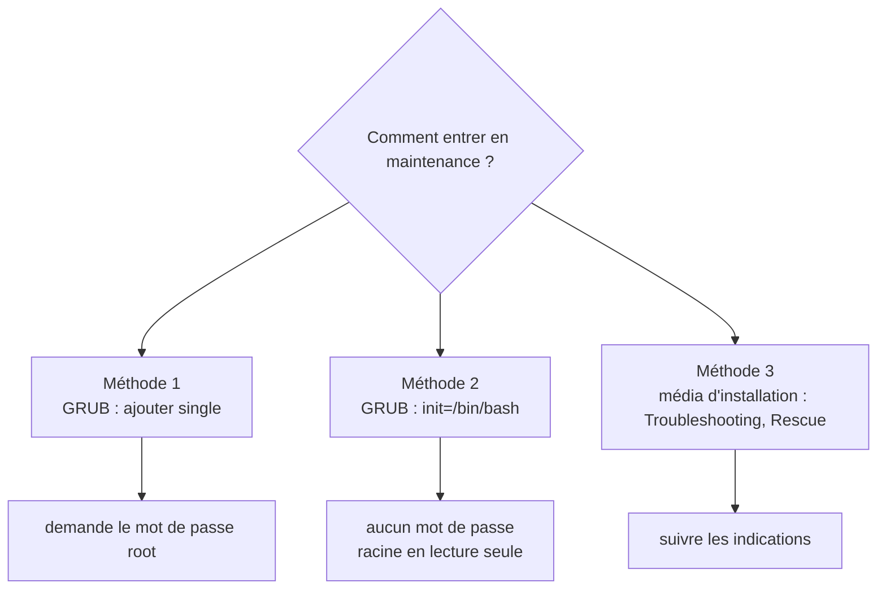

### Méthode 1 : `single` (atelier 3, partie 2)

1. Menu GRUB, sélectionner le noyau, touche `e`.
2. Sur la ligne `linux`, **retirer** `rhgb quiet` et **ajouter** `single` à la fin.
3. `Ctrl+x` pour démarrer. Sortir avec `Ctrl+d`.

Le système demande le **mot de passe root**. Cette méthode **ne marche pas** si root n'a pas de mot de passe (école du sudo).

### Méthode 2 : `init=/bin/bash` (atelier 3, partie 3)

Cette méthode remplace le premier processus par un simple **shell** : aucun mot de passe n'est demandé. Elle est « brutale » car le système n'est pas démarré normalement.

1. Menu GRUB, touche `e`, sur la ligne `linux` : retirer `rhgb quiet`, ajouter `init=/bin/bash`.
2. `Ctrl+x`, puis `Entrée` une fois le démarrage terminé.
3. Dans le shell (prompt `bash-4.4#` ou `:/#`) :

```bash
# /usr/sbin/load_policy -i         # charge la politique SELinux
# mount -o remount,rw /            # racine en lecture-écriture
# touch /root/test.txt             # ... faire les modifications voulues ...
# touch /.autorelabel              # SELinux recalculera les étiquettes au prochain boot
# sync                             # écrit le cache sur le disque
```

4. Redémarrer par **extinction forcée** de la VM (il n'y a pas de systemd, donc `reboot` ne marche pas).

**Pourquoi ces commandes ?**

| Commande | Raison |
|---|---|
| `mount -o remount,rw /` | La racine est en lecture seule (`ro` sur la ligne du noyau) |
| `load_policy -i` | SELinux n'est pas chargé sans systemd ; sans lui, les fichiers créés reçoivent une mauvaise étiquette |
| `touch /.autorelabel` | Force SELinux à recalculer les étiquettes de tout le système au prochain démarrage (démarrage plus long) |
| `sync` | Vide le cache RAM vers le disque avant l'extinction brutale |

!!! warning "Pièges rencontrés en TP"
    - Écrire `init` en **minuscules** et avec le `/` : **`init=/bin/bash`** (pas `INIT=`, pas `init=bin/bash`).
    - Si tu arrives sur un écran « **Entering emergency mode** » avec un prompt `:/#`, tu es dans le shell d'urgence de l'**initramfs**, pas dans le vrai système : `touch: command not found` en est le signe. La vraie racine est alors dans **`/sysroot`** : `mount -o remount,rw /sysroot`, puis `chroot /sysroot`.
    - Le clavier est en **QWERTY** : `/` s'obtient avec la touche `!`, `-` avec `)`.

!!! note "Question de l'atelier : « Cela a-t-il fonctionné ? »"
    Le fichier créé n'est réellement conservé que si les données ont été écrites sur le disque (`sync`) avant l'extinction forcée. Après redémarrage normal, on vérifie avec `ls -l /root`.

### Méthode 3 : le média d'installation

Démarrer sur l'ISO d'installation, puis menu **Troubleshooting**, **Rescue**, et suivre les indications.

---

## 5. Le réseau

Pour qu'une machine communique, il faut configurer la couche IP :

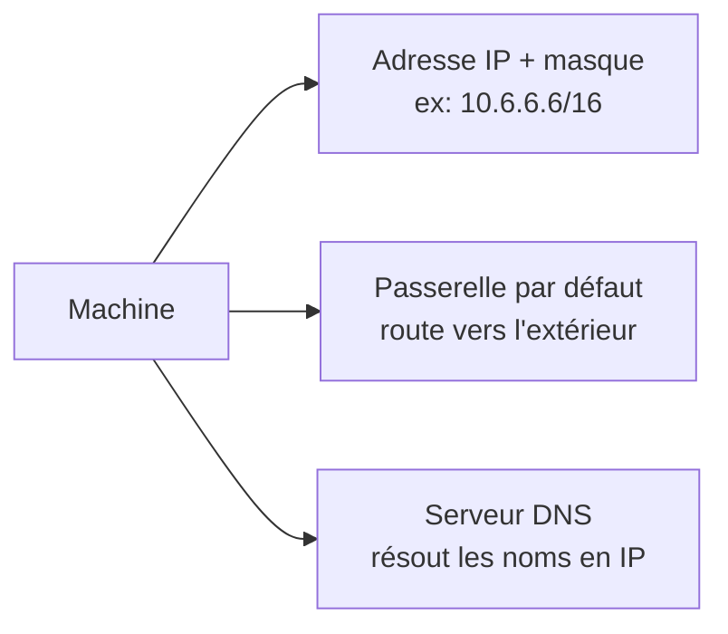

### Consulter la configuration

| Besoin | Commande / fichier |
|---|---|
| Voir les **adresses IP** | `ip a` |
| Voir la **route par défaut** (passerelle) | `ip r` |
| Voir les **serveurs DNS** | `cat /etc/resolv.conf` (lignes `nameserver`) |

Exemple de sortie de `ip a` : `inet 10.6.6.6/16` sur l'interface `ens33` signifie « adresse 10.6.6.6, masque /16 ». L'interface `lo` (127.0.0.1) est la boucle locale.

### Configurer

- Le service **NetworkManager** gère le réseau.
- **Sans interface graphique** : `nmtui` (menus dans le terminal) ou `nmcli` (ligne de commande).
- **Avec interface graphique** : Activités, puis Réseau.
- Après une modification : `systemctl restart NetworkManager`.

!!! tip "Bonus"
    `nmcli device status` liste les interfaces et leur état ; `nmcli connection show` liste les connexions configurées.

---

## 6. Les paquets (dnf, rpm)

Sous Linux, on n'installe pas les logiciels en téléchargeant des `.exe` au hasard : ils viennent de **dépôts** officiels, avec **signature** et **gestion des dépendances**. C'est le même principe qu'un « store », mais qui existe depuis les années 2000.

Avantages : logithèque centralisée et signée (**GPG**), installation facile avec dépendances automatiques, mise à jour et suppression simples.

### 6.1 Les briques

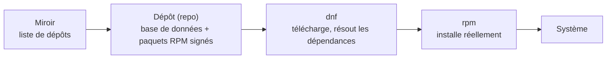

| Brique | Définition |
|---|---|
| **Paquet RPM** | Archive contenant le logiciel compilé, ses **scripts** (pre/post-installation), la **liste de ses fichiers**, sa **description** et une **signature GPG** |
| **Groupe de paquets** | Un RPM qui liste d'autres RPM (ex : « Outils de développement ») |
| **Dépôt (repository)** | Site web contenant une mini base de données des paquets + les RPM signés |
| **Miroir (mirror)** | Page web listant plusieurs serveurs de dépôts ; **facultatif** |

### 6.2 Fichiers de configuration

- `/etc/yum.conf` : comportement général de yum/dnf.
- Les dépôts se déclarent dans des fichiers **`.repo`** placés dans le dossier des dépôts.

!!! warning "Piège"
    Le cours écrit `/etc/yum.repo.d`, mais le vrai dossier est **`/etc/yum.repos.d/`** (avec un « s »).

Structure d'un fichier `.repo` :

```ini
[ol8_baseos_latest]
name=Oracle Linux 8 BaseOS Latest ($basearch)
baseurl=https://yum$ociregion.oracle.com/repo/OracleLinux/OL8/baseos/latest/$basearch/
gpgcheck=1
gpgkey=file:///etc/pki/rpm-gpg/RPM-GPG-KEY-oracle
enabled=1
```

| Ligne | Rôle |
|---|---|
| `[nom]` | Identifiant du dépôt, **unique** |
| `name=` | Nom lisible |
| `baseurl=` | Adresse **d'un** serveur de dépôt |
| `mirrorlist=` | Adresse d'une **liste** de miroirs |
| `gpgcheck=1` ou `0` | Vérifier (ou non) la signature des RPM |
| `gpgkey=` | Clé publique servant à vérifier les signatures |
| `enabled=1` ou `0` | Dépôt actif ou non (absent = actif) |

!!! warning "Piège"
    `mirrorlist` et `baseurl` **ne doivent pas être actifs en même temps** dans un même dépôt. On peut ajouter des dépôts tiers comme **EPEL**.

### 6.3 dnf : l'outil du quotidien

`dnf` (successeur de `yum`) interroge d'abord sa **base de données locale** (cache, rafraîchi automatiquement s'il a plus de 6 h) pour ne pas solliciter les dépôts à chaque commande. Pour installer, il télécharge le paquet **avec ses dépendances** puis appelle `rpm`.

| Action | Commandes |
|---|---|
| **Lister les dépôts** | `dnf repolist` ; `dnf repolist all` |
| **Chercher / s'informer** | `dnf list installed` ; `dnf list available` ; `dnf search <mot>` ; `dnf info <paquet>` ; `dnf grouplist` |
| **Trouver quel paquet fournit un fichier** | `dnf provides "*/fichier"` |
| **Installer** | `# dnf install <paquet>` ; `# dnf install <fichier.rpm>` ; `# dnf groupinstall "<groupe>"` |
| **Supprimer** | `# dnf remove <paquet>` ; `# dnf remove @"<groupe>"` |
| **Mettre à jour** | `# dnf upgrade` (tout) ; `# dnf upgrade <paquet>` ; `# dnf check-upgrade` (vérifier sans installer) |
| **Historique** | `dnf history` ; `dnf history info <n°>` ; `# dnf history undo <n°>` ; `# dnf history redo <n°>` |
| **Vider le cache** | `dnf clean all` |

Limite : on ne peut pas avoir **plusieurs versions** du même logiciel.

### 6.4 rpm : la commande de bas niveau

`rpm` installe un fichier `.rpm` **déjà téléchargé**, mais **ne télécharge pas** les dépendances (il prévient si elles manquent).

```bash
# rpm -vUh paquet.rpm     # installer OU mettre à jour (-v détails, -U update/install, -h barre de progression)
# rpm -e nom_court        # supprimer (utiliser le nom court, pas le nom complet du RPM)
$ rpm -q programme        # le paquet est-il installé ?
$ rpm -qi programme       # informations sur un paquet installé
$ rpm -qp fichier.rpm     # interroger un fichier RPM non installé
```

Red Hat recommande `-U` plutôt que `-i` car il fonctionne à la fois pour installer et mettre à jour.

!!! tip "Bonus"
    `rpm -qf /usr/sbin/sshd` indique **à quel paquet** appartient un fichier ; `rpm -ql <paquet>` liste tous ses fichiers ; `rpm -qc <paquet>` liste ses **fichiers de configuration**. Très utile pour retrouver le fichier de configuration d'un démon.

### 6.5 Installer à partir des sources

Dernier recours : on récupère le **code source** et on le compile soi-même (pour avoir la dernière version ou une configuration très précise).

!!! warning "Piège"
    **Toujours compiler avec un utilisateur normal, jamais en root.** Seule la dernière étape (`make install`) se fait en root.

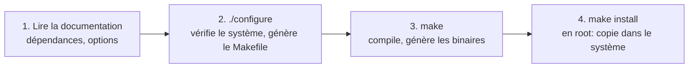

Inconvénients : il faut les outils de compilation, gérer **à la main** les dépendances et créer soi-même les scripts de service. Deux types de dépendances :

- **Fonctionnelles** : nécessaires pour faire tourner le programme.
- **De compilation** : bibliothèques de développement, paquets nommés `xxx-devel`.

Quand la compilation dit `Couldn't find superlib.so`, on cherche le paquet qui contient ce fichier : `dnf provides "*/superlib.so"`.

Les sources ne sont pas certifiées comme les paquets de la distribution : risque de bugs ou de malwares.

### 6.6 Comparatif

| | **dnf** | **rpm** | **Sources** |
|---|---|---|---|
| Télécharge | Oui | Non | Non (on récupère le code) |
| Gère les dépendances | Oui, automatiquement | Les signale seulement | À la main |
| Signature vérifiée | Oui (dépôt) | Oui (si la clé est là) | Non |
| Dernière version | Selon le dépôt | Selon le fichier | Toujours possible |
| Facilité | Très facile | Facile | Difficile |

---

## 7. Le stockage

### 7.1 Partitionner un disque

Sous Linux, un disque est un **périphérique bloc** dans `/dev`. Deux normes de table de partitions :

| | **MBR** (1983) | **GPT** (2013) |
|---|---|---|
| Emplacement | 512 premiers octets du disque | Table dédiée |
| Contenu | 446 octets de **boot loader** (stage 1 de GRUB) + 64 octets de **table de partitions** (+ 2 octets de signature) | Table de partitions étendue |
| Partitions | **4 primaires** max (ou 3 primaires + 1 **étendue** contenant les partitions **logiques**) | 128 (voire 256) |
| Taille maxi | **2,2 To** | 9,4 Zo |

**Nommage** (à connaître par cœur) :

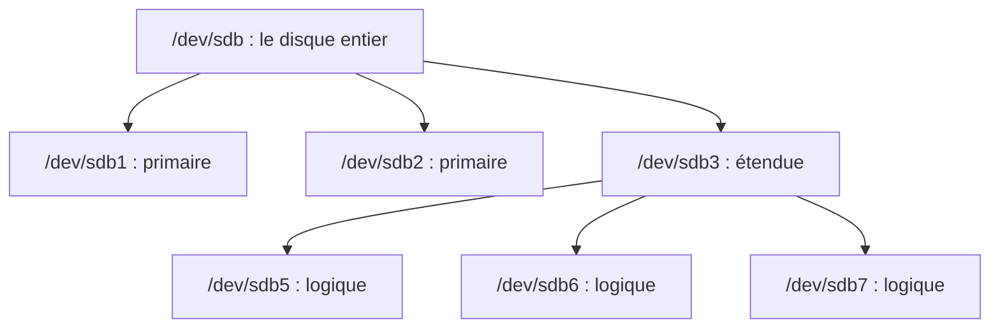

- `sda`, `sdb`... : 1er, 2e disque (SCSI/SATA). Les numéros **1 à 4** sont réservés aux partitions primaires (et à l'étendue) ; les **logiques commencent toujours à 5**.
- Disque **NVMe** : `/dev/nvme0n1p1` = périphérique `nvme0`, disque `n1`, partition `p1`.

**fdisk** : outil de partitionnement (`parted`, `sfdisk`, `cfdisk`, `gparted` existent aussi).

```bash
# fdisk -l /dev/sda        # afficher la table de partitions
# fdisk /dev/sdb           # partitionner de façon interactive
```

Touches importantes dans fdisk :

| Touche | Action |
|---|---|
| `m` | Aide |
| `p` | Afficher la table |
| `n` | Nouvelle partition (`p` primaire ou `e` étendue, numéro, début, taille avec `+20G`) |
| `d` | Supprimer une partition |
| `t` | Changer le **type** (ex : `8e` = Linux LVM, `83` = Linux) |
| `g` / `o` | Créer une table **GPT** / **DOS** (MBR) |
| `w` | **Écrire** les modifications et quitter |
| `q` | Quitter **sans** enregistrer |

!!! warning "Piège"
    Tant qu'on n'a pas tapé `w`, **rien n'est écrit** sur le disque. Après `w`, c'est définitif.

### 7.2 LVM : Logical Volume Manager

Le partitionnement classique est rigide : on ne peut agrandir une partition qu'**à froid** et avec de l'espace **contigu**. **LVM** ajoute une couche logique souple.

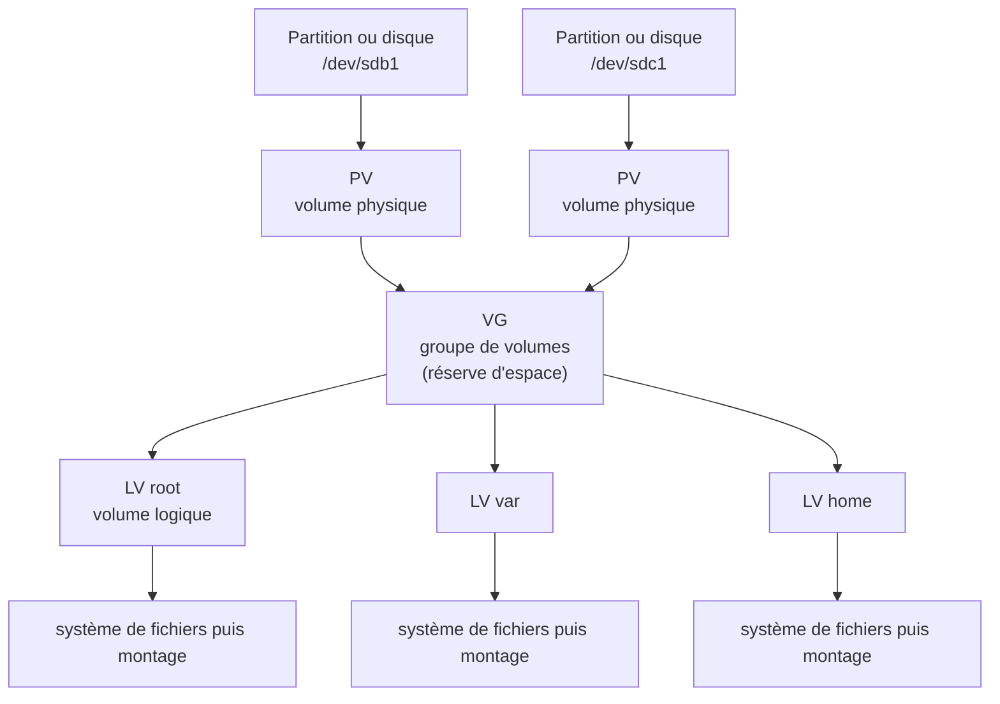

- **PV** (Physical Volume) : partition/disque intégré à LVM.
- **VG** (Volume Group) : regroupe un ou plusieurs PV.
- **LV** (Logical Volume) : « partition » découpée dans un VG, qu'on formate et monte.

Les commandes suivent toujours la même logique : `pv...`, `vg...`, `lv...` + `create`, `display`, `extend`, `reduce`, `remove`.

**Prérequis** : donner à la partition le type **`8e` (Linux LVM)** avec `fdisk`.

```bash
# pvcreate /dev/sdb1                          # créer un PV
# vgcreate vggroup1 /dev/sdb1                 # créer un VG (on peut mettre plusieurs PV)
# lvcreate -n lv1 -L 150M vggroup1            # créer un LV (-n nom, -L taille)
# vgextend vggroup1 /dev/sdb2                 # ajouter un PV au VG
# lvextend -L +400M /dev/vggroup1/lv1         # AJOUTER 400 Mo au LV
# lvextend -L 1G /dev/vggroup1/lv1            # FIXER la taille à 1 Go
```

Un LV est accessible via `/dev/<vg>/<lv>` **ou** `/dev/mapper/<vg>-<lv>`.

!!! warning "Piège : agrandir le LV ne suffit pas"
    Après `lvextend`, le **système de fichiers** ne grandit pas tout seul. Il faut l'agrandir aussi :

    - ext4 : `# resize2fs /dev/vggroup1/lv1`
    - XFS : `# xfs_growfs /point/de/montage` (XFS peut **grandir** mais **pas être réduit**)

**Afficher les informations** : résumé avec `pvs`, `vgs`, `lvs` ; détail avec `pvdisplay`, `vgdisplay`, `lvdisplay`.

### 7.3 Les systèmes de fichiers

Un système de fichiers est découpé en **blocs** (4 Ko par défaut). Sans système de fichiers, un périphérique est inutilisable : c'est le **formatage** (`mkfs`) qui l'installe.

**Le superbloc** contient les informations vitales (taille des blocs, taille du système de fichiers, dernier montage, pointeur vers l'inode racine...). Il est **dupliqué** à plusieurs endroits par sécurité.

**Les inodes** : un inode décrit **un fichier** (type, droits, nombre de liens, UID, GID, taille, dates `atime`/`ctime`/`mtime`, adresses des blocs de données).


!!! note "À retenir"
    **Le nom du fichier n'est pas dans l'inode** : il est dans le répertoire qui contient le fichier. Un fichier est considéré supprimé quand son nombre de liens physiques tombe à 0.

| Système de fichiers | À retenir |
|---|---|
| **XFS** | **Par défaut** sur RHEL depuis la 7 ; 64 bits, **journalisé**, pour gros disques et beaucoup de fichiers |
| **ext2 / ext3 / ext4** | ext3 = ext2 + **journalisation** (meilleure récupération après une extinction brutale) ; ext4 peu fragmenté grâce à la pré-allocation de blocs contigus |
| Autres | NTFS, FAT... supportés ; Btrfs installable |

!!! note "Précision"
    Le cours dit que ext4 est le défaut sur RHEL 9 ; en réalité, RHEL utilise **XFS par défaut** aussi en RHEL 8 et 9. Retiens : **XFS par défaut sur RHEL**.

**Outils de gestion :**

| Besoin | Commande |
|---|---|
| Créer (formater) | `mkfs.<type> /dev/...` (ex : `mkfs.xfs`, `mkfs.ext4`) |
| XFS : modifier / agrandir / espace / quotas | `xfs_admin`, `xfs_growfs`, `xfs_spaceman`, `xfs_quota` |
| ext : modifier (label, vérifications) / lire le superbloc | `tune2fs` (`-L` étiquette, `-l` superbloc) |
| ext : redimensionner | `resize2fs` |
| Vérifier ext | `fsck.<type>` (ex : `fsck.ext4`) |
| Vérifier **XFS** | `xfs_repair` |

!!! warning "Piège"
    Sur XFS, **`fsck.xfs` ne fait rien** : il faut utiliser `xfs_repair`.

**Prendre des informations :**

```bash
# blkid                    # UUID, type et étiquette des périphériques formatés
$ lsblk                    # arborescence disques, partitions, LVM, points de montage
$ lsblk -f                 # idem avec type de système de fichiers et UUID
```

### 7.4 Monter un système de fichiers

Sous Linux, un système de fichiers devient accessible en **montant** son périphérique sur un **répertoire** : le **point de montage**.

!!! warning "Piège"
    Le contenu du répertoire choisi devient **inaccessible** tant qu'on monte dessus. Utilise donc un répertoire **vide**. Pour un montage temporaire, le cours conseille **`/mnt`**.

```bash
# mount -t ext4 /dev/sdb1 /mnt      # monter (-t : type, -o : options)
# umount /mnt                       # démonter
$ findmnt                           # arbre des montages
$ findmnt /mnt                      # infos sur un seul point de montage
$ mount                             # liste (peu lisible, mais montre les options)
```

**Options de montage** (`-o`, séparées par des virgules) :

| Options | Défaut | Effet |
|---|---|---|
| `sync` / `async` | `async` | Écriture immédiate ou via tampon RAM |
| `exec` / `noexec` | `exec` | Autorise (ou non) l'exécution de programmes |
| `ro` / `rw` | `rw` | Lecture seule ou lecture-écriture |
| `suid` / `nosuid` | `suid` | Autorise (ou non) le SUID |
| `dev` / `nodev` | `dev` | Interprète (ou non) les fichiers de périphériques |
| `user` / `nouser` | `nouser` | (fstab) Un utilisateur simple peut monter |
| `auto` / `noauto` | `auto` | (fstab) Monté (ou non) automatiquement au démarrage |
| `remount` | ; | (mount) **Change** les options sans démonter |

### 7.5 Montage automatique : `/etc/fstab`

Les montages du démarrage sont déclarés dans **`/etc/fstab`**, lu par systemd au début du boot. Une ligne = 6 colonnes :

```text
# <file system>                              <mount point>  <type>  <options>  <dump> <pass>
/dev/mapper/ol-root                          /              xfs     defaults   0      0
UUID=32a0cf22-91d5-4082-9b69-548810a16c45    /boot          xfs     defaults   0      0
/dev/mapper/ol-swap                          none           swap    defaults   0      0
```

| Colonne | Signification |
|---|---|
| **file system** | La source : **UUID** (le plus sûr), **LABEL** (pratique mais doublons possibles) ou chemin du périphérique (bien pour **LVM**, **déconseillé** pour `/dev/sdb1`) |
| **mount point** | Répertoire de montage (`none` pour le swap) |
| **type** | Type du système de fichiers (`auto` est possible mais ralentit) |
| **options** | Options de montage ; `defaults` = `async,nouser,exec,rw,auto,suid,dev` |
| **dump** | Presque inutilisé |
| **pass** | Vérification au boot : `0` aucune, `1` pour la racine, `2` pour les autres |

!!! warning "Piège : tester le fstab sans risque"
    Après avoir ajouté une ligne, teste-la **avant de redémarrer** avec `mount /point/de/montage` (uniquement le point de montage). Aucun message = c'est bon. Le cours **déconseille `mount -a`**, qui essaie de monter toutes les entrées, pas seulement la nouvelle.

### 7.6 Procédure complète : ajouter un nouveau disque

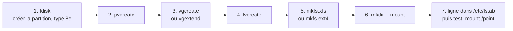

### 7.7 Espace disque : `df` et `du`

```bash
$ df -h                # espace des systèmes de fichiers montés (-h : unités lisibles, -i : inodes)
$ du -hs /etc          # taille d'un RÉPERTOIRE (-s : total seulement)
```

!!! warning "Piège"
    `ls -l` ne donne **pas** la taille d'un répertoire (juste celle de son inode) : il faut `du`.

---

## 8. Utilisateurs et groupes

### 8.1 Les identifiants

Chaque utilisateur a un **UID** (identifiant utilisateur) et un **GID** (identifiant de son groupe principal). Il peut aussi appartenir à des **groupes secondaires**. Le groupe principal est celui associé à la session à la connexion.

| Type | UID / GID | Rôle |
|---|---|---|
| **root** | 0 | Administrateur : tout-puissant. On évite de s'y connecter directement |
| **Comptes de service** (daemons) | 1 à 999 | Font tourner les services (99 % des services ne tournent **pas** en root, par sécurité) |
| **Utilisateurs humains** | 1000 et plus | Comptes des personnes |

### 8.2 Les quatre fichiers à connaître

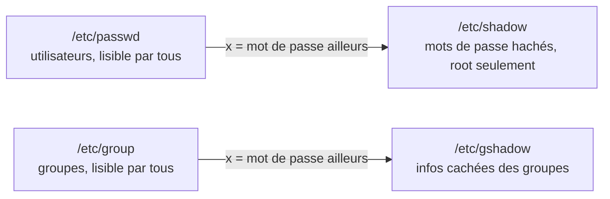

**`/etc/passwd`** : une ligne par utilisateur, 7 champs séparés par `:`

```text
penthium:x:1000:1000:penthium,666,666,:/home/penthium:/bin/bash
nom : mdp(x) : UID : GID : nom complet : répertoire personnel : shell
```

- `x` : le hash du mot de passe est dans `/etc/shadow`.
- Nom complet modifiable avec `chfn` ; shell modifiable avec `chsh`.
- Un shell `/usr/sbin/nologin` empêche la connexion (comptes de service).

**`/etc/group`** : `nomdugroupe : x : GID : membres,secondaires`

**`/etc/shadow`** : 9 champs séparés par `:`

```text
nom : hash : dernier changement : âge mini : âge maxi : avertissement : inactivité : fin de validité du compte : réservé
```

Le champ **hash** est lui-même découpé en 3 par `$` : `$6$sel$empreinte`

| Partie | Rôle |
|---|---|
| `$1$` MD5, `$2a$` Blowfish, `$5$` SHA-256, **`$6$` SHA-512** | Algorithme de hachage |
| **Sel** (*salt*) | Chaîne aléatoire ajoutée **avant** le hachage : deux utilisateurs avec le même mot de passe ont des hashs **différents** |
| Empreinte | Résultat du hachage |

Valeurs particulières du champ hash : `*` ou `!` = connexion par mot de passe **impossible** ; `!` devant un hash = mot de passe **verrouillé**.

| Champ de vieillissement | Sens |
|---|---|
| Dernier changement | Nombre de jours depuis le 1er janvier 1970. **0 = changement forcé** à la prochaine connexion |
| Âge minimum / maximum | Délai avant de pouvoir changer / obligation de changer |
| Avertissement | Jours de prévenance avant expiration |
| Inactivité | Jours pendant lesquels le mot de passe reste accepté après expiration |
| Fin de validité du compte | Date d'expiration du **compte** (différente de celle du mot de passe) |

### 8.3 Commandes

**Groupes**

```bash
# groupadd -g 2000 compta        # créer un groupe (-g : GID)
# groupmod -n nouveau ancien     # renommer (-n) ; -g change le GID (attention aux fichiers orphelins)
# groupdel compta                # supprimer (le groupe ne doit plus être groupe principal d'un utilisateur)
# gpasswd -a alice compta        # ajouter alice au groupe
# gpasswd -d alice compta        # retirer alice du groupe
```

**Utilisateurs**

```bash
# useradd -m -u 2001 -g users -G compta,wheel -s /bin/bash alice
# usermod -aG compta alice       # AJOUTER un groupe secondaire
# usermod -L alice               # verrouiller le mot de passe (ajoute ! devant le hash)
# usermod -U alice               # déverrouiller
# usermod -e 2026-12-31 alice    # date d'expiration du compte
# userdel -r alice               # supprimer l'utilisateur ET son répertoire personnel
# passwd alice                   # changer le mot de passe
# passwd -e alice                # forcer le changement à la prochaine connexion
# passwd -l alice                # verrouiller ; -u déverrouille
# chage -l alice                 # afficher/modifier les champs de vieillissement (si installé)
```

| Option `useradd` | Rôle |
|---|---|
| `-m` / `-M` | Créer / ne pas créer le répertoire personnel (sur RHEL, créé **automatiquement** par défaut) |
| `-d` | Chemin du répertoire personnel |
| `-u` | UID (sinon le plus petit disponible) |
| `-g` | Groupe **principal** (sinon un groupe du nom de l'utilisateur est créé) |
| `-G` | Groupes **secondaires**, séparés par des virgules |
| `-s` | Shell (chemin absolu) |
| `-r` | Compte **système** (service) |

!!! warning "Piège : `usermod -G` sans `-a`"
    `usermod -G groupe user` **remplace** tous les groupes secondaires. Pour en **ajouter** un sans perdre les autres : **`usermod -aG groupe user`**.

Fichiers de configuration : `/etc/default/useradd` (valeurs par défaut, affichables avec `useradd -D`), `/etc/login.defs`, et `/etc/skel` (modèle copié dans chaque nouveau répertoire personnel).

### 8.4 Changer d'identité et élever ses privilèges

| | **`su`** | **`sudo`** |
|---|---|---|
| Principe | Devenir un autre utilisateur | Exécuter **une commande** avec les droits d'un autre (root par défaut) |
| Mot de passe demandé | Celui de l'**utilisateur cible** | Celui de **l'utilisateur lui-même** |
| Devenir root | `su -` | `sudo -i` |
| Configuration | Aucune | `/etc/sudoers` ; ou ajouter l'utilisateur au groupe **`wheel`** (= tous les privilèges) |

- `su -` (ou `-l`) reproduit une connexion complète (environnement de l'utilisateur cible).
- `su -c 'commande'` exécute une commande.
- `sudo` mémorise l'authentification **5 minutes** par défaut.
- Avec `sudo`, on peut **déléguer** des tâches précises (gérer les comptes, faire les sauvegardes...) sans donner root.

!!! note "Note sur les exemples du cours"
    L'exemple `sudo apt update` du cours est un reste de Debian. Sur Oracle Linux / RHEL, on utilise **`sudo dnf ...`**.

---

## 9. Droits sur les fichiers

Les droits sont stockés dans l'**inode**, en trois catégories : **u**ser (propriétaire), **g**roup (groupe propriétaire), **o**thers (les autres).

```text
 -  rwx  r-x  r--     ←  ls -l affiche ces 10 caractères
 │   │    │    │
 │   │    │    └── others : lecture seule
 │   │    └─────── group  : lecture + exécution
 │   └──────────── user   : lecture + écriture + exécution
 └──────────────── type : - fichier, d répertoire, l lien, b/c périphérique, p tube, s socket
```

| Droit | Octal | Sur un **fichier** | Sur un **répertoire** |
|---|---|---|---|
| **r** (lecture) | 4 | Lire le contenu (`cat`) | **Lister** le contenu (`ls`) |
| **w** (écriture) | 2 | Modifier le contenu | **Créer, renommer, supprimer** des fichiers dedans (`mkdir`, `cp`, `rm`) |
| **x** (exécution) | 1 | Exécuter (programme, script) | **Traverser** le dossier, y accéder (`cd`) |

!!! warning "Piège"
    Avec `w` sur un **répertoire**, on peut supprimer ou renommer les fichiers qu'il contient **même s'ils appartiennent à quelqu'un d'autre**. D'où le sticky bit sur `/tmp` (voir plus bas).

Le droit octal est la **somme** : `rwx` = 4+2+1 = **7**, `r-x` = 5, `rw-` = 6, `r--` = 4. Donc `rwxr-xr--` = **754**.

### 9.1 Modifier les droits et les propriétaires

```bash
# chmod 770 /data/commun            # notation octale (absolue)
# chmod g+w,o-rx /data/commun       # notation symbolique (relative : + ajoute, - retire, = fixe)
# chmod -R 770 /data/commun         # -R : récursif (à utiliser avec réflexion)
# chown penthium:users /data        # changer propriétaire ET groupe
# chown :users /data/commun         # changer seulement le groupe
```

Symboles : `u g o a` (a = tous), `r w x`, et `X` (exécution seulement pour les répertoires ou fichiers déjà exécutables).

### 9.2 umask : les droits par défaut à la création

L'**umask** est **soustrait** des droits maximaux : **666** pour un fichier, **777** pour un répertoire.

| umask | Fichier créé | Répertoire créé |
|---|---|---|
| `022` (root, comptes de service) | 666 − 022 = **644** | 777 − 022 = **755** |
| `002` (utilisateurs standards RHEL) | 666 − 002 = **664** | 777 − 002 = **775** |
| `007` | **660** | **770** |

```bash
$ umask            # afficher le masque courant
$ umask 0007       # le modifier (pour la session)
```

Pour le rendre permanent, on ajoute la commande `umask` dans `~/.bashrc`.

!!! note "Astuce"
    Les fichiers n'ont jamais le droit `x` à la création : c'est pour ça que le maximum est 666 et pas 777.

### 9.3 Droits spéciaux

| Droit | Octal | Sur un fichier | Sur un répertoire | Symbole |
|---|---|---|---|---|
| **SetUID** | 4--- | S'exécute avec les droits du **propriétaire** (ex : `/usr/bin/passwd`) | Non utilisé | `s` dans la colonne user (`S` si pas de `x`) |
| **SetGID** | 2--- | S'exécute avec les droits du **groupe** | Les fichiers créés **héritent du groupe du dossier** (projets partagés) | `s` dans la colonne group |
| **Sticky bit** | 1--- | (usage historique, ignoré) | Chacun ne peut supprimer **que ses propres fichiers** (et root) : ex `/tmp` | `t` dans la colonne others (`T` si pas de `x`) |

```bash
# chmod 2770 /data/projet       # SetGID + rwxrwx---
# chmod +t /data/depot          # sticky bit
# chmod u+s /usr/local/bin/x    # SetUID
```

Majuscule (`S`, `T`) = le droit spécial est posé **mais sans `x`** en dessous.

---

## 10. Services et journaux

### 10.1 Gérer les services avec `systemctl`

Un **service** (ou *démon*) est un programme qui tourne en arrière-plan. `systemctl` pilote les **unités** systemd.

```bash
# systemctl status crond          # état + derniers logs (q pour quitter)
# systemctl start crond           # démarrer maintenant
# systemctl stop crond            # arrêter maintenant
# systemctl restart crond         # arrêter puis redémarrer
# systemctl enable crond          # démarrer AUTOMATIQUEMENT au boot
# systemctl disable crond         # ne plus démarrer au boot
$ systemctl is-enabled crond      # enabled / disabled
# systemctl enable --now crond    # enable + start en une commande
$ systemctl list-units            # lister les unités chargées (--all pour toutes)
```

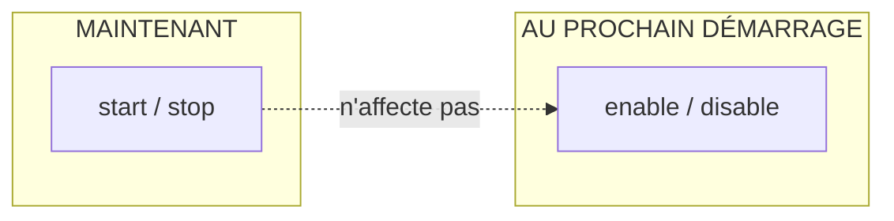

!!! warning "Piège : `start` ≠ `enable`"
    - `start` / `stop` agissent **maintenant**, mais sont oubliés au redémarrage.
    - `enable` / `disable` agissent **au prochain démarrage** (création/suppression d'un lien dans `/etc/systemd/system/multi-user.target.wants/`) mais **ne démarrent ni n'arrêtent** le service tout de suite.

### 10.2 Retrouver les éléments d'un service (atelier 4)

Exemple avec le service SSH (sous Oracle Linux, il s'appelle **`sshd`**, pas `ssh`) :

| Élément | Où le trouver | Pour `sshd` |
|---|---|---|
| **Fichier de configuration systemd** | `systemctl status sshd` (ligne `Loaded:`) ou `systemctl show -p FragmentPath sshd` | `/usr/lib/systemd/system/sshd.service` |
| **Binaire exécuté** | Ligne `ExecStart=` du fichier ci-dessus (`systemctl cat sshd`) | `/usr/sbin/sshd` |
| **Fichier de configuration du démon** | `rpm -qc openssh-server`, `man sshd` (section FILES), ou `ls /etc/ssh/` | `/etc/ssh/sshd_config` |

- `sshd_config` configure le **serveur** ; `ssh_config` configure le **client**.
- Pour **modifier** le fichier systemd, on le copie dans `/etc/systemd/system/sshd.service` (prioritaire), ou on utilise `systemctl edit --full sshd`.

**Service cron** (planification de tâches), nom : **`crond`**. Sujet de l'atelier : vérifier `systemctl is-enabled crond`, désactiver `systemctl disable crond`, redémarrer et vérifier (`inactive`, `disabled`), puis restaurer avec `systemctl enable crond` (et `start`).

### 10.3 Les journaux (logs) : deux services

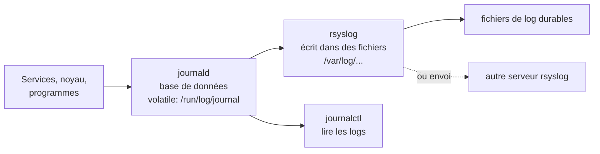

- **journald** (via systemd) : reçoit les logs de **tout** ce que systemd gère. `systemctl status <service>` en affiche les dernières lignes. Configuration : `/etc/systemd/journald.conf`. Par défaut la base est **volatile** (perdue au redémarrage).
- **rsyslog** : reçoit les logs de journald et les **conserve dans des fichiers** (durable).

### 10.4 `journalctl`

```bash
# journalctl                          # tout (navigation comme less)
# journalctl -f                       # suivre en temps réel
# journalctl -u sshd                  # logs d'un service (-u : unit)
# journalctl _PID=1                   # logs d'un processus (PID)
# journalctl /usr/sbin/sshd           # logs d'un programme (son chemin)
# journalctl -p err                   # par priorité (et plus grave)
# journalctl -f /usr/sbin/sshd -p info   # options cumulables
```

**Priorités**, de la plus grave à la moins grave : `emerg` (0), `alert`, `crit`, `err`, `warning`, `notice`, `info`, `debug` (7).

!!! tip "Bonus"
    `journalctl -b` n'affiche que les logs du **démarrage en cours** ; `journalctl -b -1` ceux du démarrage précédent (si les logs sont persistants).

### 10.5 rsyslog : facilities et priorités

rsyslog trie les messages avec une **facility** (source) et une **priorité**, et déclenche une **action** (le plus souvent écrire dans un fichier) :

| Facility | Usage |
|---|---|
| `auth`, `authpriv` | Authentification, contrôle d'accès (SSH...) |
| `daemon` | Processus système et applicatifs |
| `kern` | Noyau |
| `mail` | Services de messagerie |
| `user` | Par défaut |
| `local0` à `local7` | Libres, pour des programmes |
| `*` / `none` | Toutes / aucune |

Règles dans `/etc/rsyslog.conf` : `facility.priorité   fichier`

```text
auth,authpriv.*                 /var/log/auth.log
*.*;auth,authpriv.none          -/var/log/syslog
kern.*                          -/var/log/kern.log
```

Le `-` devant un chemin rend l'écriture **asynchrone**.

**Tester avec `logger`** : `# logger -p cron.info "message de test"` envoie un message à journald et rsyslog.

### 10.6 Conserver et limiter les logs

- **Rendre journald durable** : créer le dossier `/var/log/journal` (puis redémarrer `systemd-journald` pour être sûr qu'il le prenne en compte).
- **Limiter l'espace** : dans `/etc/systemd/journald.conf`, `SystemMaxUse=` (taille maximale totale) et `SystemMaxFileSize=` (taille par fichier). Par défaut, journald utilise **10 %** du système de fichiers.
- Si on garde tout dans journald, on peut arrêter rsyslog pour éviter les **doublons** : `systemctl disable rsyslog`.
- Certaines informations doivent être conservées un temps légal (ex : logs d'activité Internet en France).

---

## 11. Analyser le système

| Besoin | Commande |
|---|---|
| Version du système | `cat /etc/redhat-release` |
| Version du noyau et architecture | `uname -a` |
| Type de processeur | `lscpu` |
| Périphériques PCI / USB | `lspci` / `lsusb` |
| Disques, LVM, systèmes de fichiers | `fdisk -l`, `pvs`, `vgs`, `lvs`, `df -h`, `lsblk`, `blkid` |
| Taille d'un répertoire | `du -hs /chemin` |
| Détail d'un fichier / **nature** d'un fichier | `ls -l fichier` / `file fichier` |
| Qui utilise les fichiers d'un dossier | `lsof /chemin` |
| Processus en **temps réel** | `top` (natif) ; `htop`, `atop`, `glances` (à installer) |
| Lister les processus | `ps -ef` |
| Chercher un processus par nom (regex) | `pgrep -l <motif>` |
| Mémoire RAM et swap | `free -h` |

Les outils **proactifs** surveillent en continu (top, atop, glances) ; les outils **réactifs** servent après un incident (lecture des logs).

Lecture rapide de **`top`** : la 1re ligne donne le nombre de tâches ; `%Cpu(s)` la charge processeur (`id` = idle, inoccupé) ; `KiB Mem` / `KiB Swap` la mémoire ; en dessous, la liste des processus par consommation.

---

## 12. Aide-mémoire final et auto-évaluation

### 12.1 Fichiers importants

| Fichier | Rôle |
|---|---|
| `/etc/default/grub` | Paramètres de GRUB (à modifier) |
| `/boot/grub2/grub.cfg` | Config GRUB générée (**ne pas éditer**) |
| `/boot/loader/entries/` | Entrées du menu GRUB |
| `/usr/lib/systemd/system/` | Fichiers de services d'origine |
| `/etc/systemd/system/` | Fichiers de services personnalisés (**prioritaires**), `default.target` |
| `/etc/fstab` | Montages automatiques |
| `/etc/passwd`, `/etc/shadow` | Utilisateurs / mots de passe hachés |
| `/etc/group`, `/etc/gshadow` | Groupes |
| `/etc/sudoers` | Droits sudo (groupe `wheel`) |
| `/etc/resolv.conf` | Serveurs DNS |
| `/etc/yum.conf`, `/etc/yum.repos.d/` | Configuration de dnf, fichiers `.repo` |
| `/etc/rsyslog.conf` | Règles de journalisation |
| `/etc/systemd/journald.conf` | Configuration de journald |
| `/etc/ssh/sshd_config` | Configuration du serveur SSH |
| `/etc/default/useradd`, `/etc/skel` | Défauts de `useradd`, modèle de répertoire personnel |

### 12.2 Auto-évaluation

Essaie de répondre **avant** d'ouvrir la réponse.

??? question "1. Pourquoi ne faut-il pas modifier `/boot/grub2/grub.cfg` directement ?"
    Il est **régénéré automatiquement** (mise à jour du noyau, par exemple). On modifie `/etc/default/grub` (ou `/etc/grub.d/`) puis on lance `grub2-mkconfig -o /boot/grub2/grub.cfg`.

??? question "2. Quelle différence entre `systemctl set-default` et `systemctl isolate` ?"
    `set-default` change la cible utilisée à **chaque démarrage** ; `isolate` change de cible **immédiatement** mais n'est **pas conservé** au redémarrage.

??? question "3. Comment démarrer en mode maintenance sans connaître le mot de passe root ?"
    Dans GRUB (touche `e`), remplacer `rhgb quiet` par `init=/bin/bash`, `Ctrl+x`, puis `mount -o remount,rw /`. Pense à `load_policy -i`, `touch /.autorelabel` et `sync`, puis extinction forcée.

??? question "4. Pourquoi faut-il `mount -o remount,rw /` dans ce mode ?"
    Parce que la racine est montée en **lecture seule** (`ro` sur la ligne du noyau).

??? question "5. Quelle est la différence entre un PV, un VG et un LV ?"
    **PV** : partition/disque intégré à LVM. **VG** : réserve d'espace regroupant des PV. **LV** : « partition » découpée dans le VG, qu'on formate et monte.

??? question "6. Tu as agrandi un LV avec `lvextend`, mais `df -h` montre toujours l'ancienne taille. Pourquoi ?"
    Le **système de fichiers** n'a pas été agrandi : `resize2fs` pour ext4, `xfs_growfs` pour XFS.

??? question "7. Comment vérifier un système de fichiers XFS ?"
    Avec **`xfs_repair`** : `fsck.xfs` ne fait rien.

??? question "8. Comment tester une nouvelle ligne de `/etc/fstab` sans risque ?"
    `mount /point/de/montage` (uniquement ce point). Le cours déconseille `mount -a`, qui tente tout.

??? question "9. Quelle est la différence entre `dnf` et `rpm` ?"
    `dnf` **télécharge** depuis les dépôts et **résout les dépendances**, puis appelle `rpm`. `rpm` installe un fichier local et **ne télécharge pas** les dépendances.

??? question "10. Que signifie `!` au début du hash dans `/etc/shadow` ?"
    Le mot de passe est **verrouillé** (`usermod -L` / `passwd -l`).

??? question "11. Tu veux ajouter `alice` au groupe `compta` sans lui retirer ses autres groupes secondaires. Quelle commande ?"
    `usermod -aG compta alice` (sans `-a`, les autres groupes secondaires seraient remplacés).

??? question "12. Quels droits (en octal) donnent `rwxr-x---` ? Et quel umask produit ces droits sur un répertoire ?"
    **750**. Sur un répertoire, 777 − 027 = 750 : umask **027**.

??? question "13. À quoi sert le sticky bit sur un répertoire comme `/tmp` ?"
    Chacun ne peut supprimer/renommer que **ses propres fichiers** (et root), même si le répertoire est accessible en écriture à tous.

??? question "14. Quelle différence entre `systemctl start crond` et `systemctl enable crond` ?"
    `start` le lance **maintenant** ; `enable` le fera démarrer **automatiquement au boot**. Les deux sont indépendants (`enable --now` fait les deux).

??? question "15. Où sont conservés les logs de journald par défaut, et comment les rendre durables ?"
    Dans `/run/log/journal` (volatile, perdus au redémarrage). Pour les conserver : créer `/var/log/journal`.
