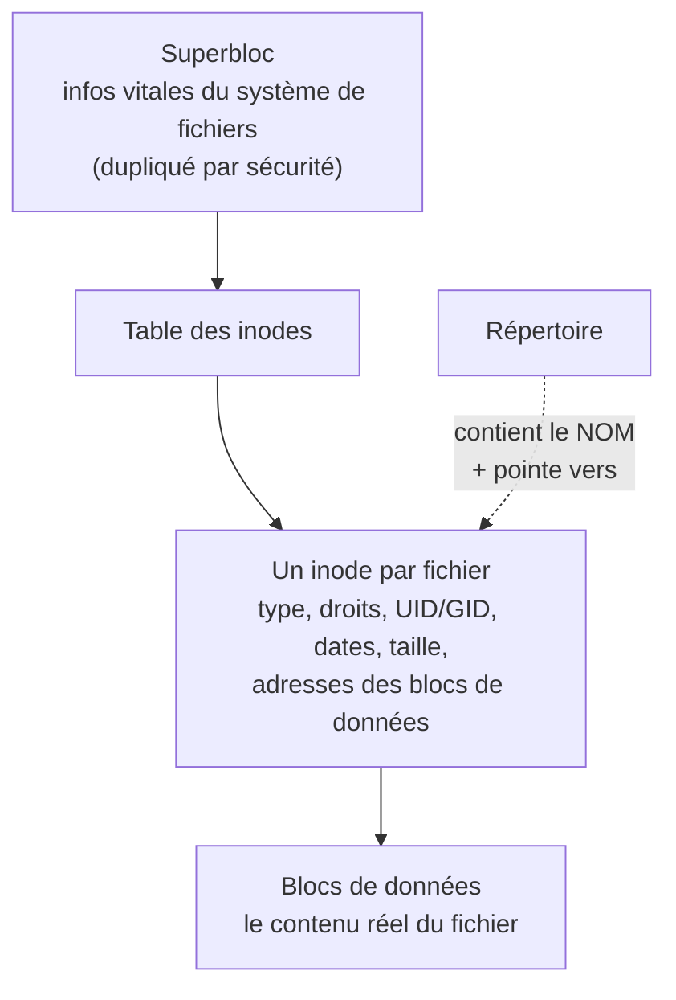
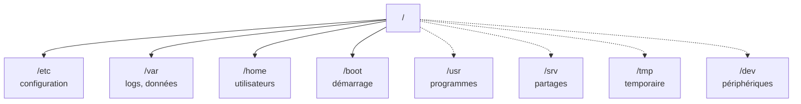

# Mémo : le système de fichiers sous Linux

!!! info "Deux choses différentes dans cette fiche"
    1. **Le principe technique** d'un système de fichiers (superbloc, inodes...) — ça vient de ton cours, chapitre 8.3.
    2. **Où chercher** dans l'arborescence (`/etc`, `/var`, `/home`...) — ton cours ne l'explique **pas du tout** ; c'est une convention Linux générale, à connaître par la pratique.

---

## Partie 1 : comment un système de fichiers fonctionne (ton cours, ch. 8.3)

Avant de pouvoir stocker quoi que ce soit, un disque/une partition doit être **formaté** (`mkfs.xfs`, `mkfs.ext4`...). Le formatage installe une structure interne faite de trois éléments :



| Élément | Rôle |
|---|---|
| **Superbloc** | Les informations vitales du système de fichiers (taille des blocs, pointeur vers l'inode racine...). Dupliqué à plusieurs endroits, pour pouvoir le récupérer en cas de corruption |
| **Inode** | Une fiche d'identité par fichier : type, droits, propriétaire/groupe, dates (`atime`/`ctime`/`mtime`), taille, et les adresses des blocs où se trouvent les vraies données |
| **Bloc de données** | Le contenu réel du fichier |

!!! danger "Le point le plus important à retenir"
    **Le nom du fichier n'est pas dans l'inode.** Il est stocké dans le **répertoire** qui contient le fichier, sous forme d'un lien vers un numéro d'inode. C'est pour ça qu'un même fichier peut avoir plusieurs noms (liens physiques), et qu'un fichier n'est vraiment supprimé que lorsque son dernier lien disparaît.

**Pour consulter ces informations toi-même :**

```bash
$ tune2fs -l /dev/sdXn      # affiche le superbloc (ext2/3/4)
$ ls -i fichier              # affiche le numéro d'inode d'un fichier
$ stat fichier                # affiche TOUT le contenu de l'inode d'un fichier
```

---

## Partie 2 : du disque au dossier utilisable (montage)

Un système de fichiers fraîchement formaté n'est **pas automatiquement accessible**. Il faut le **monter** sur un dossier existant, qui devient alors le **point d'entrée** vers son contenu.


```bash
# mount /dev/sdb1 /mnt          # montage manuel (temporaire)
# umount /mnt                   # démonter
$ findmnt                        # voir tout ce qui est monté, sous forme d'arbre
```

!!! warning "Piège du cours : le contenu du dossier devient invisible pendant le montage"
    Si tu montes un périphérique sur un dossier qui contenait déjà des fichiers, ces fichiers ne sont **pas supprimés**, mais deviennent **inaccessibles** tant que le montage est actif. Utilise toujours un dossier vide pour monter quelque chose.

**Rendre un montage permanent** : une ligne dans `/etc/fstab`, lue par systemd au démarrage (déjà vu dans la fiche de révision et le TP7) :

```text
UUID=xxxx-xxxx   /point/de/montage   xfs   defaults   0   0
```

---

## Partie 3 : où chercher dans l'arborescence (hors cours)

C'est la partie qui répond à « je ne sais jamais où chercher ». Sous Linux, **tout part d'une seule racine (`/`)** — contrairement à Windows avec ses lettres de lecteur (`C:`, `D:`...). Chaque dossier a un **rôle standardisé**, respecté par (presque) toutes les distributions.



Les quatre premiers (`/etc`, `/var`, `/home`, `/boot`) sont ceux que tu croises le plus souvent en TP. Les quatre suivants (en pointillés) complètent l'essentiel : `/usr` pour les programmes installés, `/srv` pour les partages (comme `documentation`/`depot` du TP9), `/tmp` pour le temporaire, `/dev` pour les périphériques.

!!! tip "D'autres dossiers existent"
    `/root` (personnel de root), `/opt` (logiciels tiers), `/bin`/`/sbin` (commandes de base), `/proc`/`/sys` (infos noyau en temps réel), `/mnt`/`/media` (montages ponctuels). Le tableau ci-dessous les couvre tous.

### Le tableau à garder sous la main

| Dossier | Je cherche... | Exemples concrets vus en TP |
|---|---|---|
| **`/etc`** | La **configuration** de tout le système et des services | `/etc/fstab`, `/etc/passwd`, `/etc/ssh/sshd_config`, `/etc/yum.repos.d/`, `/etc/default/grub` |
| **`/var`** | Des données qui **changent/grossissent** au fil du temps | `/var/log/` (tous les journaux), `/var/log/cron`, `/var/spool/` |
| **`/home`** | Le répertoire personnel de **chaque utilisateur humain** | `/home/pierre`, `/home/jjacques` |
| **`/root`** | Le répertoire personnel de **root uniquement** (pas dans `/home`) | — |
| **`/usr`** | Les **programmes et bibliothèques** installés (la plus grosse partie du système) | `/usr/bin`, `/usr/sbin`, `/usr/lib/systemd/system/` (fichiers de service d'origine) |
| **`/bin`, `/sbin`** | Les commandes **essentielles**, disponibles même en mode minimal | (souvent des liens vers `/usr/bin`, `/usr/sbin` sur les systèmes récents) |
| **`/opt`** | Des logiciels **tiers**, installés en dehors du gestionnaire de paquets | Un logiciel compilé à la main, par exemple |
| **`/tmp`** | Des fichiers **temporaires**, effacés au redémarrage, accessibles en écriture à tous (sticky bit) | — |
| **`/boot`** | Tout ce qui sert au **démarrage** : noyau, initramfs, GRUB | `vmlinuz-...`, `initramfs-...`, `/boot/grub2/grub.cfg` |
| **`/dev`** | Les **périphériques** du système, représentés comme des fichiers | `/dev/sda`, `/dev/nvme0n1`, `/dev/null` |
| **`/proc`, `/sys`** | Des informations **virtuelles** sur le noyau et le matériel, générées à la volée (pas de vrais fichiers sur disque) | `/proc/cpuinfo`, `/proc/meminfo` |
| **`/srv`** | Des données **servies** par le système à ses utilisateurs (partages, sites web...) | `/srv/data`, `/srv/documentation` (vus en TP7/TP9) |
| **`/mnt`, `/media`** | Des points de montage **temporaires**, pour tester ou brancher quelque chose ponctuellement | `/mnt` (vu en TP7, montage manuel) |

### Le réflexe à avoir pour trouver un fichier de configuration

Trois façons de **retrouver** où chercher, sans tout connaître par cœur (déjà vues dans les TP précédents) :

```bash
$ rpm -qc <paquet>         # fichiers de CONFIGURATION d'un paquet installé
$ rpm -ql <paquet>         # TOUS les fichiers d'un paquet
$ man <commande>           # section FILES en bas de page, souvent très utile
$ rpm -qf /chemin/fichier  # à quel paquet appartient ce fichier ?
```

!!! tip "Exemple concret"
    Tu ne te souviens plus où se trouve la config d'un service ? `rpm -qc <nom-du-paquet>` te le dit directement, sans deviner. C'est la méthode qu'on a utilisée pour retrouver `/etc/ssh/sshd_config` au TP4.

---

## À retenir

- **Inode** = fiche d'identité d'un fichier (droits, dates, emplacement des données) ; le **nom** est dans le dossier, pas dans l'inode.
- **Monter** = rendre un système de fichiers formaté accessible via un dossier ; `/etc/fstab` automatise ça au démarrage.
- L'arborescence Linux a un **rôle standard par dossier** : `/etc` = config, `/var` = données qui changent, `/home` = utilisateurs, `/usr` = programmes, `/boot` = démarrage.
- Pas besoin de tout mémoriser : `rpm -qc`, `rpm -ql`, `rpm -qf` et `man <commande>` (section FILES) retrouvent l'emplacement exact à ta place.
