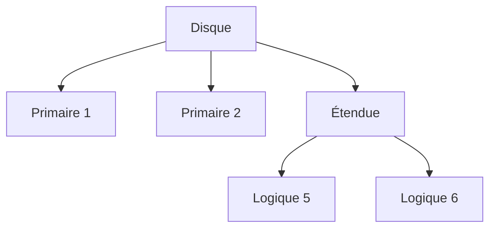
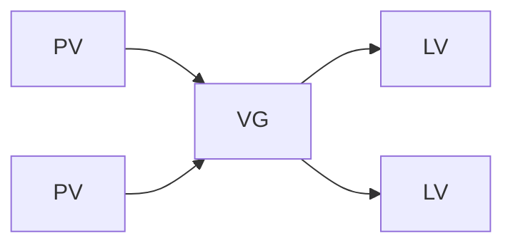

# Mémo : partitions, LVM, systèmes de fichiers

## Partitionnement classique

| Type | C'est quoi |
|---|---|
| **Primaire** | Une partition normale, directement sur le disque. 4 maximum en MBR (GPT : jusqu'à 128) |
| **Étendue** | Une partition MBR spéciale qui sert de « conteneur » pour dépasser la limite de 4 primaires |
| **Logique** | Une sous-partition à l'intérieur d'une étendue ; numérotée à partir de 5 |

## LVM : les 3 niveaux

| Sigle | Nom | C'est quoi |
|---|---|---|
| **PV** | Physical Volume | Un disque/partition rendu utilisable par LVM |
| **VG** | Volume Group | Une « réserve d'espace » regroupant un ou plusieurs PV |
| **LV** | Logical Volume | Une « partition virtuelle » découpée dans un VG, qu'on formate et monte |

**Pourquoi LVM** : on peut agrandir un LV à chaud, répartir un VG sur plusieurs disques, et redimensionner sans contrainte de découpage physique — impossible avec le partitionnement classique seul.

## Systèmes de fichiers

| Type | À retenir en 1 ligne |
|---|---|
| **XFS** | Défaut sur RHEL/Oracle Linux ; s'agrandit à chaud (`xfs_growfs`) ; **ne se réduit jamais** |
| **ext4** | Répandu, journalisé ; s'agrandit ET se réduit (`resize2fs`) |
| **swap** | Pas un vrai système de fichiers : espace d'échange RAM/disque |

!!! danger "Piège à retenir"
    `fsck.xfs` ne fait rien → vérifier XFS avec **`xfs_repair`**. `xfs_growfs` prend le **point de montage**, `resize2fs` prend le **périphérique**.

## Récapitulatif visuel de la chaîne complète

