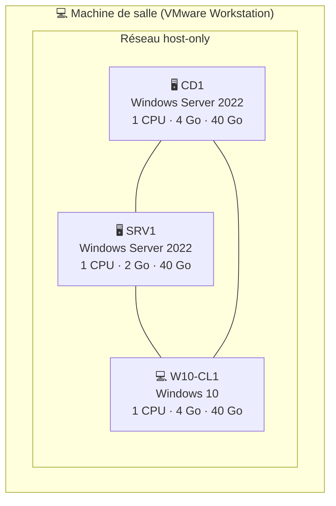
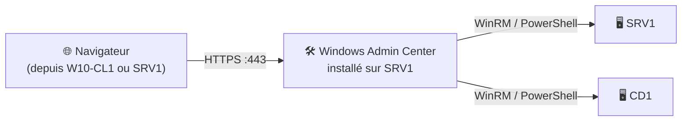

# TP1 — Création de l'infrastructure

> **Objectifs** : créer les machines virtuelles, configurer le réseau des systèmes Windows, mesurer les performances d'un serveur, déployer Windows Admin Center et retrouver des événements dans les journaux.

---

## Sommaire

- [Vue d'ensemble](#vue-densemble)
- [Étape 1 — Créer les machines virtuelles](#étape-1--créer-les-machines-virtuelles)
- [Étape 2 — Configurer le réseau des VM](#étape-2--configurer-le-réseau-des-vm)
- [Étape 3 — Mesurer les performances de CD1](#étape-3--mesurer-les-performances-de-cd1)
- [Étape 4 — Installer Windows Admin Center](#étape-4--installer-windows-admin-center)
- [Étape 5 — Analyser le relevé de performances](#étape-5--analyser-le-relevé-de-performances)
- [Étape 6 — Retrouver des événements dans les journaux](#étape-6--retrouver-des-événements-dans-les-journaux)
- [Récapitulatif](#récapitulatif)

---

## Vue d'ensemble

On construit une **maquette** : un petit réseau isolé qui simule l'infrastructure d'une entreprise. Toutes les VM sont en **host-only**, elles communiquent entre elles et avec ta machine hôte, mais pas avec Internet ni le réseau de l'école.



> ⚠️ **Adresses IP** : les adresses utilisées dans ce tuto sont des **exemples**. Remplace-les par celles du schéma fourni par ton formateur.

| Machine | Adresse IP (exemple) | Masque | DNS |
|---|---|---|---|
| CD1 | `192.168.21.10` | `/16` | `127.0.0.1` puis lui-même |
| SRV1 | `192.168.21.20` | `/16` | IP de CD1 |
| W10-CL1 | `192.168.21.100` | `/16` | IP de CD1 |

---

## Étape 1 — Créer les machines virtuelles

Cette étape se fait dans **VMware Workstation** (interface graphique).

1. Sur le disque `D:`, crée une arborescence du type `D:\VM\CD1`, `D:\VM\SRV1`, `D:\VM\W10-CL1`.
2. Copie les VM préconfigurées depuis le partage **distrib** dans leur dossier respectif.
3. Ouvre chaque VM dans VMware et ajuste le matériel (CPU, RAM, disque) selon le tableau ci-dessus.
4. Dans **Network Adapter**, choisis **Host-only**.

> 💡 **Pourquoi un dossier par VM ?** Une VM est composée de plusieurs fichiers (`.vmx`, `.vmdk`, snapshots…). Les séparer évite les mélanges et facilite les sauvegardes.

Tu peux créer l'arborescence en PowerShell sur ta machine de salle :

```powershell
# Crée un dossier par machine virtuelle sur le disque D:
# -Force : ne génère pas d'erreur si le dossier existe déjà
"CD1", "SRV1", "W10-CL1" | ForEach-Object {
    New-Item -Path "D:\VM\$_" -ItemType Directory -Force
}
```

---

## Étape 2 — Configurer le réseau des VM

On donne à chaque machine un **nom** et une **adresse IP fixe**. Un serveur doit toujours avoir une IP fixe : si son adresse change, les autres machines ne le trouvent plus.

À exécuter **dans chaque VM**, dans une console PowerShell lancée **en administrateur** (exemple pour CD1) :

```powershell
# 1. Afficher les cartes réseau pour connaître leur nom (souvent "Ethernet0")
Get-NetAdapter

# 2. Attribuer une adresse IP fixe à la carte
New-NetIPAddress -InterfaceAlias "Ethernet0" `
                 -IPAddress "192.168.21.10" `
                 -PrefixLength 16          # /16 = masque 255.255.0.0

# 3. Indiquer le serveur DNS à utiliser
#    Pour CD1 (futur contrôleur de domaine) : il sera son propre DNS
Set-DnsClientServerAddress -InterfaceAlias "Ethernet0" -ServerAddresses "127.0.0.1"

# 4. Renommer la machine puis redémarrer pour appliquer le nom
Rename-Computer -NewName "CD1" -Restart
```

Pour **SRV1** et **W10-CL1**, change l'IP et le nom, et mets l'**IP de CD1** comme DNS :

```powershell
# Exemple pour SRV1
New-NetIPAddress -InterfaceAlias "Ethernet0" -IPAddress "192.168.21.20" -PrefixLength 16
Set-DnsClientServerAddress -InterfaceAlias "Ethernet0" -ServerAddresses "192.168.21.10"
Rename-Computer -NewName "SRV1" -Restart
```

**Vérification :**

```powershell
# Affiche la configuration IP de la machine
Get-NetIPConfiguration

# Teste la communication avec une autre VM (ici CD1)
Test-Connection 192.168.21.10 -Count 2
```

> ⚠️ Le **ping** est bloqué par défaut par le pare-feu Windows. S'il échoue, active la règle ICMP :
>
> ```powershell
> # Autorise les réponses au ping (ICMPv4) sur cette machine
> Enable-NetFirewallRule -Name "FPS-ICMP4-ERQ-In"
> ```

---

## Étape 3 — Mesurer les performances de CD1

### Le principe

On crée une **ligne de base** (*baseline*) : une photo des performances « normales » du serveur. Plus tard, si le serveur ralentit, on compare avec cette référence pour trouver ce qui a changé.


### Les compteurs demandés

| Objet | Compteur (nom anglais) | Ce qu'il mesure |
|---|---|---|
| Processeur | `% Processor Time` | Pourcentage du temps où le CPU travaille |
| Processeur | `% Idle Time` | Pourcentage du temps où le CPU est inactif |
| Mémoire | `Available MBytes` | Mémoire vive libre, en Mo |
| Mémoire | `Pages/sec` | Échanges entre RAM et fichier d'échange (*swap*) |
| Disque physique | `Avg. Disk sec/Read` | Temps moyen d'une lecture |
| Disque physique | `Avg. Disk sec/Write` | Temps moyen d'une écriture |
| Disque physique | `% Disk Time` | Temps passé à traiter des lectures/écritures |
| Disque physique | `% Idle Time` | Temps d'inactivité du disque |

> 💡 **Comment lire ces valeurs ?** Un CPU souvent au-dessus de 80 %, peu de mémoire disponible avec beaucoup de `Pages/sec`, ou des temps disque supérieurs à 20 ms signalent un serveur en difficulté.

### 3.1 Créer l'ensemble de collecteurs

On utilise **`logman`**, l'outil en ligne de commande de l'analyseur de performances. À exécuter sur **CD1** en administrateur :

```powershell
# Liste des compteurs à collecter
$compteurs = @(
    "\Processor(_Total)\% Processor Time",
    "\Processor(_Total)\% Idle Time",
    "\Memory\Available MBytes",
    "\Memory\Pages/sec",
    "\PhysicalDisk(_Total)\Avg. Disk sec/Read",
    "\PhysicalDisk(_Total)\Avg. Disk sec/Write",
    "\PhysicalDisk(_Total)\% Disk Time",
    "\PhysicalDisk(_Total)\% Idle Time"
)

# Crée l'ensemble de collecteurs "CompteurBase"
#   -c  : les compteurs à collecter
#   -si : intervalle d'échantillonnage (une mesure toutes les 15 secondes)
#   -rf : durée d'exécution (s'arrête automatiquement après 10 minutes)
#   -o  : fichier de sortie, avec la date du jour au format AAMMJJ
#   -f  : format binaire (.blg), lisible par l'analyseur de performances
logman create counter CompteurBase `
    -c $compteurs `
    -si 00:00:15 `
    -rf 00:10:00 `
    -f bin `
    -o "C:\PerfLogs\CompteurBase-$(Get-Date -Format 'yyMMdd')"
```

> ⚠️ **Windows en français** : si `logman` refuse les noms anglais, affiche les noms exacts des compteurs de ton système avec :
>
> ```powershell
> # Liste les compteurs disponibles pour l'objet Processeur, Mémoire et Disque physique
> Get-Counter -ListSet "Processeur", "Mémoire", "Disque physique" |
>     Select-Object -ExpandProperty Paths
> ```
>
> Tu peux aussi créer l'ensemble graphiquement : **Analyseur de performances → Ensembles de collecteurs de données → Définis par l'utilisateur → Nouveau**.

### 3.2 Planifier la collecte

La collecte doit démarrer **dans 30 minutes**, durer **10 minutes**, et se répéter **chaque jour jusqu'à vendredi inclus**. On crée une tâche planifiée qui, chaque jour :

1. met à jour le nom du fichier avec la date du jour (`CompteurBase-AAMMJJ`) ;
2. démarre la collecte (qui s'arrête seule après 10 min grâce à `-rf`).

```powershell
# Commande exécutée chaque jour par la tâche planifiée :
#   1. met à jour le nom du fichier de sortie avec la date du jour
#   2. démarre la collecte
$commande = 'logman update CompteurBase -o "C:\PerfLogs\CompteurBase-$(Get-Date -Format yyMMdd)"; logman start CompteurBase'

# Action : lancer PowerShell avec cette commande
$action = New-ScheduledTaskAction -Execute "powershell.exe" `
                                  -Argument "-NoProfile -Command $commande"

# Déclencheur : tous les jours, en commençant dans 30 minutes
$trigger = New-ScheduledTaskTrigger -Daily -At (Get-Date).AddMinutes(30)

# Calcul du vendredi de la semaine en cours
# (DayOfWeek : lundi = 1 ... vendredi = 5)
$vendredi = (Get-Date).Date.AddDays(5 - [int](Get-Date).DayOfWeek)

# La tâche expire le samedi à 00h00 (vendredi inclus)
$trigger.EndBoundary = $vendredi.AddDays(1).ToString("s")

# Enregistre la tâche, exécutée par le compte SYSTEM avec les droits maximum
Register-ScheduledTask -TaskName "Collecte CompteurBase" `
                       -Action $action `
                       -Trigger $trigger `
                       -User "NT AUTHORITY\SYSTEM" `
                       -RunLevel Highest
```

**Vérification :**

```powershell
# Affiche l'état de l'ensemble de collecteurs
logman query CompteurBase

# Affiche la tâche planifiée et sa prochaine exécution
Get-ScheduledTask -TaskName "Collecte CompteurBase" | Get-ScheduledTaskInfo
```

---

## Étape 4 — Installer Windows Admin Center

### Le principe

**Windows Admin Center (WAC)** est une console d'administration accessible depuis un **navigateur web**. Installée sur SRV1, elle permet de gérer plusieurs serveurs à distance sans ouvrir de session Bureau à distance sur chacun.



### 4.1 Installation

1. Installe Firefox ou Chrome sur SRV1 depuis le serveur **distrib** (Internet Explorer n'est pas compatible).
2. Lance le fichier `.msi` fourni par le formateur et garde **tous les paramètres par défaut**.

Équivalent en ligne de commande (installation silencieuse) :

```powershell
# Installe WAC sans interface, sur le port 443,
# avec un certificat auto-signé généré automatiquement
msiexec /i "C:\Sources\WindowsAdminCenter.msi" /qn SME_PORT=443 SSL_CERTIFICATE_OPTION=generate
```

### 4.2 Connexion et utilisation

1. Ouvre `https://srv1:443` dans le navigateur. Accepte l'avertissement de certificat : il est auto-signé, c'est normal en maquette.
2. Sélectionne **SRV1 → Paramètres → Bureau à distance** et active le Bureau à distance.
3. Clique sur **+ Ajouter → Serveurs** et saisis `CD1`.

Pour info, voici ce que WAC fait quand tu actives le Bureau à distance, en PowerShell :

```powershell
# Autorise les connexions Bureau à distance (0 = autorisé, 1 = refusé)
Set-ItemProperty -Path "HKLM:\System\CurrentControlSet\Control\Terminal Server" `
                 -Name "fDenyTSConnections" -Value 0

# Ouvre les règles du pare-feu pour le Bureau à distance
# (le nom de groupe "@FirewallAPI.dll,-28752" fonctionne quelle que soit la langue de Windows)
Enable-NetFirewallRule -Group "@FirewallAPI.dll,-28752"
```

**Vérification depuis W10-CL1 :**

```powershell
# Ouvre une connexion Bureau à distance vers SRV1
mstsc /v:SRV1
```

---

## Étape 5 — Analyser le relevé de performances

Une fois la collecte exécutée :

1. Ouvre l'**Analyseur de performances** (`perfmon`).
2. Va dans **Rapports → Définis par l'utilisateur → CompteurBase** et ouvre le rapport.

Tu peux aussi lire le fichier en PowerShell :

```powershell
# Liste les fichiers de collecte générés
Get-ChildItem C:\PerfLogs -Recurse -Filter "*.blg"

# Importe un fichier et affiche la moyenne de chaque compteur
Import-Counter -Path "C:\PerfLogs\CompteurBase-*\*.blg" |
    Select-Object -ExpandProperty CounterSamples |
    Group-Object Path |
    Select-Object Name, @{ Name = "Moyenne"; Expression = { ($_.Group.CookedValue | Measure-Object -Average).Average } }
```

> 💡 **Les valeurs sont-elles correctes ?** Sur une VM au repos, le CPU doit être bas, et `% Processor Time` + `% Idle Time` doivent faire environ 100 %. Sur un disque virtuel, des temps de lecture/écriture incohérents sont fréquents : le disque est émulé par VMware.

---

## Étape 6 — Retrouver des événements dans les journaux

Chaque installation d'application via un `.msi` est enregistrée dans le journal **Application** par la source **MsiInstaller**.

```powershell
# Cherche dans le journal Application les événements d'installation MSI
# qui mentionnent "Admin Center"
Get-WinEvent -FilterHashtable @{ LogName = "Application"; ProviderName = "MsiInstaller" } |
    Where-Object Message -like "*Admin Center*" |
    Select-Object TimeCreated, Id, Message |
    Format-List
```

Dans le résultat, relève :

- **la date et l'heure** : colonne `TimeCreated` ;
- **la version** : indiquée dans le message, par exemple `Version du produit : 2.x.x`.

> 💡 L'ID **11707** signifie « installation réussie », l'ID **1033** donne le résumé de l'installation avec la version.

En graphique : **Observateur d'événements** (`eventvwr.msc`) → **Journaux Windows → Application** → **Filtrer le journal actuel** → source `MsiInstaller`.

---

## Récapitulatif

| Besoin | Commande clé |
|---|---|
| Fixer une IP | `New-NetIPAddress` |
| Définir le DNS | `Set-DnsClientServerAddress` |
| Renommer une machine | `Rename-Computer` |
| Créer une collecte de performances | `logman create counter` |
| Planifier une tâche | `Register-ScheduledTask` |
| Activer le Bureau à distance | `Set-ItemProperty ... fDenyTSConnections 0` |
| Lire les journaux | `Get-WinEvent -FilterHashtable` |
