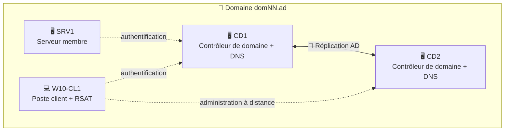
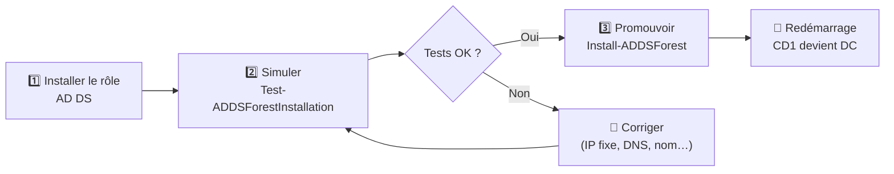
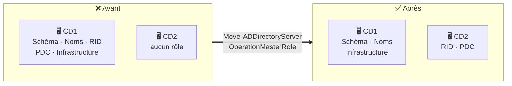

# TP2 — Création d'un domaine Active Directory

> **Objectifs** : créer un domaine Active Directory, ajouter un second contrôleur de domaine, intégrer les machines au domaine, administrer depuis un poste client et répartir les rôles FSMO.

> ⚠️ **Convention** : dans tout ce tuto, **`NN`** représente tes initiales. Remplace `domNN.ad` par ton vrai nom de domaine (ex : `domJD.ad`) et `DOMNN` par son nom NetBIOS (ex : `DOMJD`).

---

## Sommaire

- [Vue d'ensemble](#vue-densemble)
- [Étape 1 — Simuler puis promouvoir CD1](#étape-1--simuler-puis-promouvoir-cd1)
- [Étape 2 — Ajouter un second contrôleur de domaine (CD2)](#étape-2--ajouter-un-second-contrôleur-de-domaine-cd2)
- [Étape 3 — Intégrer W10-CL1 et SRV1 au domaine](#étape-3--intégrer-w10-cl1-et-srv1-au-domaine)
- [Étape 4 — Administrer depuis le poste client (RSAT)](#étape-4--administrer-depuis-le-poste-client-rsat)
- [Étape 5 — Répartir les rôles FSMO](#étape-5--répartir-les-rôles-fsmo)
- [Récapitulatif](#récapitulatif)

---

## Vue d'ensemble

### C'est quoi un domaine Active Directory ?

Un **domaine AD** est une base de données centrale qui contient les utilisateurs, les ordinateurs et les groupes de l'entreprise. Au lieu de créer un compte sur chaque PC, on le crée **une seule fois** dans l'annuaire, et l'utilisateur peut se connecter sur n'importe quelle machine du domaine.

Les serveurs qui hébergent cette base sont les **contrôleurs de domaine** (DC). On en installe **au moins deux** : si l'un tombe en panne, l'autre continue d'authentifier les utilisateurs.



| Machine | Rôle | Adresse IP (exemple) | DNS |
|---|---|---|---|
| CD1 | Premier contrôleur de domaine | `192.168.21.10` | `127.0.0.1` |
| CD2 | Contrôleur de domaine supplémentaire | `192.168.21.11` | IP de CD1 |
| SRV1 | Serveur membre | `192.168.21.20` | IP de CD1 |
| W10-CL1 | Poste client | `192.168.21.100` | IP de CD1 |

> ⚠️ Les adresses sont des **exemples**, utilise celles du schéma de ton formateur.

> 💡 **Pourquoi le DNS est-il si important ?** Les machines trouvent les contrôleurs de domaine **grâce au DNS**. Si un client n'utilise pas le DNS du domaine, il ne pourra ni rejoindre le domaine ni s'y connecter. C'est la cause d'erreur n°1 en TP.

---

## Étape 1 — Simuler puis promouvoir CD1



### 1.1 Installer le rôle AD DS

À exécuter sur **CD1**, en administrateur :

```powershell
# Installe le rôle "Services de domaine Active Directory"
# -IncludeManagementTools : ajoute aussi les consoles et le module PowerShell AD
Install-WindowsFeature AD-Domain-Services -IncludeManagementTools
```

### 1.2 Simuler la promotion

La simulation vérifie que tous les prérequis sont remplis **sans rien modifier**. C'est la commande à noter dans ton compte rendu.

```powershell
# Simule la création d'une nouvelle forêt avec le domaine domNN.ad
#   -DomainName        : nom DNS complet du domaine
#   -DomainNetbiosName : nom court (15 caractères max, en majuscules)
#   -InstallDns        : installe aussi le serveur DNS sur CD1
Test-ADDSForestInstallation -DomainName "domNN.ad" `
                            -DomainNetbiosName "DOMNN" `
                            -InstallDns
```

Le mot de passe du **mode restauration des services d'annuaire** (DSRM) te sera demandé. Il sert à réparer AD en cas de gros problème, note-le bien.

> 💡 Les **avertissements** (warnings) sur la délégation DNS sont normaux dans une maquette. Seuls les résultats **en échec** bloquent la promotion.

### 1.3 Promouvoir CD1

```powershell
# Crée la forêt et le domaine, puis redémarre automatiquement CD1
Install-ADDSForest -DomainName "domNN.ad" `
                   -DomainNetbiosName "DOMNN" `
                   -InstallDns `
                   -SafeModeAdministratorPassword (Read-Host "Mot de passe DSRM" -AsSecureString)
```

**Vérification après redémarrage** (connecte-toi avec `DOMNN\Administrateur`) :

```powershell
# Affiche les informations du domaine
Get-ADDomain | Select-Object DNSRoot, NetBIOSName, DomainMode

# Liste les contrôleurs de domaine
Get-ADDomainController -Filter * | Select-Object Name, IPv4Address, Site
```

---

## Étape 2 — Ajouter un second contrôleur de domaine (CD2)

### 2.1 Créer la VM

Dans VMware Workstation, crée une VM **CD2** : 1 CPU, 4 Go de RAM, 40 Go de disque, carte réseau en **host-only**.

### 2.2 Configurer le réseau

Sur **CD2**, en administrateur :

```powershell
# IP fixe de CD2
New-NetIPAddress -InterfaceAlias "Ethernet0" -IPAddress "192.168.21.11" -PrefixLength 16

# DNS = CD1, pour que CD2 puisse trouver le domaine
Set-DnsClientServerAddress -InterfaceAlias "Ethernet0" -ServerAddresses "192.168.21.10"

# Renomme la machine et redémarre
Rename-Computer -NewName "CD2" -Restart
```

### 2.3 Promouvoir CD2

```powershell
# Installe le rôle AD DS
Install-WindowsFeature AD-Domain-Services -IncludeManagementTools

# Ajoute CD2 comme contrôleur de domaine SUPPLÉMENTAIRE du domaine existant
#   -Credential : un compte administrateur du domaine
#   -InstallDns : CD2 sera aussi serveur DNS (tolérance de panne du DNS)
Install-ADDSDomainController -DomainName "domNN.ad" `
                             -InstallDns `
                             -Credential (Get-Credential "DOMNN\Administrateur") `
                             -SafeModeAdministratorPassword (Read-Host "Mot de passe DSRM" -AsSecureString)
```

> 💡 **Différence avec l'étape 1** : `Install-ADDSForest` crée un **nouveau** domaine, alors que `Install-ADDSDomainController` **rejoint** un domaine existant. CD2 reçoit une copie complète de l'annuaire par réplication.

**Vérification** (sur CD1 ou CD2) :

```powershell
# Les deux DC doivent apparaître
Get-ADDomainController -Filter * | Select-Object Name, IPv4Address

# Vérifie l'état de la réplication entre les DC
repadmin /replsummary
```

---

## Étape 3 — Intégrer W10-CL1 et SRV1 au domaine

Avant de rejoindre le domaine, la machine doit utiliser **CD1 comme DNS** (voir TP1). Ensuite, sur **SRV1** puis sur **W10-CL1**, en administrateur :

```powershell
# Vérifie que le domaine est bien trouvé via le DNS
Resolve-DnsName domNN.ad

# Intègre la machine au domaine puis redémarre
Add-Computer -DomainName "domNN.ad" `
             -Credential (Get-Credential "DOMNN\Administrateur") `
             -Restart
```

**Vérification** (sur un DC) :

```powershell
# Liste les ordinateurs du domaine
Get-ADComputer -Filter * | Select-Object Name, DistinguishedName
```

> 💡 Les ordinateurs qui rejoignent le domaine arrivent par défaut dans le conteneur **`Computers`**. On les rangera dans des unités d'organisation au TP3.

---

## Étape 4 — Administrer depuis le poste client (RSAT)

### Le principe

Les **RSAT** (*Remote Server Administration Tools*) installent sur Windows 10 les mêmes consoles que sur un serveur : Utilisateurs et ordinateurs AD, DNS, DHCP, GPO… L'administrateur travaille depuis **son poste**, sans ouvrir de session sur les serveurs. C'est plus sûr et plus pratique.

### 4.1 Installer les RSAT

Sur **W10-CL1**, dans PowerShell **en administrateur** :

```powershell
# Liste les outils RSAT disponibles et leur état
Get-WindowsCapability -Online -Name "Rsat*" | Select-Object Name, State

# Installe tous les outils RSAT
Get-WindowsCapability -Online -Name "Rsat*" | Add-WindowsCapability -Online
```

> ⚠️ Cette méthode télécharge les outils depuis Windows Update. Sans accès Internet, utilise l'installation fournie par ton formateur (fichier `.msu` ou ISO *Features on Demand*).

Pour installer seulement les outils essentiels :

```powershell
# Outils Active Directory (consoles + module PowerShell)
Add-WindowsCapability -Online -Name "Rsat.ActiveDirectory.DS-LDS.Tools~~~~0.0.1.0"

# Console de gestion des stratégies de groupe
Add-WindowsCapability -Online -Name "Rsat.GroupPolicy.Management.Tools~~~~0.0.1.0"

# Console DNS
Add-WindowsCapability -Online -Name "Rsat.Dns.Tools~~~~0.0.1.0"
```

### 4.2 Créer un utilisateur à ton nom

Ouvre le **Centre d'administration Active Directory** (`dsac.exe`) et crée ton utilisateur dans le conteneur `Users`. L'équivalent PowerShell :

```powershell
# Crée un utilisateur à ton nom (remplace Prénom/Nom)
New-ADUser -Name "Jean Dupont" `
           -GivenName "Jean" `
           -Surname "Dupont" `
           -SamAccountName "jdupont" `
           -UserPrincipalName "jdupont@domNN.ad" `
           -AccountPassword (Read-Host "Mot de passe" -AsSecureString) `
           -Enabled $true
```

> 💡 Le **Centre d'administration AD** affiche en bas une **visionneuse de l'historique PowerShell** : chaque action faite à la souris y apparaît sous forme de commande. C'est un excellent moyen d'apprendre PowerShell.

---

## Étape 5 — Répartir les rôles FSMO

### Le principe

La plupart des modifications AD peuvent se faire sur n'importe quel DC. Mais **5 opérations** sont confiées à **un seul DC** à la fois : ce sont les rôles **FSMO** (*Flexible Single Master Operations*).

| Rôle | Portée | À quoi il sert |
|---|---|---|
| **Maître de schéma** | Forêt | Modifier la structure de l'annuaire (types d'objets et attributs) |
| **Maître d'attribution de noms** | Forêt | Ajouter ou supprimer des domaines dans la forêt |
| **Maître RID** | Domaine | Distribuer aux DC des lots d'identifiants uniques (SID) pour créer des objets |
| **Émulateur PDC** | Domaine | Référence pour l'heure, les changements de mot de passe et les verrouillages de compte |
| **Maître d'infrastructure** | Domaine | Mettre à jour les références entre objets de domaines différents |

Par défaut, **CD1 possède les 5 rôles**. S'il tombe en panne, tout est bloqué d'un coup. On répartit donc les rôles :



### 5.1 Voir les détenteurs actuels

```powershell
# Méthode rapide : affiche les 5 rôles et leur détenteur
netdom query fsmo
```

Méthode PowerShell équivalente :

```powershell
# Rôles de niveau domaine
Get-ADDomain | Select-Object RIDMaster, PDCEmulator, InfrastructureMaster

# Rôles de niveau forêt
Get-ADForest | Select-Object SchemaMaster, DomainNamingMaster
```

### 5.2 Déplacer les rôles RID et PDC vers CD2

```powershell
# Transfère les rôles Maître RID et Émulateur PDC vers CD2
Move-ADDirectoryServerOperationMasterRole -Identity "CD2" `
                                          -OperationMasterRole RIDMaster, PDCEmulator
```

Confirme avec **O** (Oui) ou **T** (Oui pour tout).

### 5.3 Vérifier

```powershell
netdom query fsmo
```

Résultat attendu :

```text
Contrôleur de schéma             CD1.domNN.ad
Maître d'attribution de noms     CD1.domNN.ad
PDC                              CD2.domNN.ad
Gestionnaire du pool RID         CD2.domNN.ad
Maître d'infrastructure          CD1.domNN.ad
```

> 💡 **Transfert vs saisie** : ici on **transfère** les rôles, les deux DC sont en ligne et se mettent d'accord. Si un DC est définitivement mort, on **saisit** le rôle avec le paramètre `-Force`. C'est une opération de dernier recours.

---

## Récapitulatif

| Besoin | Commande clé |
|---|---|
| Installer le rôle AD DS | `Install-WindowsFeature AD-Domain-Services` |
| Simuler une promotion | `Test-ADDSForestInstallation` |
| Créer une forêt / un domaine | `Install-ADDSForest` |
| Ajouter un DC | `Install-ADDSDomainController` |
| Joindre une machine au domaine | `Add-Computer` |
| Installer les RSAT | `Add-WindowsCapability -Name Rsat*` |
| Voir les rôles FSMO | `netdom query fsmo` |
| Déplacer des rôles FSMO | `Move-ADDirectoryServerOperationMasterRole` |
