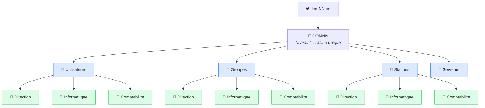
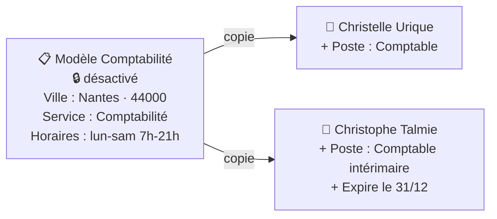
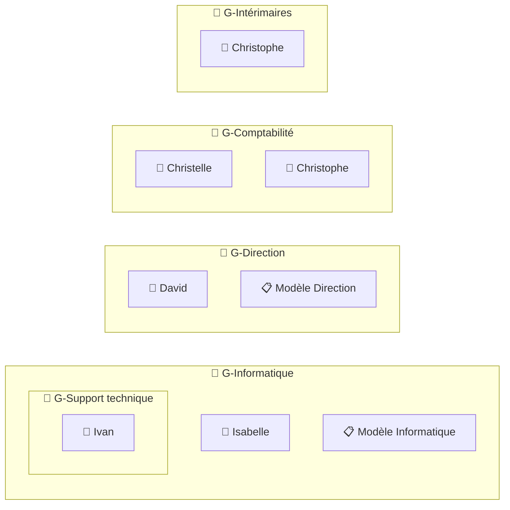
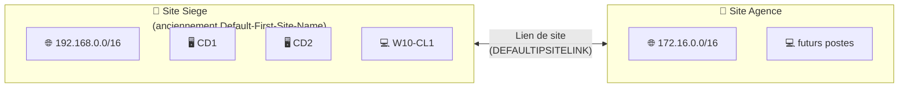

# TP3 — Gestion d'un domaine Active Directory

> **Objectifs** : organiser l'annuaire en unités d'organisation, créer des modèles de comptes, des utilisateurs et des groupes, utiliser des requêtes enregistrées, et préparer l'arrivée d'un second site.

> ⚠️ **Convention** : remplace `NN` par tes initiales partout (`domNN.ad` → `domJD.ad`, `DC=domNN` → `DC=domJD`).

---

## Sommaire

- [Vue d'ensemble](#vue-densemble)
- [Étape 1 — Créer l'arborescence des OU](#étape-1--créer-larborescence-des-ou)
- [Étape 2 — Créer les modèles de comptes](#étape-2--créer-les-modèles-de-comptes)
- [Étape 3 — Créer les comptes utilisateurs](#étape-3--créer-les-comptes-utilisateurs)
- [Étape 4 — Définir les mots de passe et activer les comptes](#étape-4--définir-les-mots-de-passe-et-activer-les-comptes)
- [Étape 5 — Créer les groupes](#étape-5--créer-les-groupes)
- [Étape 6 — Requête enregistrée « Comptes désactivés »](#étape-6--requête-enregistrée--comptes-désactivés-)
- [Étape 7 — Préparer le site « Agence »](#étape-7--préparer-le-site--agence-)
- [Bonus — Exports PowerShell](#bonus--exports-powershell)
- [Récapitulatif](#récapitulatif)

---

## Vue d'ensemble

Toutes les commandes s'exécutent sur un **contrôleur de domaine** ou sur **W10-CL1 avec les RSAT**, dans une console PowerShell lancée en tant qu'administrateur du domaine.

> 💡 **Petit rappel de vocabulaire**
>
> | Terme | Définition |
> |---|---|
> | **OU** (unité d'organisation) | Un « dossier » de l'annuaire pour ranger les objets. On y applique des GPO et des délégations. |
> | **Groupe** | Un ensemble d'utilisateurs, auquel on donne des droits. On ne donne jamais de droits à un utilisateur seul. |
> | **DN** (*Distinguished Name*) | Le « chemin complet » d'un objet, lu de droite à gauche. Exemple : `OU=Direction,OU=Utilisateurs,OU=DOMNN,DC=domNN,DC=ad`. |

> ⚠️ **Accents dans les scripts** : si tu enregistres ces commandes dans un fichier `.ps1`, enregistre-le en **UTF-8 avec BOM**. Sinon PowerShell 5.1 déforme les accents (`G-Comptabilité` devient `G-Comptabilité`). Copier-coller directement dans la console ne pose pas de problème.

---

## Étape 1 — Créer l'arborescence des OU

> 💡 L'énoncé demande de créer les OU **après** les comptes, puis de déplacer les objets. En pratique, on crée d'abord les OU pour ranger chaque objet directement au bon endroit. La commande de déplacement est tout de même donnée plus bas.

### L'organisation demandée



- **Niveau 1** : une OU racine `DOMNN` qui rassemble tout ce qu'on crée. On repère immédiatement nos objets par rapport aux objets système.
- **Niveau 2** : une OU par **catégorie d'objet**, pour pouvoir appliquer des GPO « ordinateur » d'un côté et « utilisateur » de l'autre.
- **Niveau 3** : une OU par **service**, pour cibler un service précis (GPO de la Direction, délégation au responsable Comptabilité…).

### Création en PowerShell

```powershell
# Chemin de base du domaine (à adapter avec tes initiales)
$domaine = "DC=domNN,DC=ad"

# Niveau 1 : l'OU racine
New-ADOrganizationalUnit -Name "DOMNN" -Path $domaine

# Niveau 2 : une OU par catégorie d'objets
$racine = "OU=DOMNN,$domaine"
"Utilisateurs", "Groupes", "Stations", "Serveurs" | ForEach-Object {
    New-ADOrganizationalUnit -Name $_ -Path $racine
}

# Niveau 3 : une OU par service, dans Utilisateurs, Groupes et Stations
$services = "Direction", "Informatique", "Comptabilite"
foreach ($categorie in "Utilisateurs", "Groupes", "Stations") {
    foreach ($service in $services) {
        New-ADOrganizationalUnit -Name $service -Path "OU=$categorie,$racine"
    }
}
```

> 💡 Les OU sont créées **protégées contre la suppression accidentelle**. Pour en supprimer une, décoche cette option dans l'onglet **Objet** de ses propriétés (affichage avancé activé).

**Vérification :**

```powershell
# Affiche toutes les OU créées sous DOMNN
Get-ADOrganizationalUnit -Filter * -SearchBase "OU=DOMNN,DC=domNN,DC=ad" |
    Select-Object Name, DistinguishedName
```

---

## Étape 2 — Créer les modèles de comptes

### Le principe

Un **modèle** est un compte **désactivé** qui contient les attributs communs à tout un service (ville, service, entreprise, horaires…). Pour créer un nouvel employé, on **copie** le modèle : il ne reste qu'à saisir le nom et le poste.



### 2.1 Créer les trois modèles

```powershell
$racine = "OU=DOMNN,DC=domNN,DC=ad"

# Attributs communs aux trois modèles
$communs = @{
    City       = "Nantes"
    PostalCode = "44000"
    Company    = "Société ASR"
    Enabled    = $false      # un modèle ne doit JAMAIS pouvoir ouvrir de session
}

# Modèle Direction
New-ADUser @communs -Name "Modèle Direction" `
           -SamAccountName "modele.direction" `
           -Department "Direction" `
           -Path "OU=Direction,OU=Utilisateurs,$racine"

# Modèle Informatique
New-ADUser @communs -Name "Modèle Informatique" `
           -SamAccountName "modele.informatique" `
           -Department "Informatique" `
           -Path "OU=Informatique,OU=Utilisateurs,$racine"

# Modèle Comptabilité
New-ADUser @communs -Name "Modèle Comptabilité" `
           -SamAccountName "modele.comptabilite" `
           -Department "Comptabilité" `
           -Path "OU=Comptabilite,OU=Utilisateurs,$racine"
```

> 💡 **`@communs`** : c'est le *splatting*. On range des paramètres dans un tableau `@{...}` pour les passer d'un coup à une commande, ce qui évite de les répéter trois fois.

### 2.2 Horaires de connexion (Comptabilité : lundi-samedi, 7h-21h)

**Méthode la plus simple (graphique)** : dans **Utilisateurs et ordinateurs AD**, ouvre les propriétés de *Modèle Comptabilité* → onglet **Compte** → **Horaires d'accès**, puis coche du lundi au samedi de 7h à 21h.

**En PowerShell**, les horaires sont stockés dans l'attribut `logonHours` : 168 cases (7 jours × 24 heures), en heure **UTC**. Cette fonction fait la conversion pour toi :

```powershell
function Get-LogonHours {
    param(
        [int[]]$Jours,   # 0 = dimanche, 1 = lundi ... 6 = samedi
        [int]$Debut,     # heure de début (ex : 7)
        [int]$Fin        # heure de fin (ex : 21)
    )

    # Décalage entre l'heure locale et l'heure UTC (+1 en hiver, +2 en été en France)
    $decalage = [TimeZoneInfo]::Local.GetUtcOffset((Get-Date)).Hours

    # 21 octets = 168 bits = une case par heure de la semaine
    $octets = New-Object byte[] 21

    foreach ($jour in $Jours) {
        for ($heure = $Debut; $heure -lt $Fin; $heure++) {
            # Position de la case, convertie en heure UTC
            $case = ($jour * 24 + $heure - $decalage + 168) % 168
            # Active le bit correspondant
            $octets[[math]::Floor($case / 8)] = $octets[[math]::Floor($case / 8)] -bor (1 -shl ($case % 8))
        }
    }
    return ,$octets
}

# Applique lundi (1) à samedi (6), de 7h à 21h, au modèle Comptabilité
$horaires = Get-LogonHours -Jours 1, 2, 3, 4, 5, 6 -Debut 7 -Fin 21
Set-ADUser "modele.comptabilite" -Replace @{ logonHours = $horaires }
```

> ⚠️ Le calcul utilise le décalage horaire du jour où tu lances la commande. Au passage heure d'hiver / heure d'été, les horaires se décalent d'une heure. La console graphique a exactement le même comportement.

**Vérification :**

```powershell
Get-ADUser -Filter "SamAccountName -like 'modele.*'" -Properties City, PostalCode, Department, Company |
    Select-Object Name, Enabled, City, PostalCode, Department, Company
```

---

## Étape 3 — Créer les comptes utilisateurs

Règles de l'énoncé :

- identifiant = **1re lettre du prénom + nom** (ex : `dgrenier`) ;
- **aucun mot de passe** à la création ;
- comptes **désactivés** après création.

| Prénom | Nom | Modèle | Poste | Téléphone |
|---|---|---|---|---|
| David | Grenier | Direction | Directeur Comptabilité Finances | 504 |
| Isabelle | Védère | Informatique | Administratrice SR | 666 |
| Ivan | Tard | Informatique | Support technique | |
| Christelle | Urique | Comptabilité | Comptable | |
| Christophe | Talmie | Comptabilité | Comptable intérimaire | |

```powershell
$racine = "OU=DOMNN,DC=domNN,DC=ad"

# Fonction qui crée un utilisateur en copiant un modèle
function New-UtilisateurDepuisModele {
    param($Prenom, $Nom, $Modele, $OU, $Poste, $Telephone)

    # Identifiant : 1re lettre du prénom + nom, en minuscules (ex : dgrenier)
    $login = ($Prenom.Substring(0, 1) + $Nom).ToLower()

    # Récupère le modèle avec les attributs à copier
    $source = Get-ADUser $Modele -Properties City, PostalCode, Department, Company, logonHours

    # Paramètres du nouvel utilisateur
    $parametres = @{
        Instance          = $source              # copie les attributs du modèle
        Name              = "$Prenom $Nom"
        GivenName         = $Prenom
        Surname           = $Nom
        DisplayName       = "$Prenom $Nom"
        SamAccountName    = $login
        UserPrincipalName = "$login@domNN.ad"
        Title             = $Poste
        Path              = "OU=$OU,OU=Utilisateurs,$racine"
        Enabled           = $false               # sans mot de passe, le compte reste désactivé
    }

    # Le téléphone n'est ajouté que s'il est renseigné
    if ($Telephone) { $parametres.OfficePhone = $Telephone }

    New-ADUser @parametres
}

New-UtilisateurDepuisModele "David"      "Grenier" "modele.direction"    "Direction"    "Directeur Comptabilité Finances" "504"
New-UtilisateurDepuisModele "Isabelle"   "Védère"  "modele.informatique" "Informatique" "Administratrice SR"              "666"
New-UtilisateurDepuisModele "Ivan"       "Tard"    "modele.informatique" "Informatique" "Support technique"               $null
New-UtilisateurDepuisModele "Christelle" "Urique"  "modele.comptabilite" "Comptabilite" "Comptable"                       $null
New-UtilisateurDepuisModele "Christophe" "Talmie"  "modele.comptabilite" "Comptabilite" "Comptable intérimaire"           $null
```

> ⚠️ Pour Isabelle, l'identifiant sera `ivédère` avec un accent. Si tu préfères un identifiant sans accent, crée-la avec `"Vedere"` comme nom et corrige ensuite l'affichage avec `Set-ADUser ivedere -Surname "Védère" -DisplayName "Isabelle Védère"`.

### Date d'expiration du compte intérimaire

```powershell
# Le compte de Christophe expire à la fin du 31 décembre de l'année en cours
# (AccountExpirationDate = premier instant où le compte n'est plus valide)
$finAnnee = Get-Date -Year (Get-Date).Year -Month 12 -Day 31 -Hour 0 -Minute 0 -Second 0
Set-ADAccountExpiration -Identity "ctalmie" -DateTime $finAnnee.AddDays(1)
```

### Déplacer un objet existant

Si tu as créé des objets dans `Users` avant de faire les OU :

```powershell
# Déplace l'utilisateur dgrenier dans l'OU Direction
Get-ADUser "dgrenier" | Move-ADObject -TargetPath "OU=Direction,OU=Utilisateurs,OU=DOMNN,DC=domNN,DC=ad"
```

---

## Étape 4 — Définir les mots de passe et activer les comptes

L'énoncé demande d'agir **en ligne de commande** pour David, Isabelle et Christelle.

```powershell
# Mot de passe commun, converti en texte sécurisé (obligatoire pour les commandes AD)
$motDePasse = ConvertTo-SecureString "Cs3cr3t!" -AsPlainText -Force

foreach ($login in "dgrenier", "ivédère", "curique") {
    # Réinitialise le mot de passe (-Reset : pas besoin de connaître l'ancien)
    Set-ADAccountPassword -Identity $login -Reset -NewPassword $motDePasse
    # Active le compte
    Enable-ADAccount -Identity $login
}
```

Alternative avec la commande classique `net user` :

```powershell
net user dgrenier Cs3cr3t! /domain
```

**Test** : ouvre une session sur **W10-CL1** avec `DOMNN\dgrenier` et le mot de passe `Cs3cr3t!`.

> ⚠️ Pour Christelle, le test doit se faire **du lundi au samedi entre 7h et 21h**, sinon la connexion est refusée à cause des horaires d'accès.

---

## Étape 5 — Créer les groupes

### Le principe

On ne donne **jamais** de droits directement à un utilisateur. On le met dans un **groupe global** (qui représente un service), puis on donne des droits au groupe. Si quelqu'un change de service, on change juste son groupe.



> 💡 **Pourquoi mettre le modèle dans le groupe ?** Quand on copie un modèle, **ses appartenances aux groupes sont copiées aussi** (en graphique). Chaque nouvel employé créé depuis le modèle rejoint donc automatiquement le bon groupe.

> 💡 **Groupes imbriqués** : G-Support technique est membre de G-Informatique, donc Ivan hérite des droits de G-Informatique.

### 5.1 Création des groupes

```powershell
$racine = "OU=DOMNN,DC=domNN,DC=ad"

# Paramètres communs : groupe de SÉCURITÉ, d'étendue GLOBALE
$typeGroupe = @{ GroupScope = "Global"; GroupCategory = "Security" }

New-ADGroup @typeGroupe -Name "G-Direction" `
            -Path "OU=Direction,OU=Groupes,$racine" `
            -OtherAttributes @{ mail = "direction@domNN.fr" }   # adresse de messagerie

New-ADGroup @typeGroupe -Name "G-Informatique"       -Path "OU=Informatique,OU=Groupes,$racine"
New-ADGroup @typeGroupe -Name "G-Support technique"  -Path "OU=Informatique,OU=Groupes,$racine"
New-ADGroup @typeGroupe -Name "G-Comptabilité"       -Path "OU=Comptabilite,OU=Groupes,$racine"

# G-Intérimaires : transversal à tous les services, rangé à la racine de l'OU Groupes
New-ADGroup @typeGroupe -Name "G-Intérimaires"       -Path "OU=Groupes,$racine"
```

### 5.2 Ajout des membres

```powershell
Add-ADGroupMember "G-Direction"         -Members "modele.direction", "dgrenier"
Add-ADGroupMember "G-Support technique" -Members "itard"
Add-ADGroupMember "G-Informatique"      -Members "modele.informatique", "G-Support technique", "ivédère"
Add-ADGroupMember "G-Comptabilité"      -Members "curique", "ctalmie"
Add-ADGroupMember "G-Intérimaires"      -Members "ctalmie"
```

**Vérification :**

```powershell
# Membres directs d'un groupe
Get-ADGroupMember "G-Informatique" | Select-Object Name, ObjectClass

# Membres y compris ceux des groupes imbriqués (-Recursive : Ivan apparaît)
Get-ADGroupMember "G-Informatique" -Recursive | Select-Object Name
```

---

## Étape 6 — Requête enregistrée « Comptes désactivés »

Une **requête enregistrée** est un filtre sauvegardé dans la console **Utilisateurs et ordinateurs AD**. Elle se crée uniquement en graphique :

1. Dans la console, clic droit sur **Requêtes enregistrées → Nouveau → Requête**.
2. Nom : `Comptes désactivés`.
3. **Définir la requête** → onglet **Utilisateurs** → coche **Comptes désactivés**.
4. Valide : la liste des comptes désactivés s'affiche. Les modèles et Christophe doivent y apparaître.

L'équivalent PowerShell, pour une recherche ponctuelle :

```powershell
# Liste tous les comptes utilisateurs désactivés
Search-ADAccount -AccountDisabled -UsersOnly | Select-Object Name, SamAccountName
```

---

## Étape 7 — Préparer le site « Agence »

### Le principe

Un **site AD** représente un **lieu géographique** relié par un réseau rapide. Il permet aux clients de s'authentifier auprès d'un DC **proche** plutôt qu'à l'autre bout d'une liaison lente. Un client sait à quel site il appartient grâce à son **adresse IP** : chaque site est associé à un ou plusieurs **sous-réseaux**.



### 7.1 Renommer le site par défaut et créer le site Agence

```powershell
# Renomme le site par défaut en "Siege"
Get-ADReplicationSite "Default-First-Site-Name" |
    Rename-ADObject -NewName "Siege"

# Crée le nouveau site "Agence"
New-ADReplicationSite -Name "Agence"

# Associe la plage réseau de l'agence au site Agence
New-ADReplicationSubnet -Name "172.16.0.0/16" -Site "Agence"

# Bonne pratique : déclarer aussi le réseau du siège (adapte au réseau de ta maquette)
New-ADReplicationSubnet -Name "192.168.0.0/16" -Site "Siege"
```

> 💡 Le site Agence est automatiquement rattaché au lien de site par défaut **DEFAULTIPSITELINK**. Tu peux le vérifier avec `Get-ADReplicationSiteLink -Filter *`.

### 7.2 Mettre à jour et contrôler les enregistrements DNS

Chaque DC publie dans le DNS des enregistrements **SRV** qui indiquent son site (`_ldap._tcp.<Site>._sites...`). Après le renommage, on force la réinscription :

```powershell
# Sur CD1 et CD2 : réinscrit les enregistrements DNS du contrôleur de domaine
nltest /dsregdns

# Vérifie la présence des enregistrements du site Siege
Resolve-DnsName -Type SRV "_ldap._tcp.Siege._sites.domNN.ad"
Resolve-DnsName -Type SRV "_ldap._tcp.Siege._sites.dc._msdcs.domNN.ad"
```

Graphiquement : **Gestionnaire DNS** → zone `domNN.ad` → `_sites` → `Siege` → `_tcp`. Tu dois y voir CD1 et CD2.

> 💡 Le site **Agence** n'a pas d'enregistrements, c'est normal : aucun DC n'y est encore installé.

### 7.3 Vérifier le site du client

Sur **W10-CL1** :

```powershell
# Affiche le site AD auquel appartient la machine
nltest /dsgetsite
```

Résultat attendu :

```text
Siege
La commande s'est correctement déroulée
```

---

## Bonus — Exports PowerShell

### Membres de chaque groupe global

```powershell
# Récupère les groupes globaux créés dans notre OU DOMNN
$groupes = Get-ADGroup -Filter "GroupScope -eq 'Global'" -SearchBase "OU=DOMNN,DC=domNN,DC=ad"

# Pour chaque groupe : son nom, puis la liste de ses membres
$resultat = foreach ($groupe in $groupes) {
    "=== $($groupe.Name) ==="
    Get-ADGroupMember $groupe | ForEach-Object { "  - $($_.Name)" }
    ""   # ligne vide pour aérer
}

# Enregistre le résultat dans un fichier au lieu de l'afficher
$resultat | Out-File "C:\ctrl_membres_groupes.txt" -Encoding UTF8
```

### Détail du compte de David

```powershell
# -Properties * : récupère TOUS les attributs du compte, pas seulement ceux par défaut
Get-ADUser "dgrenier" -Properties * | Out-File "C:\detail_user_David.txt" -Encoding UTF8
```

**Vérification :**

```powershell
Get-Content "C:\ctrl_membres_groupes.txt"
```

---

## Récapitulatif

| Besoin | Commande clé |
|---|---|
| Créer une OU | `New-ADOrganizationalUnit` |
| Créer un utilisateur | `New-ADUser` |
| Copier un modèle | `New-ADUser -Instance` |
| Définir un mot de passe | `Set-ADAccountPassword -Reset` |
| Activer un compte | `Enable-ADAccount` |
| Date d'expiration | `Set-ADAccountExpiration` |
| Créer un groupe | `New-ADGroup` |
| Ajouter des membres | `Add-ADGroupMember` |
| Déplacer un objet | `Move-ADObject` |
| Comptes désactivés | `Search-ADAccount -AccountDisabled` |
| Créer un site / sous-réseau | `New-ADReplicationSite` / `New-ADReplicationSubnet` |
| Site du client | `nltest /dsgetsite` |
