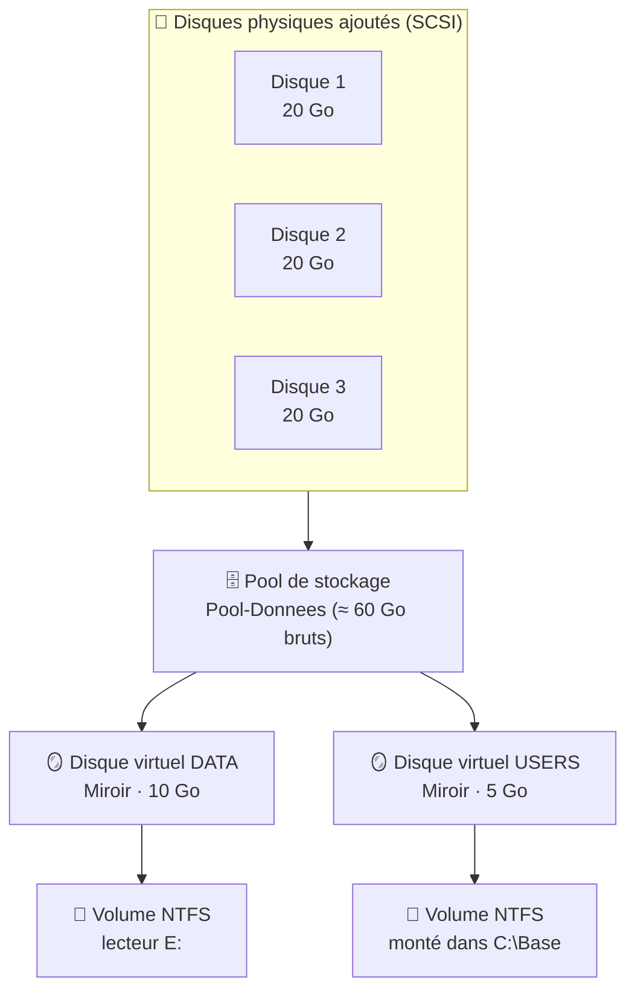
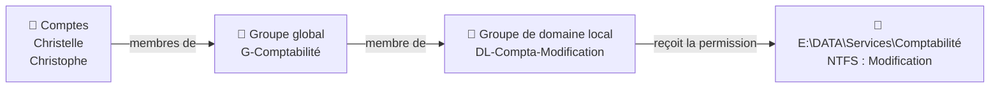
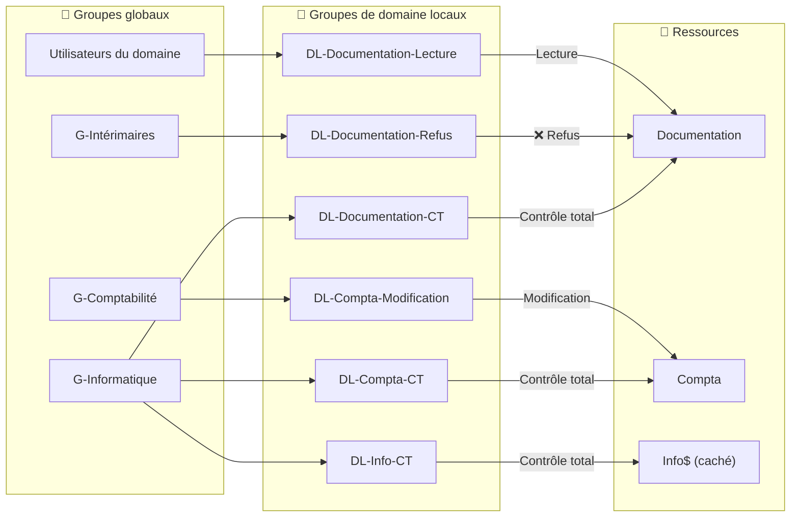
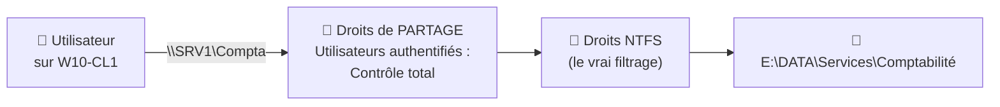
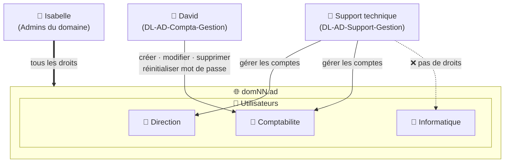
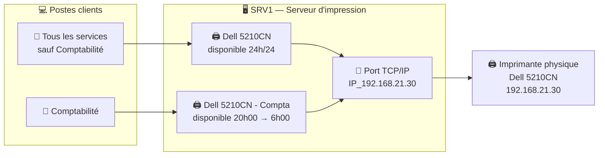

# TP4 — Gestion de ressources

> **Objectifs** : ajouter de l'espace de stockage tolérant aux pannes, partager des dossiers avec les bons droits, déléguer des privilèges dans l'Active Directory et partager une imprimante.

> ⚠️ **Convention** : remplace `NN` par tes initiales partout (`DOMNN` → `DOMJD`, `DC=domNN` → `DC=domJD`).

---

## Sommaire

- [Étape 1 — Ajouter de l'espace disque sur SRV1](#étape-1--ajouter-de-lespace-disque-sur-srv1)
- [Étape 2 — Comprendre la méthode AGDLP](#étape-2--comprendre-la-méthode-agdlp)
- [Étape 3 — Créer les groupes de domaine locaux](#étape-3--créer-les-groupes-de-domaine-locaux)
- [Étape 4 — Créer les dossiers et les partages](#étape-4--créer-les-dossiers-et-les-partages)
- [Étape 5 — Tester les accès](#étape-5--tester-les-accès)
- [Étape 6 — Déléguer des privilèges dans l'AD](#étape-6--déléguer-des-privilèges-dans-lad)
- [Étape 7 — Partager l'imprimante](#étape-7--partager-limprimante)
- [Récapitulatif](#récapitulatif)

---

## Étape 1 — Ajouter de l'espace disque sur SRV1

### Le principe

On ajoute 3 disques de 20 Go et on les regroupe dans un **pool de stockage**. Dans ce pool, on crée des **disques virtuels en miroir** : chaque donnée est écrite sur 2 disques. Si un disque tombe en panne, les données restent disponibles sur l'autre, **sans interruption de service**.



> 💡 **Miroir ou parité ?** Les deux supportent la perte d'un disque. Le **miroir** consomme plus d'espace (données en double) mais il est plus rapide en écriture. La **parité** économise de l'espace mais écrit plus lentement. Pour une maquette, le miroir est le plus simple.

### 1.1 Ajouter les disques dans VMware

VM **SRV1** éteinte → **Edit virtual machine settings → Add → Hard Disk → SCSI → 20 Go**. Répète 3 fois, puis démarre la VM.

### 1.2 Créer le pool de stockage

Sur **SRV1**, en administrateur :

```powershell
# Liste les disques disponibles pour un pool (vierges, non utilisés)
$disques = Get-PhysicalDisk -CanPool $true
$disques | Select-Object FriendlyName, Size, MediaType

# Récupère le sous-système de stockage de Windows
$sousSysteme = Get-StorageSubSystem | Select-Object -First 1

# Crée le pool avec les 3 disques
New-StoragePool -FriendlyName "Pool-Donnees" `
                -StorageSubSystemUniqueId $sousSysteme.UniqueId `
                -PhysicalDisks $disques
```

### 1.3 Créer le volume DATA (E:)

```powershell
# Crée un disque virtuel de 10 Go en miroir dans le pool
#   -ResiliencySettingName Mirror : chaque donnée est écrite sur 2 disques
#   -ProvisioningType Fixed       : l'espace est réservé immédiatement
New-VirtualDisk -StoragePoolFriendlyName "Pool-Donnees" `
                -FriendlyName "DATA" `
                -ResiliencySettingName Mirror `
                -Size 10GB `
                -ProvisioningType Fixed

# Initialise le disque, crée une partition sur la lettre E: et la formate en NTFS
Get-VirtualDisk "DATA" | Get-Disk |
    Initialize-Disk -PartitionStyle GPT -PassThru |
    New-Partition -DriveLetter E -UseMaximumSize |
    Format-Volume -FileSystem NTFS -NewFileSystemLabel "DATA" -Confirm:$false
```

### 1.4 Créer le volume USERS (monté dans C:\Base)

Au lieu d'une lettre, ce volume est **monté dans un dossier vide** : `C:\Base` donne accès à un disque différent de `C:`.

```powershell
# Disque virtuel de 5 Go en miroir
New-VirtualDisk -StoragePoolFriendlyName "Pool-Donnees" `
                -FriendlyName "USERS" `
                -ResiliencySettingName Mirror `
                -Size 5GB `
                -ProvisioningType Fixed

# Le dossier de montage doit exister et être vide
New-Item -Path "C:\Base" -ItemType Directory -Force

# Initialise le disque et crée la partition (sans lettre de lecteur)
$partition = Get-VirtualDisk "USERS" | Get-Disk |
    Initialize-Disk -PartitionStyle GPT -PassThru |
    New-Partition -UseMaximumSize

# Formate en NTFS
$partition | Format-Volume -FileSystem NTFS -NewFileSystemLabel "USERS" -Confirm:$false

# Monte la partition dans le dossier C:\Base
$partition | Add-PartitionAccessPath -AccessPath "C:\Base\"
```

**Vérification :**

```powershell
# Les deux disques virtuels doivent être "Healthy" (sains) en miroir
Get-VirtualDisk | Select-Object FriendlyName, ResiliencySettingName, Size, HealthStatus

# Les volumes et leurs points de montage
Get-Volume | Where-Object FileSystemLabel -in "DATA", "USERS"
```

> 💡 **Tester la tolérance de panne** : retire un disque dans VMware pendant que la VM tourne. `E:` reste accessible, et `Get-VirtualDisk` affiche l'état **Degraded** (dégradé) au lieu de **Healthy**.

---

## Étape 2 — Comprendre la méthode AGDLP

### Le principe

Microsoft recommande de **ne jamais donner de droits directement à un utilisateur**, ni même à un groupe global. On suit la chaîne **AGDLP** :

| Lettre | Signification | Dans ce TP |
|---|---|---|
| **A** | *Accounts* : les comptes utilisateurs | Christelle, Isabelle… |
| **G** | *Global groups* : groupes globaux, **un par service** (qui sont les gens) | `G-Comptabilité` |
| **DL** | *Domain Local groups* : groupes de domaine locaux, **un par ressource et par droit** (ce qu'on peut faire) | `DL-Compta-Modification` |
| **P** | *Permissions* : les droits NTFS sur le dossier | Modification sur `E:\DATA\Services\Comptabilité` |



> 💡 **Pourquoi cette complexité ?** Si un nouveau comptable arrive, on l'ajoute simplement dans `G-Comptabilité` : il obtient tous les accès du service **sans toucher aux dossiers**. Et en lisant les membres de `DL-Compta-Modification`, on sait immédiatement **qui** peut modifier ce dossier.

### Les accès demandés



> 💡 **Le cas des intérimaires** : Christophe fait partie des « Utilisateurs du domaine », il reçoit donc la lecture sur Documentation. Pour le bloquer, on ajoute un **refus explicite**. Un refus l'emporte toujours sur une autorisation.
>
> **Le cas de Compta** : « aucun privilège pour les autres services » ne nécessite pas de refus. Il suffit de **ne pas leur donner d'accès** : ce qui n'est pas autorisé est interdit.

---

## Étape 3 — Créer les groupes de domaine locaux

Sur un DC ou sur W10-CL1 avec les RSAT :

```powershell
$ouGroupes = "OU=Groupes,OU=DOMNN,DC=domNN,DC=ad"

# Paramètres communs : groupes de sécurité, étendue Domaine local
$typeDL = @{ GroupScope = "DomainLocal"; GroupCategory = "Security"; Path = $ouGroupes }

# Création des groupes (un par ressource et par niveau de droit)
"DL-Documentation-Lecture", "DL-Documentation-Refus", "DL-Documentation-CT",
"DL-Compta-Modification", "DL-Compta-CT",
"DL-Info-CT" | ForEach-Object {
    New-ADGroup @typeDL -Name $_
}
```

### Ajouter les groupes globaux dans les groupes locaux

```powershell
# "Utilisateurs du domaine" a toujours un SID qui se termine par -513
# (on utilise le SID car le nom change selon la langue de Windows)
$sidDomaine = (Get-ADDomain).DomainSID.Value
$utilisateursDuDomaine = Get-ADGroup -Identity "$sidDomaine-513"

# Documentation
Add-ADGroupMember "DL-Documentation-Lecture" -Members $utilisateursDuDomaine
Add-ADGroupMember "DL-Documentation-Refus"   -Members "G-Intérimaires"
Add-ADGroupMember "DL-Documentation-CT"      -Members "G-Informatique"

# Comptabilité
Add-ADGroupMember "DL-Compta-Modification"   -Members "G-Comptabilité"
Add-ADGroupMember "DL-Compta-CT"             -Members "G-Informatique"

# Informatique
Add-ADGroupMember "DL-Info-CT"               -Members "G-Informatique"
```

---

## Étape 4 — Créer les dossiers et les partages

### Le principe : deux niveaux de droits

Un dossier partagé est protégé par **deux couches** de droits. Le droit effectif est **le plus restrictif des deux**.



> 💡 **Bonne pratique** : on ouvre largement le partage (*Utilisateurs authentifiés : Contrôle total*) et on gère **tout le filtrage en NTFS**. On n'a ainsi qu'un seul endroit à vérifier, et les droits NTFS s'appliquent aussi aux accès locaux.

### 4.1 Créer l'arborescence

Sur **SRV1**, en administrateur :

```powershell
# Crée les dossiers (et les dossiers parents manquants)
New-Item -Path "E:\DATA\Documentation"          -ItemType Directory -Force
New-Item -Path "E:\DATA\Services\Comptabilité"  -ItemType Directory -Force
New-Item -Path "E:\DATA\Informatique"           -ItemType Directory -Force
```

### 4.2 Définir les droits NTFS

On utilise **`icacls`**, plus lisible que les commandes PowerShell natives pour les droits NTFS.

| Code icacls | Signification |
|---|---|
| `F` | Contrôle total (*Full*) |
| `M` | Modification |
| `RX` | Lecture et exécution |
| `(OI)(CI)` | S'applique au dossier, aux sous-dossiers et aux fichiers |
| `/inheritance:r` | Supprime les droits hérités du dossier parent |
| `*S-1-5-18` | SYSTEM (désigné par son SID, valable en toutes langues) |
| `*S-1-5-32-544` | Administrateurs locaux |

```powershell
# --- Documentation ---
# /inheritance:r supprime les droits hérités de E:\ (qui donnent la lecture à tous)
icacls "E:\DATA\Documentation" /inheritance:r `
    /grant "*S-1-5-18:(OI)(CI)F" `
    /grant "*S-1-5-32-544:(OI)(CI)F" `
    /grant "DOMNN\DL-Documentation-CT:(OI)(CI)F" `
    /grant "DOMNN\DL-Documentation-Lecture:(OI)(CI)RX" `
    /deny  "DOMNN\DL-Documentation-Refus:(OI)(CI)F"

# --- Comptabilité ---
icacls "E:\DATA\Services\Comptabilité" /inheritance:r `
    /grant "*S-1-5-18:(OI)(CI)F" `
    /grant "*S-1-5-32-544:(OI)(CI)F" `
    /grant "DOMNN\DL-Compta-CT:(OI)(CI)F" `
    /grant "DOMNN\DL-Compta-Modification:(OI)(CI)M"

# --- Informatique ---
icacls "E:\DATA\Informatique" /inheritance:r `
    /grant "*S-1-5-18:(OI)(CI)F" `
    /grant "*S-1-5-32-544:(OI)(CI)F" `
    /grant "DOMNN\DL-Info-CT:(OI)(CI)F"
```

**Vérification :**

```powershell
# Affiche les droits NTFS d'un dossier
icacls "E:\DATA\Documentation"
```

### 4.3 Créer les partages

```powershell
# Nom local du groupe "Utilisateurs authentifiés" (SID S-1-5-11), quelle que soit la langue
$utilisateursAuth = ([Security.Principal.SecurityIdentifier]"S-1-5-11").Translate([Security.Principal.NTAccount]).Value

# -FolderEnumerationMode AccessBased : chacun ne voit que les dossiers auxquels il a accès
New-SmbShare -Name "Documentation" -Path "E:\DATA\Documentation" `
             -FullAccess $utilisateursAuth -FolderEnumerationMode AccessBased

New-SmbShare -Name "Compta" -Path "E:\DATA\Services\Comptabilité" `
             -FullAccess $utilisateursAuth -FolderEnumerationMode AccessBased

# Le $ à la fin du nom rend le partage INVISIBLE dans le voisinage réseau
# (il reste accessible si on connaît son nom : \\SRV1\Info$)
New-SmbShare -Name "Info$" -Path "E:\DATA\Informatique" `
             -FullAccess $utilisateursAuth
```

> ⚠️ Un partage caché n'est **pas** un partage sécurisé : il est seulement absent de la liste. La sécurité repose toujours sur les droits NTFS.

### 4.4 Publier le partage Documentation dans l'annuaire

Un partage **publié** apparaît dans l'AD : les utilisateurs peuvent le trouver avec la recherche de l'annuaire sans connaître le nom du serveur.

```powershell
# Crée un objet "Dossier partagé" (type volume) qui pointe vers le partage
New-ADObject -Name "Documentation" `
             -Type "volume" `
             -Path "OU=DOMNN,DC=domNN,DC=ad" `
             -OtherAttributes @{ uNCName = "\\SRV1\Documentation" }
```

En graphique : **Utilisateurs et ordinateurs AD** → clic droit sur une OU → **Nouveau → Dossier partagé**.

**Vérification :**

```powershell
# Liste les partages de SRV1
Get-SmbShare | Where-Object Name -in "Documentation", "Compta", "Info$"
```

---

## Étape 5 — Tester les accès

Ouvre une session sur **W10-CL1** avec chaque utilisateur, puis teste :

```powershell
# Test d'ACCÈS / LECTURE : lister le contenu du partage
Get-ChildItem "\\SRV1\Documentation"

# Test de MODIFICATION : créer puis supprimer un fichier
New-Item "\\SRV1\Documentation\test.txt" -ItemType File
Remove-Item "\\SRV1\Documentation\test.txt"
```

> ⚠️ **Appartenance aux groupes** : les groupes d'un utilisateur sont lus **à l'ouverture de session**. Si tu modifies ses groupes, il doit **se déconnecter et se reconnecter** pour que le changement soit pris en compte.

### Résultats attendus

**DOCUMENTATION**

| Utilisateur | Privilège testé | Résultat attendu | Pourquoi |
|---|---|---|---|
| Christophe | Accès | ❌ ÉCHEC | Intérimaire → refus explicite |
| Christelle | Accès | ✅ OK | Utilisateur du domaine → lecture |
| David | Lecture | ✅ OK | Utilisateur du domaine → lecture |
| Isabelle | Lecture | ✅ OK | Informatique → contrôle total |
| Christelle | Modification | ❌ ÉCHEC | Lecture seule |
| Isabelle | Modification | ✅ OK | Informatique → contrôle total |

**COMPTABILITÉ**

| Utilisateur | Privilège testé | Résultat attendu | Pourquoi |
|---|---|---|---|
| Christelle | Accès | ✅ OK | Comptabilité → modification |
| David | Accès | ❌ ÉCHEC | Service Direction → aucun droit |
| Christelle | Modification | ✅ OK | Comptabilité → modification |
| Isabelle | Contrôle total | ✅ OK | Informatique → contrôle total |

> 💡 Pour tester le **contrôle total** d'Isabelle, ouvre les propriétés d'un fichier du partage → **Sécurité → Modifier**. Seul un utilisateur en contrôle total peut changer les autorisations.

---

## Étape 6 — Déléguer des privilèges dans l'AD

### Le principe

La **délégation** donne à un utilisateur des droits d'administration **limités à une OU**, sans en faire un administrateur du domaine. C'est le principe du **moindre privilège** : chacun a juste les droits nécessaires à son travail.



### 6.1 Créer les groupes de délégation

On délègue à des **groupes**, jamais à des personnes : si David change de poste, on retire juste son appartenance.

```powershell
$ouGroupes = "OU=Groupes,OU=DOMNN,DC=domNN,DC=ad"

New-ADGroup -Name "DL-AD-Compta-Gestion"  -GroupScope DomainLocal -GroupCategory Security -Path $ouGroupes
New-ADGroup -Name "DL-AD-Support-Gestion" -GroupScope DomainLocal -GroupCategory Security -Path $ouGroupes

Add-ADGroupMember "DL-AD-Compta-Gestion"  -Members "dgrenier"
Add-ADGroupMember "DL-AD-Support-Gestion" -Members "G-Support technique"
```

### 6.2 Appliquer la délégation

**Méthode graphique (recommandée)** : dans **Utilisateurs et ordinateurs AD**, clic droit sur l'OU → **Délégation de contrôle** → ajoute le groupe → coche **Créer, supprimer et gérer les comptes d'utilisateurs** et **Réinitialiser les mots de passe utilisateur et forcer leur changement**.

**En ligne de commande**, avec `dsacls` :

```powershell
# Fonction : donne à un groupe la gestion complète des utilisateurs d'une OU
function Set-DelegationUtilisateurs {
    param($OU, $Groupe)

    # CCDC;user : créer (CC) et supprimer (DC) des objets de type utilisateur dans l'OU
    dsacls $OU /I:T /G "${Groupe}:CCDC;user"

    # GA;;user : tous les droits (GA = Generic All) sur les objets utilisateurs de l'OU,
    # ce qui inclut la modification des attributs et la réinitialisation du mot de passe
    # /I:S : s'applique uniquement aux objets enfants, pas à l'OU elle-même
    dsacls $OU /I:S /G "${Groupe}:GA;;user"
}

$base = "OU=Utilisateurs,OU=DOMNN,DC=domNN,DC=ad"

# David : gestion des comptes de la Comptabilité
Set-DelegationUtilisateurs -OU "OU=Comptabilite,$base" -Groupe "DOMNN\DL-AD-Compta-Gestion"

# Support technique : tous les services SAUF Informatique
Set-DelegationUtilisateurs -OU "OU=Comptabilite,$base" -Groupe "DOMNN\DL-AD-Support-Gestion"
Set-DelegationUtilisateurs -OU "OU=Direction,$base"    -Groupe "DOMNN\DL-AD-Support-Gestion"
```

> 💡 **Pourquoi pas sur l'OU `Utilisateurs` directement ?** Les droits seraient hérités par **toutes** les sous-OU, y compris Informatique. Le support pourrait alors réinitialiser le mot de passe d'Isabelle et prendre son identité d'administratrice.

### 6.3 Isabelle administratrice

L'énoncé demande un groupe qui dispose **nativement** de tous les droits : c'est **Admins du domaine**.

```powershell
# "Admins du domaine" a toujours un SID qui se termine par -512
$sidDomaine = (Get-ADDomain).DomainSID.Value
Add-ADGroupMember -Identity "$sidDomaine-512" -Members "ivédère"
```

> 💡 Dans une forêt à plusieurs domaines, le groupe qui a les droits sur **toute la forêt** est **Administrateurs de l'entreprise** (SID `-519`). Avec un seul domaine, **Admins du domaine** suffit.

### 6.4 Tester

Sur **W10-CL1**, connecté en tant que **David** (les RSAT doivent être installés) :

```powershell
# Doit fonctionner : Christelle est dans l'OU Comptabilité
Set-ADAccountPassword -Identity "curique" -Reset `
    -NewPassword (ConvertTo-SecureString "Cs3cr3t!" -AsPlainText -Force)

# Doit ÉCHOUER (accès refusé) : Isabelle est dans l'OU Informatique
Set-ADAccountPassword -Identity "ivédère" -Reset `
    -NewPassword (ConvertTo-SecureString "Cs3cr3t!" -AsPlainText -Force)
```

Refais le test avec **Ivan** : il doit pouvoir gérer Direction et Comptabilité, mais pas Informatique.

---

## Étape 7 — Partager l'imprimante

### Le principe

**SRV1** devient **serveur d'impression** : l'imprimante réseau est installée **une seule fois** sur le serveur, puis les postes s'y connectent. Le serveur gère les pilotes, les files d'attente et les droits.

Pour limiter la Comptabilité à la plage **20h-6h** tout en laissant les autres imprimer toute la journée, on crée **deux imprimantes logiques** vers le **même périphérique physique**, chacune avec ses horaires et ses droits.



### 7.1 Installer le rôle et le pilote

Sur **SRV1**, en administrateur :

```powershell
# Installe le rôle Serveur d'impression et sa console
Install-WindowsFeature Print-Server -IncludeManagementTools

# Ajoute le pilote Dell au magasin de pilotes de Windows
# (remplace le chemin par celui du pilote fourni par le formateur)
pnputil /add-driver "C:\Pilotes\Dell\*.inf" /install

# Installe le pilote 64 bits dans le serveur d'impression
# (vérifie le nom exact dans le fichier .inf si la commande échoue)
Add-PrinterDriver -Name "Dell Open Print PCL 5"

# Pilote 32 bits, pour les anciens postes (nécessite le .inf 32 bits)
Add-PrinterDriver -Name "Dell Open Print PCL 5" `
                  -PrinterEnvironment "Windows NT x86" `
                  -InfPath "C:\Pilotes\Dell\x86\pilote.inf"
```

> 💡 **Pourquoi deux pilotes ?** Quand un poste se connecte, il **télécharge le pilote depuis le serveur**. Un Windows 32 bits a besoin du pilote 32 bits. En graphique : **Gestion de l'impression → Imprimante → Propriétés → Partage → Pilotes supplémentaires**.

### 7.2 Créer le port et les imprimantes

```powershell
# Port TCP/IP standard vers l'adresse de l'imprimante
# (équivalent du type de périphérique "Generic Network Card" de l'assistant)
Add-PrinterPort -Name "IP_192.168.21.30" -PrinterHostAddress "192.168.21.30"

# Imprimante pour tout le monde, partagée et publiée dans l'AD (-Published)
Add-Printer -Name "Dell 5210CN" `
            -DriverName "Dell Open Print PCL 5" `
            -PortName "IP_192.168.21.30" `
            -Shared -ShareName "Dell5210CN" `
            -Published

# Seconde imprimante logique, réservée à la Comptabilité
Add-Printer -Name "Dell 5210CN - Compta" `
            -DriverName "Dell Open Print PCL 5" `
            -PortName "IP_192.168.21.30" `
            -Shared -ShareName "Dell5210CN-Compta" `
            -Published
```

> 💡 **Publiée dans l'AD** : l'imprimante apparaît dans l'annuaire. Les utilisateurs la trouvent avec **Ajouter une imprimante → Rechercher une imprimante dans l'annuaire**.

### 7.3 Horaires et autorisations

Ces réglages se font plus simplement dans **Gestion de l'impression** (`printmanagement.msc`).

**Horaires** : propriétés de *Dell 5210CN - Compta* → onglet **Avancé** → **Disponible de 20:00 à 6:00**.

**Autorisations** : onglet **Sécurité** de chaque imprimante.

| Imprimante | Groupe / utilisateur | Autorisation |
|---|---|---|
| Dell 5210CN | Utilisateurs authentifiés | ✅ Imprimer |
| Dell 5210CN | G-Comptabilité | ❌ Refuser : Imprimer |
| Dell 5210CN | G-Informatique | ✅ Imprimer · Gérer cette imprimante · Gérer les documents |
| Dell 5210CN - Compta | G-Comptabilité | ✅ Imprimer |
| Dell 5210CN - Compta | David (responsable) | ✅ Imprimer · Gérer les documents |
| Dell 5210CN - Compta | G-Informatique | ✅ Imprimer · Gérer cette imprimante · Gérer les documents |

> ⚠️ Sur *Dell 5210CN - Compta*, **retire le groupe « Tout le monde »**, sinon tout le monde pourrait imprimer dessus.

> 💡 **Le refus sur la première imprimante** est indispensable : la Comptabilité fait partie des « Utilisateurs authentifiés » et pourrait sinon imprimer à toute heure sur l'imprimante principale.

**Vérification :**

```powershell
# Liste les imprimantes partagées et publiées
Get-Printer | Select-Object Name, ShareName, Shared, Published, PortName
```

### 7.4 Tester manuellement depuis W10-CL1

```powershell
# Se connecte à l'imprimante partagée (le pilote est téléchargé depuis SRV1)
Add-Printer -ConnectionName "\\SRV1\Dell5210CN"

# Vérifie qu'elle est bien installée
Get-Printer | Where-Object Name -like "*Dell*"
```

Le déploiement **automatique** par service se fera avec une GPO au TP5.

---

## Récapitulatif

| Besoin | Commande clé |
|---|---|
| Créer un pool de stockage | `New-StoragePool` |
| Créer un disque virtuel en miroir | `New-VirtualDisk -ResiliencySettingName Mirror` |
| Monter un volume dans un dossier | `Add-PartitionAccessPath` |
| Créer un groupe de domaine local | `New-ADGroup -GroupScope DomainLocal` |
| Droits NTFS | `icacls` |
| Créer un partage | `New-SmbShare` |
| Publier un partage dans l'AD | `New-ADObject -Type volume` |
| Déléguer des droits sur une OU | `dsacls` ou assistant *Délégation de contrôle* |
| Installer une imprimante partagée | `Add-PrinterPort` + `Add-Printer -Shared -Published` |
| Se connecter à une imprimante | `Add-Printer -ConnectionName` |
