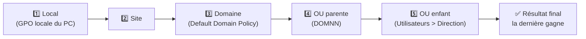
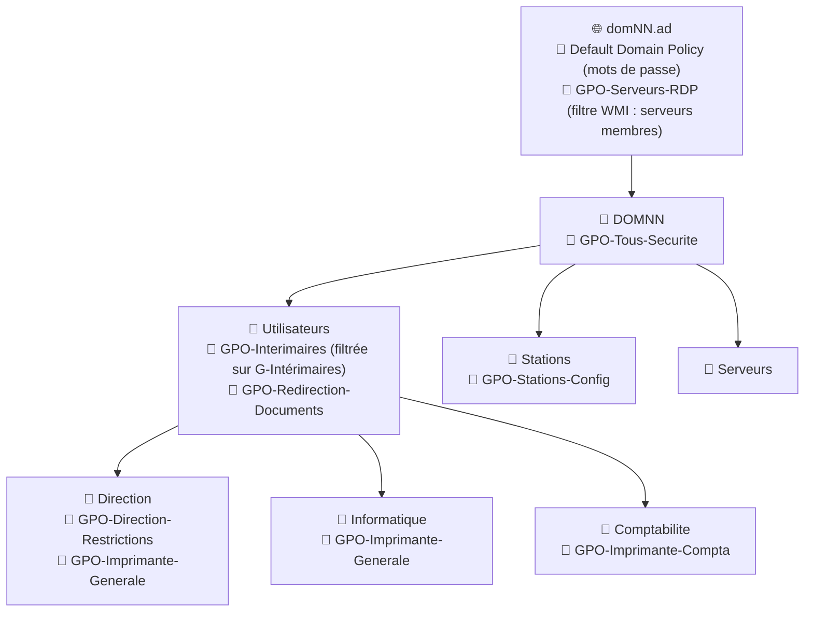
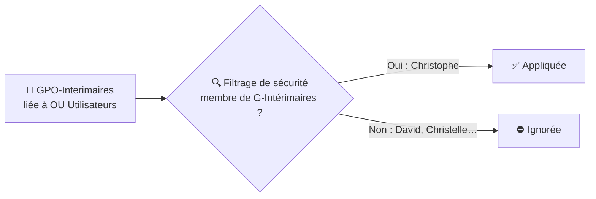
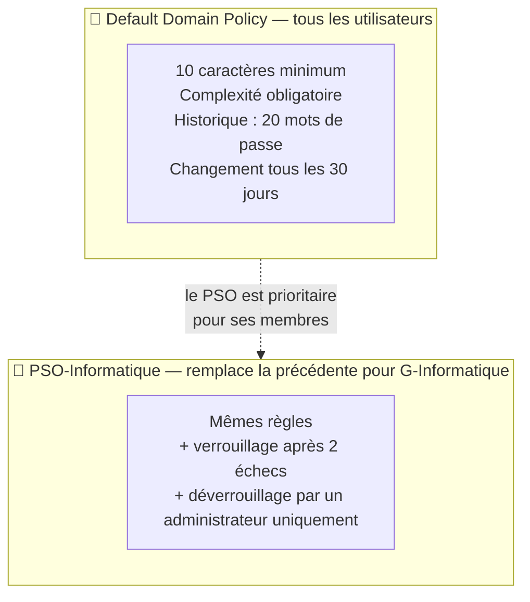
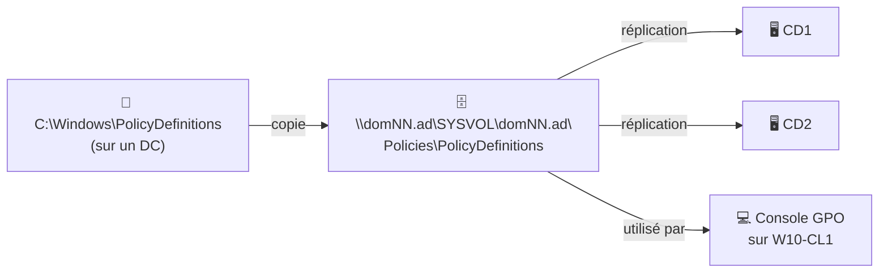
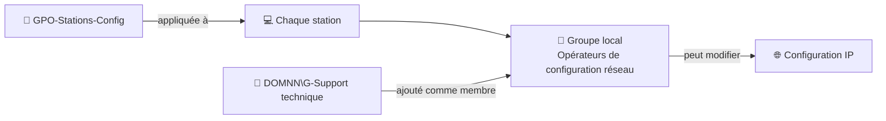
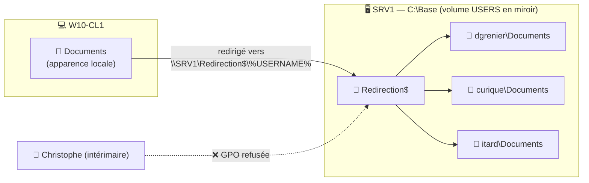
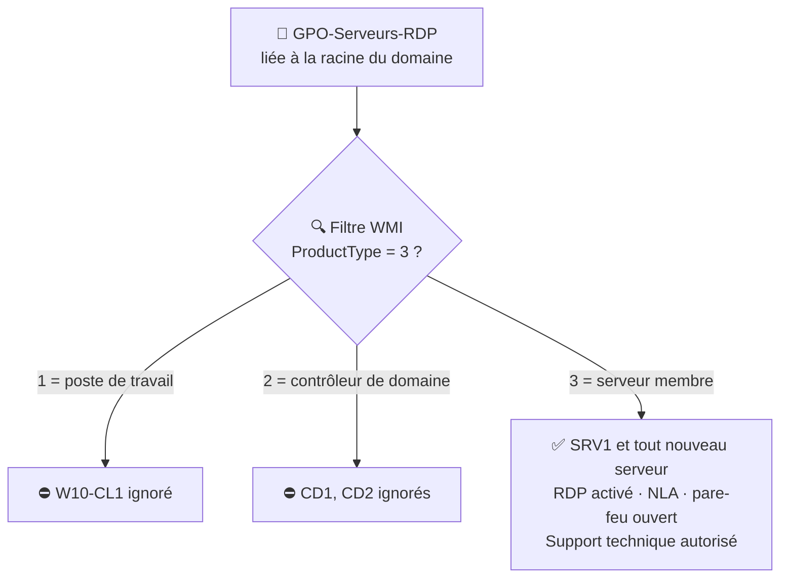
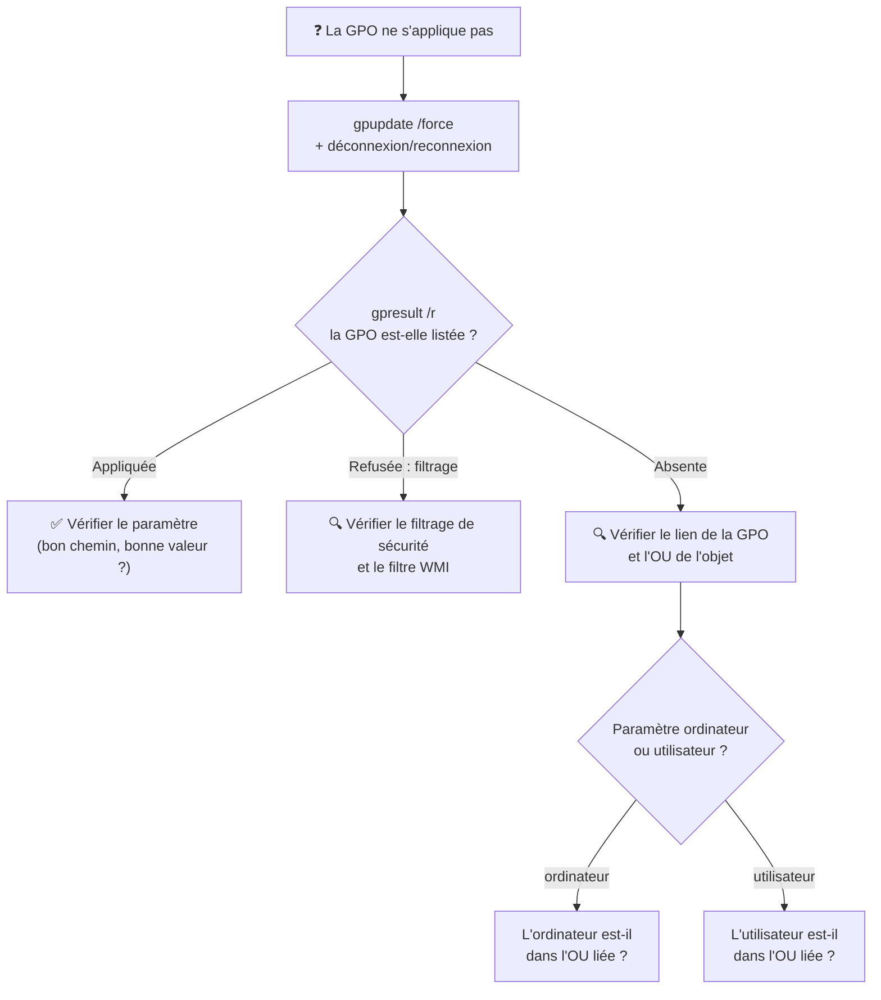

# TP5 — Les stratégies de groupe (GPO)

> **Objectifs** : configurer des paramètres ciblés par GPO, créer et lier des stratégies, durcir la politique de mots de passe, déployer des imprimantes, rediriger des dossiers et automatiser la configuration des serveurs.

> ⚠️ **Convention** : remplace `NN` par tes initiales partout (`DOMNN` → `DOMJD`, `DC=domNN` → `DC=domJD`).

> 🧪 **#MaintenantJeTeste** : l'énoncé insiste, et il a raison. **Teste chaque GPO avant de passer à la suivante.** Une erreur est bien plus facile à trouver quand une seule chose a changé.

---

## Sommaire

- [Comprendre les GPO](#comprendre-les-gpo)
- [Étape 0 — Ranger les ordinateurs dans les OU](#étape-0--ranger-les-ordinateurs-dans-les-ou)
- [Étape 1 — GPO pour tous : sécurité de base](#étape-1--gpo-pour-tous--sécurité-de-base)
- [Étape 2 — GPO Direction : restrictions](#étape-2--gpo-direction--restrictions)
- [Étape 3 — GPO Intérimaires : filtrage par groupe](#étape-3--gpo-intérimaires--filtrage-par-groupe)
- [Étape 4 — Stratégie de mots de passe](#étape-4--stratégie-de-mots-de-passe)
- [Étape 5 — Déployer les imprimantes](#étape-5--déployer-les-imprimantes)
- [Étape 6 — Magasin central des modèles d'administration](#étape-6--magasin-central-des-modèles-dadministration)
- [Étape 7 — Support technique : configuration réseau des postes](#étape-7--support-technique--configuration-réseau-des-postes)
- [Étape 8 — Redirection du dossier Documents](#étape-8--redirection-du-dossier-documents)
- [Étape 9 — Bureau à distance automatique sur les nouveaux serveurs](#étape-9--bureau-à-distance-automatique-sur-les-nouveaux-serveurs)
- [Tester et dépanner les GPO](#tester-et-dépanner-les-gpo)
- [Récapitulatif](#récapitulatif)

---

## Comprendre les GPO

### C'est quoi une GPO ?

Une **stratégie de groupe** (*Group Policy Object*) est un ensemble de paramètres appliqué automatiquement à des utilisateurs ou des ordinateurs. On configure une fois, et tous les postes concernés reçoivent la configuration.

Une GPO contient **deux parties indépendantes** :

| Partie | S'applique à… | Quand ? | Exemple |
|---|---|---|---|
| **Configuration ordinateur** | Les **ordinateurs** présents dans l'OU liée | Au démarrage, puis toutes les ~90 min | Pare-feu, Bureau à distance |
| **Configuration utilisateur** | Les **utilisateurs** présents dans l'OU liée | À l'ouverture de session, puis toutes les ~90 min | Gestionnaire des tâches, corbeille |

> ⚠️ **Piège classique** : une GPO avec des paramètres **ordinateur** liée à une OU qui ne contient que des **utilisateurs** ne fait **rien**. Et inversement.

### L'ordre d'application : LSDOU

Les GPO s'appliquent dans cet ordre. En cas de conflit, **la dernière appliquée gagne** : c'est l'OU la plus proche de l'objet qui a le dernier mot.



### Le plan de ce TP



Toutes les commandes s'exécutent sur un **DC** ou sur **W10-CL1 avec les RSAT**, en administrateur du domaine. Le module `GroupPolicy` est installé avec la console de gestion des stratégies de groupe (`gpmc.msc`).

---

## Étape 0 — Ranger les ordinateurs dans les OU

Au TP2, W10-CL1 et SRV1 ont rejoint le domaine dans le conteneur **`Computers`**. Or un conteneur ne peut **pas** recevoir de GPO. Il faut les déplacer dans nos OU pour que les paramètres ordinateur s'appliquent.

```powershell
$racine = "OU=DOMNN,DC=domNN,DC=ad"

# Le poste client va dans Stations (ici dans le sous-dossier Informatique, à adapter)
Get-ADComputer "W10-CL1" | Move-ADObject -TargetPath "OU=Informatique,OU=Stations,$racine"

# Le serveur membre va dans Serveurs
Get-ADComputer "SRV1" | Move-ADObject -TargetPath "OU=Serveurs,$racine"
```

---

## Étape 1 — GPO pour tous : sécurité de base

**Besoins :**

- ne pas afficher le nom du dernier utilisateur connecté ;
- forcer l'activation du pare-feu et bloquer les connexions entrantes.

Ces deux paramètres sont des paramètres **ordinateur**. On lie la GPO à l'OU racine **DOMNN** pour qu'elle touche toutes les machines rangées dessous.

> 💡 **Pourquoi masquer le dernier utilisateur ?** Afficher son identifiant donne à un attaquant la moitié des informations de connexion. Il ne lui reste plus qu'à deviner le mot de passe.

### Méthode PowerShell

`Set-GPRegistryValue` écrit dans une GPO la valeur de registre qui correspond au paramètre voulu.

```powershell
# 1. Crée la GPO et la lie à l'OU DOMNN
New-GPO -Name "GPO-Tous-Securite" |
    New-GPLink -Target "OU=DOMNN,DC=domNN,DC=ad"

# 2. Ne pas afficher le dernier nom d'utilisateur
Set-GPRegistryValue -Name "GPO-Tous-Securite" `
    -Key "HKLM\Software\Microsoft\Windows\CurrentVersion\Policies\System" `
    -ValueName "DontDisplayLastUserName" -Type DWord -Value 1

# 3. Pare-feu : activé (EnableFirewall = 1) et entrées bloquées (DefaultInboundAction = 1)
#    pour les 3 profils réseau : domaine, privé et public
foreach ($profil in "DomainProfile", "PrivateProfile", "PublicProfile") {
    $cle = "HKLM\Software\Policies\Microsoft\WindowsFirewall\$profil"
    Set-GPRegistryValue -Name "GPO-Tous-Securite" -Key $cle -ValueName "EnableFirewall"       -Type DWord -Value 1
    Set-GPRegistryValue -Name "GPO-Tous-Securite" -Key $cle -ValueName "DefaultInboundAction" -Type DWord -Value 1
}
```

### Méthode graphique (équivalente)

| Paramètre | Chemin dans l'éditeur de GPO |
|---|---|
| Dernier utilisateur | Configuration ordinateur → Stratégies → Paramètres Windows → Paramètres de sécurité → Stratégies locales → Options de sécurité → **Ouverture de session interactive : ne pas afficher le dernier utilisateur connecté** → Activé |
| Pare-feu | Configuration ordinateur → Stratégies → Paramètres Windows → Paramètres de sécurité → **Pare-feu Windows Defender avec fonctions avancées** → Propriétés → pour chaque profil : État = Actif, Connexions entrantes = Bloquer |

🧪 **Test** : sur W10-CL1, lance `gpupdate /force`, redémarre, et vérifie que l'écran de connexion ne propose plus le dernier utilisateur.

---

## Étape 2 — GPO Direction : restrictions

**Besoins** (paramètres **utilisateur**, liés à l'OU `Utilisateurs > Direction`) :

| Besoin | Valeur de registre |
|---|---|
| Pas de « Propriétés » dans le clic droit sur *Ce PC* | `NoPropertiesMyComputer = 1` |
| Console Certificats interdite dans les MMC | `Restrict_Run = 1` sur le composant Certificats |
| Outils d'édition du registre bloqués | `DisableRegistryTools = 1` |
| Gestionnaire des tâches bloqué | `DisableTaskMgr = 1` |

```powershell
$gpo = "GPO-Direction-Restrictions"

# 1. Crée la GPO et la lie à l'OU des utilisateurs de la Direction
New-GPO -Name $gpo |
    New-GPLink -Target "OU=Direction,OU=Utilisateurs,OU=DOMNN,DC=domNN,DC=ad"

# 2. Supprime "Propriétés" du menu contextuel de Ce PC
Set-GPRegistryValue -Name $gpo `
    -Key "HKCU\Software\Microsoft\Windows\CurrentVersion\Policies\Explorer" `
    -ValueName "NoPropertiesMyComputer" -Type DWord -Value 1

# 3. Interdit le composant enfichable "Certificats" dans les consoles MMC
#    (le GUID identifie le composant Certificats)
Set-GPRegistryValue -Name $gpo `
    -Key "HKCU\Software\Policies\Microsoft\MMC\{53D6AB1D-2488-11D1-A28C-00C04FB94F17}" `
    -ValueName "Restrict_Run" -Type DWord -Value 1

# 4. Bloque l'éditeur du registre (regedit)
Set-GPRegistryValue -Name $gpo `
    -Key "HKCU\Software\Microsoft\Windows\CurrentVersion\Policies\System" `
    -ValueName "DisableRegistryTools" -Type DWord -Value 1

# 5. Bloque le Gestionnaire des tâches
Set-GPRegistryValue -Name $gpo `
    -Key "HKCU\Software\Microsoft\Windows\CurrentVersion\Policies\System" `
    -ValueName "DisableTaskMgr" -Type DWord -Value 1
```

**Chemins graphiques** (Configuration utilisateur → Stratégies → Modèles d'administration) :

- **Bureau** → *Supprimer Propriétés du menu contextuel de l'icône Ordinateur* ;
- **Composants Windows → Microsoft Management Console → Composants logiciels enfichables restreints/autorisés** → *Certificats* → Désactivé ;
- **Système** → *Empêcher l'accès aux outils de modifications du Registre* ;
- **Système → Options Ctrl+Alt+Suppr** → *Supprimer le Gestionnaire des tâches*.

🧪 **Test** : connecte-toi avec **David** sur W10-CL1. `regedit`, `Ctrl + Shift + Esc` et l'ajout de *Certificats* dans `mmc` doivent être bloqués. Refais le test avec **Christelle** : tout doit fonctionner normalement.

---

## Étape 3 — GPO Intérimaires : filtrage par groupe

### Le principe

Les intérimaires ne forment pas une OU : Christophe est rangé dans l'OU Comptabilité. On lie donc la GPO à l'OU **Utilisateurs** (tous les utilisateurs), puis on la **filtre** pour qu'elle ne s'applique qu'aux membres de **G-Intérimaires**.



### Création et filtrage

```powershell
$gpo = "GPO-Interimaires"

# 1. Crée la GPO et la lie à l'OU Utilisateurs
New-GPO -Name $gpo |
    New-GPLink -Target "OU=Utilisateurs,OU=DOMNN,DC=domNN,DC=ad"

# 2. Masque la Corbeille sur le Bureau (le GUID identifie la Corbeille)
Set-GPRegistryValue -Name $gpo `
    -Key "HKCU\Software\Microsoft\Windows\CurrentVersion\Policies\NonEnum" `
    -ValueName "{645FF040-5081-101B-9F08-00AA002F954E}" -Type DWord -Value 1

# 3. Interdit la lecture des CD/DVD (le GUID identifie la classe "lecteurs CD/DVD")
Set-GPRegistryValue -Name $gpo `
    -Key "HKCU\Software\Policies\Microsoft\Windows\RemovableStorageDevices\{53f56308-b6bf-11d0-94f2-00a0c91efb8b}" `
    -ValueName "Deny_Read" -Type DWord -Value 1

# 4. Filtrage : G-Intérimaires peut LIRE et APPLIQUER la GPO
Set-GPPermission -Name $gpo -TargetName "G-Intérimaires" -TargetType Group -PermissionLevel GpoApply

# 5. Les Utilisateurs authentifiés gardent seulement la LECTURE (plus l'application)
#    Le nom du groupe est récupéré via son SID pour fonctionner en français comme en anglais
$utilisateursAuth = ([Security.Principal.SecurityIdentifier]"S-1-5-11").Translate([Security.Principal.NTAccount]).Value.Split("\")[1]
Set-GPPermission -Name $gpo -TargetName $utilisateursAuth -TargetType Group -PermissionLevel GpoRead -Replace
```

> ⚠️ **Ne supprime pas complètement « Utilisateurs authentifiés »** : depuis 2016, les ordinateurs doivent pouvoir **lire** toutes les GPO. Sans cette lecture, la GPO ne s'applique plus du tout, même aux intérimaires. C'est pour ça qu'on garde `GpoRead`.

### L'animation de bienvenue : un cas particulier

Le paramètre *Afficher l'animation lors de la première connexion* existe **uniquement côté ordinateur**. Il ne peut donc pas être filtré sur un groupe d'utilisateurs. La solution : l'appliquer à toutes les stations. L'animation ne s'affiche de toute façon qu'à la toute première connexion d'un utilisateur sur un poste.

```powershell
# GPO des stations, liée à l'OU Stations (elle servira aussi à l'étape 7)
New-GPO -Name "GPO-Stations-Config" |
    New-GPLink -Target "OU=Stations,OU=DOMNN,DC=domNN,DC=ad"

# Désactive l'animation de première connexion (0 = désactivée)
Set-GPRegistryValue -Name "GPO-Stations-Config" `
    -Key "HKLM\Software\Microsoft\Windows\CurrentVersion\Policies\System" `
    -ValueName "EnableFirstLogonAnimation" -Type DWord -Value 0
```

Chemin graphique : Configuration ordinateur → Modèles d'administration → **Système → Ouverture de session** → *Afficher l'animation lors de la première connexion* → Désactivé.

🧪 **Test** : connecte-toi avec **Christophe** : pas de Corbeille, lecteur CD inaccessible. Avec **Christelle** (même OU, pas intérimaire), tout est normal.

---

## Étape 4 — Stratégie de mots de passe

### Le principe



- La politique **générale** se règle **uniquement** dans la GPO liée au domaine : la **Default Domain Policy**.
- Une politique **différente pour un groupe** se fait avec un **PSO** (*Password Settings Object*, stratégie de mot de passe affinée).

### 4.1 Politique générale (tous les utilisateurs)

On modifie la **Default Domain Policy** dans `gpmc.msc` → clic droit → **Modifier** :

**Configuration ordinateur → Stratégies → Paramètres Windows → Paramètres de sécurité → Stratégies de comptes → Stratégie de mot de passe**

| Paramètre | Valeur |
|---|---|
| Longueur minimale du mot de passe | 10 caractères |
| Le mot de passe doit respecter des exigences de complexité | Activé |
| Conserver l'historique des mots de passe | 20 mots de passe |
| Durée de vie maximale du mot de passe | 30 jours |

> ⚠️ **Pourquoi pas en PowerShell ?** La commande `Set-ADDefaultDomainPasswordPolicy` modifie directement le domaine, mais la Default Domain Policy **réécrit ses propres valeurs** au rafraîchissement suivant. Pour un réglage durable, on modifie la GPO.

**Vérification :**

```powershell
# Affiche la politique de mot de passe effective du domaine
Get-ADDefaultDomainPasswordPolicy
```

### 4.2 PSO pour le service Informatique

```powershell
# Crée la stratégie affinée
# Un PSO REMPLACE entièrement la politique du domaine pour ses membres :
# il faut donc aussi y remettre les règles générales (longueur, complexité…)
New-ADFineGrainedPasswordPolicy -Name "PSO-Informatique" `
    -Precedence 10 `
    -MinPasswordLength 10 `
    -ComplexityEnabled $true `
    -PasswordHistoryCount 20 `
    -MaxPasswordAge "30.00:00:00" `
    -MinPasswordAge "1.00:00:00" `
    -LockoutThreshold 2 `
    -LockoutObservationWindow "00:30:00" `
    -LockoutDuration "00:30:00" `
    -ReversibleEncryptionEnabled $false

# Applique le PSO au groupe G-Informatique
Add-ADFineGrainedPasswordPolicySubject -Identity "PSO-Informatique" -Subjects "G-Informatique"
```

**Déverrouillage par un administrateur uniquement** : ouvre le **Centre d'administration AD** (`dsac.exe`) → **System → Password Settings Container** → *PSO-Informatique* → section *Appliquer la stratégie de verrouillage de compte* → coche **Jusqu'à ce qu'un administrateur déverrouille manuellement le compte**.

> 💡 **Precedence** (priorité) : si un utilisateur est concerné par plusieurs PSO, c'est celui dont le nombre est **le plus petit** qui s'applique.

**Vérification :**

```powershell
# Affiche la politique réellement appliquée à Ivan (doit être PSO-Informatique)
Get-ADUserResultantPasswordPolicy -Identity "itard"

# Après 2 mauvais mots de passe, vérifie le verrouillage…
Get-ADUser "itard" -Properties LockedOut | Select-Object Name, LockedOut

# … et déverrouille le compte (action réservée aux administrateurs)
Unlock-ADAccount -Identity "itard"
```

---

## Étape 5 — Déployer les imprimantes

On réutilise les deux imprimantes logiques du TP4 et on déploie chacune au bon service :

| GPO | Liée à | Imprimante déployée |
|---|---|---|
| GPO-Imprimante-Generale | OU Utilisateurs → Direction **et** Informatique | `\\SRV1\Dell5210CN` |
| GPO-Imprimante-Compta | OU Utilisateurs → Comptabilite | `\\SRV1\Dell5210CN-Compta` |

### 5.1 Créer les GPO vides

```powershell
$ou = "OU=Utilisateurs,OU=DOMNN,DC=domNN,DC=ad"

# GPO générale, liée à deux OU
New-GPO -Name "GPO-Imprimante-Generale" | New-GPLink -Target "OU=Direction,$ou"
New-GPLink -Name "GPO-Imprimante-Generale" -Target "OU=Informatique,$ou"

# GPO Comptabilité
New-GPO -Name "GPO-Imprimante-Compta" | New-GPLink -Target "OU=Comptabilite,$ou"
```

### 5.2 Ajouter l'imprimante dans chaque GPO

Sur SRV1, ouvre **Gestion de l'impression** (`printmanagement.msc`) :

1. **Serveurs d'impression → SRV1 → Imprimantes** → clic droit sur *Dell 5210CN* → **Déployer avec la stratégie de groupe**.
2. **Parcourir** → choisis *GPO-Imprimante-Generale*.
3. Coche **Les utilisateurs auxquels cet objet GPO s'applique (par utilisateur)** → **Ajouter** → **OK**.
4. Recommence avec *Dell 5210CN - Compta* et *GPO-Imprimante-Compta*.

> 💡 **Alternative plus souple** : les **Préférences** de GPO (Configuration utilisateur → Préférences → Paramètres du Panneau de configuration → **Imprimantes**) permettent de cibler un groupe précis avec le **ciblage au niveau de l'élément**, sans créer une GPO par imprimante.

🧪 **Test** : connecte-toi avec Christelle, puis avec David. Chacun doit voir apparaître **sa** imprimante (`Get-Printer`).

---

## Étape 6 — Magasin central des modèles d'administration

### Le principe

Les paramètres des **modèles d'administration** sont décrits par des fichiers **`.admx`** (définitions) et **`.adml`** (traductions). Par défaut, chaque console GPO utilise les fichiers **de la machine locale**. Si W10-CL1 a des modèles différents de ceux des DC, on ne voit pas les mêmes paramètres selon le poste utilisé.

Le **magasin central** est un dossier dans **SYSVOL**, répliqué sur tous les DC. Dès qu'il existe, **toutes les consoles l'utilisent** à la place des fichiers locaux.



```powershell
# Nom DNS du domaine (ex : domNN.ad)
$domaine = (Get-ADDomain).DNSRoot

# Copie les modèles d'administration du DC dans le magasin central
# (le dossier PolicyDefinitions est créé dans Policies)
Copy-Item -Path "C:\Windows\PolicyDefinitions" `
          -Destination "\\$domaine\SYSVOL\$domaine\Policies\" `
          -Recurse
```

**Vérification :** dans l'éditeur d'une GPO, clique sur **Modèles d'administration**. Le titre doit indiquer *Stratégies de modèles d'administration récupérées depuis le magasin central*.

> 💡 Pour ajouter plus tard les modèles d'Office, de Chrome, etc., il suffit de copier leurs `.admx` et `.adml` dans ce même dossier.

---

## Étape 7 — Support technique : configuration réseau des postes

### Le principe

Windows possède un groupe local intégré, **Opérateurs de configuration réseau**, dont les membres peuvent modifier la configuration IP **sans être administrateurs**. On ajoute **G-Support technique** à ce groupe sur **toutes les stations**, grâce aux **Préférences** de GPO.



On complète la GPO **GPO-Stations-Config** (créée à l'étape 3, liée à l'OU Stations) :

1. `gpmc.msc` → clic droit sur *GPO-Stations-Config* → **Modifier**.
2. **Configuration ordinateur → Préférences → Paramètres du Panneau de configuration → Utilisateurs et groupes locaux**.
3. Clic droit → **Nouveau → Groupe local**.
4. Action : **Mettre à jour**. Nom du groupe : **Opérateurs de configuration réseau (intégré)**.
5. **Ajouter** → `DOMNN\G-Support technique`, action **Ajouter à ce groupe**.

> 💡 **Pourquoi « Mettre à jour » ?** Cette action **ajoute** notre groupe sans toucher aux membres existants. L'action *Remplacer* viderait le groupe avant de le remplir.

🧪 **Test** : sur W10-CL1, connecte-toi avec **Ivan**, ouvre `ncpa.cpl` et modifie la configuration IP de la carte. Remets ensuite les bonnes valeurs.

```powershell
# Sur W10-CL1 : vérifie les membres du groupe local
# (S-1-5-32-556 = Opérateurs de configuration réseau, quelle que soit la langue)
Get-LocalGroupMember -SID "S-1-5-32-556"
```

---

## Étape 8 — Redirection du dossier Documents

### Le principe

Le dossier **Documents** de chaque utilisateur est stocké **sur SRV1** plutôt que sur le disque du PC. Si le disque d'un poste tombe en panne, **aucune donnée n'est perdue**. Et les données sont sur le volume miroir `USERS` du TP4.



### 8.1 Créer le partage sécurisé sur SRV1

Microsoft recommande des droits précis pour qu'un utilisateur puisse créer **son** dossier sans voir celui des autres :

| Qui | Droit | S'applique à |
|---|---|---|
| SYSTEM | Contrôle total | Dossier, sous-dossiers, fichiers |
| Administrateurs | Contrôle total | Ce dossier uniquement |
| CREATEUR PROPRIETAIRE | Contrôle total | Sous-dossiers et fichiers uniquement |
| Utilisateurs concernés | Lister le dossier + créer des dossiers | Ce dossier uniquement |

> 💡 **Comment ça marche ?** L'utilisateur peut seulement **créer un dossier** à la racine. Comme il en devient le **propriétaire**, la règle *CREATEUR PROPRIETAIRE* lui donne le contrôle total **sur son dossier uniquement**. Il ne peut pas ouvrir celui des autres.

Sur **SRV1**, en administrateur :

```powershell
# Groupe de domaine local qui recevra l'accès (méthode AGDLP)
New-ADGroup -Name "DL-Redirection-Acces" -GroupScope DomainLocal -GroupCategory Security `
            -Path "OU=Groupes,OU=DOMNN,DC=domNN,DC=ad"

# On y met "Utilisateurs du domaine" (SID en -513)
$sidDomaine = (Get-ADDomain).DomainSID.Value
Add-ADGroupMember "DL-Redirection-Acces" -Members (Get-ADGroup -Identity "$sidDomaine-513")

# Crée le dossier racine sur le volume USERS
New-Item -Path "C:\Base\Redirection" -ItemType Directory -Force

# Droits NTFS recommandés par Microsoft
#   *S-1-5-18     = SYSTEM
#   *S-1-5-32-544 = Administrateurs
#   *S-1-3-0      = CREATEUR PROPRIETAIRE ; (IO) = sous-dossiers et fichiers uniquement
#   RD,AD,RA,REA,RC,X = lister, créer des dossiers, lire attributs et autorisations, traverser
icacls "C:\Base\Redirection" /inheritance:r `
    /grant "*S-1-5-18:(OI)(CI)F" `
    /grant "*S-1-5-32-544:F" `
    /grant "*S-1-3-0:(OI)(CI)(IO)F" `
    /grant "DOMNN\DL-Redirection-Acces:(RD,AD,RA,REA,RC,X)"

# Partage caché ($), avec énumération basée sur l'accès :
# chacun ne voit que son propre dossier
$utilisateursAuth = ([Security.Principal.SecurityIdentifier]"S-1-5-11").Translate([Security.Principal.NTAccount]).Value
New-SmbShare -Name "Redirection$" -Path "C:\Base\Redirection" `
             -FullAccess $utilisateursAuth `
             -FolderEnumerationMode AccessBased
```

### 8.2 Créer la GPO de redirection

```powershell
# Crée la GPO et la lie à l'OU Utilisateurs
New-GPO -Name "GPO-Redirection-Documents" |
    New-GPLink -Target "OU=Utilisateurs,OU=DOMNN,DC=domNN,DC=ad"
```

Le paramétrage se fait dans l'éditeur (`gpmc.msc` → *GPO-Redirection-Documents* → **Modifier**) :

1. **Configuration utilisateur → Stratégies → Paramètres Windows → Redirection de dossiers → Documents** → clic droit → **Propriétés**.
2. Paramètre : **De base – Rediriger les dossiers de tout le monde vers le même emplacement**.
3. Emplacement : **Créer un dossier pour chaque utilisateur sous le chemin racine**.
4. Chemin racine : `\\SRV1\Redirection$`
5. Onglet **Paramètres** : laisse cochés **Accorder à l'utilisateur des droits exclusifs** et **Déplacer le contenu de Documents vers le nouvel emplacement**.

### 8.3 Exclure les intérimaires

On ajoute un **refus** d'application pour G-Intérimaires. Ce réglage n'existe pas en PowerShell simple, il se fait en graphique :

1. `gpmc.msc` → *GPO-Redirection-Documents* → onglet **Délégation** → **Avancé**.
2. **Ajouter** → `G-Intérimaires`.
3. Dans la colonne **Refuser**, coche **Appliquer la stratégie de groupe**.

> 💡 Un **refus** l'emporte toujours sur une autorisation : Christophe est aussi un utilisateur authentifié, mais la GPO ne s'appliquera pas à lui.

🧪 **Test** : connecte-toi avec Christelle, **déconnecte-toi puis reconnecte-toi** (la redirection s'applique à l'ouverture de session). Crée un fichier dans Documents, puis vérifie sur SRV1 :

```powershell
Get-ChildItem "C:\Base\Redirection" -Recurse
```

Avec **Christophe**, Documents doit rester en local (`C:\Users\ctalmie\Documents`).

---

## Étape 9 — Bureau à distance automatique sur les nouveaux serveurs

### Le principe

Tout **nouveau serveur membre** doit activer le Bureau à distance avec **NLA** (authentification au niveau du réseau) pour le Support technique, **sans intervention humaine**.

**Le piège** : un nouveau serveur qui rejoint le domaine arrive dans le conteneur **`Computers`**, pas dans l'OU Serveurs. Une GPO liée à l'OU Serveurs ne le toucherait donc pas.

**La solution** : lier la GPO **à la racine du domaine**, avec un **filtre WMI** qui ne la laisse s'appliquer qu'aux **serveurs membres**, où qu'ils soient rangés.



> 💡 **NLA** oblige l'utilisateur à s'authentifier **avant** que la session distante ne s'ouvre. Cela protège le serveur contre certaines attaques et économise ses ressources.

### 9.1 Créer la GPO et ses paramètres

```powershell
$gpo = "GPO-Serveurs-RDP"

# 1. Crée la GPO et la lie à la RACINE du domaine
New-GPO -Name $gpo | New-GPLink -Target "DC=domNN,DC=ad"

$cleRDS = "HKLM\Software\Policies\Microsoft\Windows NT\Terminal Services"

# 2. Autorise les connexions Bureau à distance (0 = connexions autorisées)
Set-GPRegistryValue -Name $gpo -Key $cleRDS -ValueName "fDenyTSConnections" -Type DWord -Value 0

# 3. Exige l'authentification NLA (1 = obligatoire)
Set-GPRegistryValue -Name $gpo -Key $cleRDS -ValueName "UserAuthentication" -Type DWord -Value 1

# 4. Ouvre le pare-feu pour le Bureau à distance (profil domaine)
$cleFW = "HKLM\Software\Policies\Microsoft\WindowsFirewall\DomainProfile\Services\RemoteDesktop"
Set-GPRegistryValue -Name $gpo -Key $cleFW -ValueName "Enabled"         -Type DWord  -Value 1
Set-GPRegistryValue -Name $gpo -Key $cleFW -ValueName "RemoteAddresses" -Type String -Value "*"
```

Chemins graphiques équivalents (Configuration ordinateur → Stratégies → Modèles d'administration) :

- **Composants Windows → Services Bureau à distance → Hôte de la session Bureau à distance → Connexions** → *Autoriser les utilisateurs à se connecter à distance à l'aide des services Bureau à distance* → Activé ;
- **… → Hôte de la session Bureau à distance → Sécurité** → *Requérir l'authentification utilisateur pour les connexions à distance à l'aide de l'authentification au niveau du réseau* → Activé ;
- **Réseau → Connexions réseau → Pare-feu Windows Defender → Profil du domaine** → *Autoriser les exceptions entrantes du Bureau à distance* → Activé.

### 9.2 Autoriser le Support technique

Dans l'éditeur de *GPO-Serveurs-RDP* : **Configuration ordinateur → Préférences → Paramètres du Panneau de configuration → Utilisateurs et groupes locaux** → **Nouveau → Groupe local** :

- Action : **Mettre à jour**
- Groupe : **Utilisateurs du Bureau à distance (intégré)**
- Membre à ajouter : `DOMNN\G-Support technique`

### 9.3 Créer et associer le filtre WMI

Dans `gpmc.msc` :

1. Clic droit sur **Filtres WMI → Nouveau**.
2. Nom : `Serveurs membres uniquement`.
3. **Ajouter** une requête, espace de noms `root\CIMv2` :

   ```sql
   SELECT * FROM Win32_OperatingSystem WHERE ProductType = "3"
   ```

4. Sélectionne *GPO-Serveurs-RDP* → onglet **Étendue** → en bas, **Filtrage WMI** → choisis `Serveurs membres uniquement`.

### 9.4 Tester

Comme l'indique l'énoncé, on désactive d'abord le Bureau à distance sur SRV1 :

```powershell
# Sur SRV1 : désactive le Bureau à distance (1 = connexions refusées)
Set-ItemProperty -Path "HKLM:\System\CurrentControlSet\Control\Terminal Server" `
                 -Name "fDenyTSConnections" -Value 1

# Applique immédiatement les GPO
gpupdate /force

# Vérifie que la GPO est bien appliquée
gpresult /r /scope computer
```

Puis, depuis **W10-CL1**, connecté avec **Ivan** :

```powershell
mstsc /v:SRV1
```

La connexion doit fonctionner, avec une demande d'identifiants **avant** l'ouverture de la session : c'est le signe que NLA est actif.

---

## Tester et dépanner les GPO



| Commande | Utilité |
|---|---|
| `gpupdate /force` | Réapplique immédiatement toutes les GPO |
| `gpresult /r` | Résumé des GPO appliquées (et refusées) pour l'utilisateur et l'ordinateur |
| `gpresult /h C:\rapport.html` | Rapport détaillé en HTML, paramètre par paramètre |
| `Get-GPO -All \| Select DisplayName` | Liste toutes les GPO du domaine |
| `Get-GPOReport -Name "GPO-Tous-Securite" -ReportType Html -Path C:\gpo.html` | Rapport sur le contenu d'une GPO |
| `Get-GPInheritance -Target "OU=Direction,OU=Utilisateurs,OU=DOMNN,DC=domNN,DC=ad"` | GPO héritées par une OU, dans l'ordre d'application |

> 💡 **Délai** : sans `gpupdate`, les GPO se rafraîchissent toutes les **90 minutes** (± 30 min aléatoires). Certains paramètres (redirection de dossiers, installation de logiciels) ne s'appliquent **qu'au démarrage ou à l'ouverture de session**.

---

## Récapitulatif

| Besoin | Commande / outil clé |
|---|---|
| Créer et lier une GPO | `New-GPO \| New-GPLink` |
| Paramètre de modèle d'administration | `Set-GPRegistryValue` |
| Filtrer une GPO sur un groupe | `Set-GPPermission -PermissionLevel GpoApply` |
| Politique de mot de passe générale | Default Domain Policy |
| Politique de mot de passe par groupe | `New-ADFineGrainedPasswordPolicy` (PSO) |
| Déployer une imprimante | Gestion de l'impression → *Déployer avec la stratégie de groupe* |
| Magasin central | Copier `PolicyDefinitions` dans SYSVOL |
| Ajouter un groupe à un groupe local | Préférences → Utilisateurs et groupes locaux |
| Rediriger Documents | Redirection de dossiers + partage sécurisé |
| Cibler un type de machine | Filtre WMI |
| Vérifier l'application | `gpupdate /force`, `gpresult /r` |
