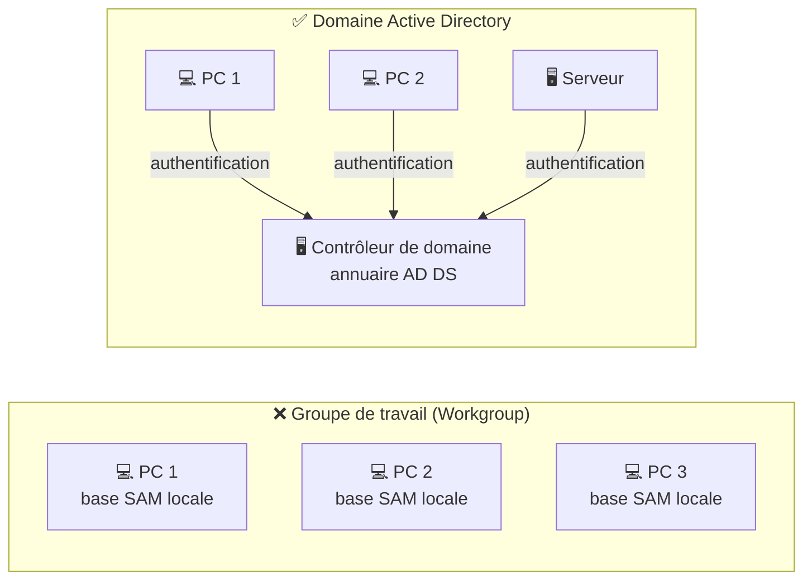
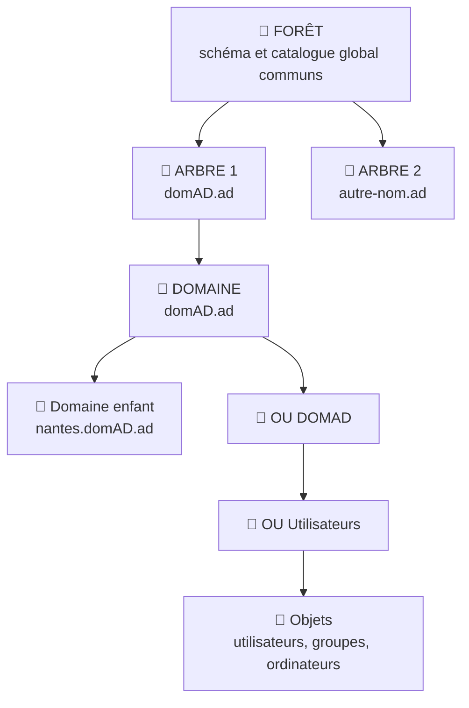
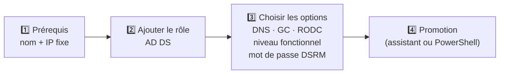
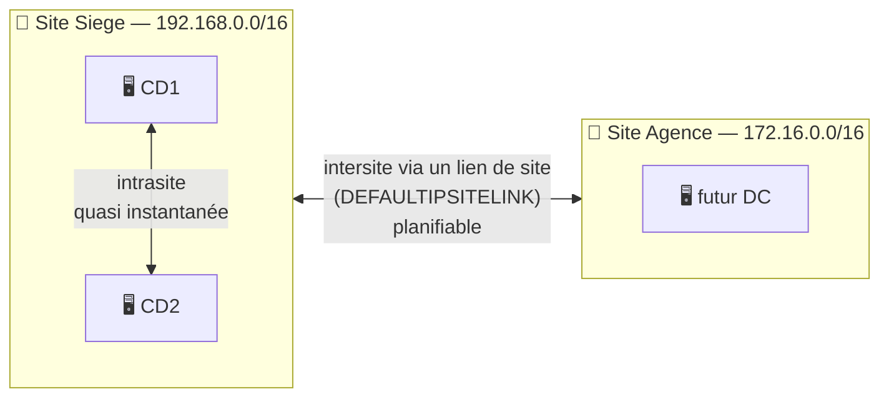
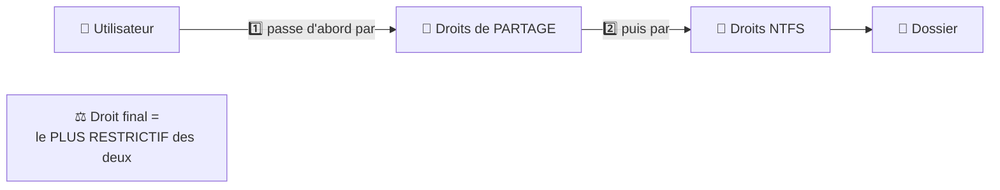
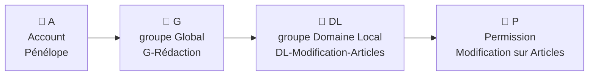
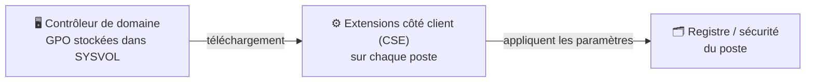
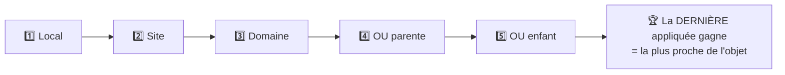

# Fiche de révision — Administration Windows et Active Directory

> **Module ASR02-02** · Résumé du cours, relié aux TP 1 à 5, avec des exemples de scripts PowerShell simples.
>
> 📌 Dans les exemples : domaine **`domAD.ad`** (NetBIOS **`DOMAD`**), réseau **`192.168.0.0/16`**.

---

## Sommaire

1. [Les contextes de travail](#1-les-contextes-de-travail)
2. [Windows Server : éditions, installation, outils](#2-windows-server--éditions-installation-outils)
3. [Active Directory : les concepts](#3-active-directory--les-concepts)
4. [Active Directory : gérer les objets](#4-active-directory--gérer-les-objets)
5. [Les sites Active Directory](#5-les-sites-active-directory)
6. [L'accès aux ressources](#6-laccès-aux-ressources)
7. [Les stratégies de groupe (GPO)](#7-les-stratégies-de-groupe-gpo)
8. [PowerShell : les bases pour scripter](#8-powershell--les-bases-pour-scripter)
9. [Scripts d'exemple](#9-scripts-dexemple)
10. [Mémo des commandes](#10-mémo-des-commandes)
11. [Testez-vous](#11-testez-vous)

---

## 1. Les contextes de travail

Où sont hébergés les services de l'entreprise (authentification, fichiers, messagerie…) ?

| Contexte | Où sont les serveurs ? | Accès nomade | Qui gère ? |
|---|---|---|---|
| **On-premises** (traditionnel) | Dans les locaux, sur le réseau privé de l'entreprise | Par **VPN** | Les techniciens internes ou un prestataire |
| **Cloud** | Dans les datacenters d'un prestataire | **Directement** par Internet, sans VPN | Le prestataire (Internet obligatoire) |
| **Hybride** | Un mélange : certains services en interne, d'autres dans le cloud | Selon le service utilisé | L'entreprise et le(s) prestataire(s) |

> 🧪 **Dans les TP** : on travaille en **on-premises**. Tous les serveurs (CD1, CD2, SRV1) sont « chez nous », sur un réseau privé.

---

## 2. Windows Server : éditions, installation, outils

### 2.1 Les éditions de Windows Server 2022

| | **Essentials** | **Standard** | **Datacenter** |
|---|---|---|---|
| **Pour qui ?** | Petites entreprises | Plus de 25 utilisateurs, peu de virtualisation | Environnements très virtualisés |
| **Licences** | 25 utilisateurs / 50 périphériques max, inclus | Licences d'accès client (**CAL**) + 1 licence pour 16 cœurs | CAL + 1 licence pour 16 cœurs |
| **VM Hyper-V autorisées** | 1 seule | **2** | **Illimité** |
| **Particularité** | — | Fonctionnalités standard | + fonctions avancées (SDN…) |

### 2.2 Les modes d'installation

| **Expérience de bureau** (graphique) | **Server Core** (minimal) |
|---|---|
| Interface graphique complète | Presque pas d'interface graphique |
| Consoles utilisables directement sur le serveur | Administration **à distance** (RSAT, WAC, PowerShell) |
| Plus de RAM et de disque | **Moins de ressources** consommées |
| Plus de services qui tournent | **Surface d'attaque réduite** : moins de services, moins de failles |

> ⚠️ **Choix définitif** : on ne peut pas passer de l'un à l'autre après l'installation. Beaucoup d'entreprises installent 1 ou 2 serveurs graphiques pour administrer, et tout le reste en Core.

### 2.3 Les outils de gestion

| Outil | Rôle |
|---|---|
| **Gestionnaire de serveur** | La console centrale : ajout de rôles, vue d'ensemble des serveurs |
| **PowerShell** | Ligne de commande **et** langage de script, l'outil moderne |
| **Invite de commandes (`cmd`)** | Héritage des anciens Windows (`ipconfig`, `netdom`…) |
| **Consoles MMC** | `dsa.msc`, `dnsmgmt.msc`… utilisables à distance grâce aux **RSAT** |
| **Windows Admin Center** (WAC) | Console **web** (HTTPS), depuis 2018, pour gérer plusieurs serveurs |

> 🧪 **TP1** : on installe WAC sur SRV1 et on y ajoute CD1. **TP2** : on installe les RSAT sur W10-CL1 → [voir TP2](TP/tp02-creation-domaine-ad.md)

### 2.4 Surveiller l'état du système

Surveiller un serveur sert à **garantir la disponibilité** des services, **trouver la cause** d'une panne et **optimiser** les ressources.

| Outil | Raccourci | Usage |
|---|---|---|
| **Gestionnaire des tâches** | `Ctrl + Shift + Échap` | Vue **immédiate** : processus, CPU, mémoire, disque, réseau, utilisateurs |
| **Moniteur de ressources** | `resmon` | Plus détaillé, **par processus** |
| **Analyseur de performances** | `perfmon` | **Collecte** de données dans la durée, puis rapports |
| **Observateur d'événements** | `eventvwr` | **Journaux** des messages du système, des services et des applications |

**Les journaux de l'Observateur d'événements :**

| Journal | Contenu |
|---|---|
| **Application** | Événements des applications (ex : installation MSI) |
| **Sécurité** | Événements d'**audit** (connexions, accès…) |
| **Système** | Événements du système d'exploitation (pilotes, services…) |
| **Journaux dédiés** | Certains rôles ont leur propre journal (DNS Server, Directory Service…) |

L'Observateur permet aussi de créer des **vues personnalisées**, des **abonnements** (collecter les événements d'autres serveurs) et de **déclencher une action** quand un événement survient.

> 🧪 **TP1** : on crée une **ligne de base** de performances de CD1 avec l'Analyseur, puis on retrouve l'installation de WAC dans le journal **Application** → [voir TP1](TP/tp01-creation-infrastructure.md)

### 2.5 Checklist avant de déployer un serveur

1. Choisir l'**édition** adaptée.
2. Choisir le **mode d'installation** (graphique ou Core).
3. Définir le **nom d'hôte** et le suffixe DNS.
4. Configurer le **réseau** avec une **IP fixe**.
5. **Analyser l'existant** : que fait déjà l'infrastructure ?

---

## 3. Active Directory : les concepts

### 3.1 Groupe de travail ou domaine ?



| **Groupe de travail** | **Domaine AD** |
|---|---|
| Chaque PC a sa propre base de comptes : la **SAM** | Une base **centrale** : l'annuaire AD |
| Un compte par PC, pas de connexion unique | **Un seul compte** pour se connecter sur n'importe quelle machine |
| Mots de passe et permissions difficiles à gérer | Mots de passe, droits et GPO gérés **à un seul endroit** |
| Adapté aux **très petits** environnements | Adapté aux entreprises |

Les machines du domaine **font confiance** au domaine : elles **délèguent l'authentification** au contrôleur de domaine.

> 💡 **Active Directory** est l'annuaire de Windows depuis Windows 2000. Il contient les utilisateurs, groupes, ordinateurs, imprimantes, dossiers partagés… Il s'appuie sur d'autres services : **DNS** (indispensable), TCP/IP, DHCP, **Kerberos** (authentification), **LDAP** (interrogation de l'annuaire), SNTP (heure), NTFS.

### 3.2 La structure logique



| Élément | Définition |
|---|---|
| **Forêt** | Ensemble de 1 à n arbres. Tous partagent le même **schéma** et le même **catalogue global**. Les domaines d'une forêt se font confiance (**approbations bidirectionnelles** par défaut). |
| **Arbre** | Ensemble de domaines qui partagent le même nom DNS : `nantes.domAD.ad` est enfant de `domAD.ad`. |
| **Domaine** | Ensemble d'ordinateurs et d'utilisateurs qui partagent la **même base d'annuaire**. Il a un nom DNS unique (souvent en `.local` ou `.ad` pour ne pas entrer en conflit avec Internet). |
| **Unité d'organisation (OU)** | « Dossier » **logique** (pas physique) pour ranger les objets, **appliquer des GPO** et **déléguer** l'administration. |
| **Objet** | Tout élément de l'annuaire : utilisateur, ordinateur, groupe, imprimante… Chaque objet a des **attributs** (nom, téléphone, service…). |

> 🧪 **TP2** : on crée une **nouvelle forêt** qui contient un seul domaine, `domAD.ad`.

### 3.3 Où sont stockées les données ?

L'annuaire est découpé en **partitions** :

| Partition | Contenu | Répliquée sur… |
|---|---|---|
| **Domaine** | Les objets du domaine (OU, utilisateurs, groupes…) | Tous les DC **du domaine** |
| **Schéma** | La « définition » des objets : quelles classes, quels attributs | Tous les DC **de la forêt** |
| **Configuration** | Configuration des services : **sites**, services, partitions | Tous les DC **de la forêt** |
| **Applicatives** | Zones DNS intégrées à AD… | Selon la configuration |

Et physiquement, sur chaque contrôleur de domaine :

| Emplacement | Contenu |
|---|---|
| `C:\Windows\NTDS` | La **base de données** AD (fichier `ntds.dit`) |
| `C:\Windows\SYSVOL` | Un **partage** de fichiers : GPO, scripts de connexion |

### 3.4 Le contrôleur de domaine (DC)

Un **contrôleur de domaine** est un serveur qui héberge l'annuaire. Il a 5 missions :

1. **Authentification** : « Qui es-tu ? As-tu le droit d'entrer ? »
2. **Autorisation** : « À quoi as-tu le droit d'accéder ? »
3. **Stockage** de la base Active Directory.
4. **Distribution des GPO**.
5. **Réplication** avec les autres DC pour la continuité de service.

> 💡 **Multi-maître** : avec plusieurs DC, **tous** peuvent modifier l'annuaire. Les modifications sont ensuite copiées entre eux par **réplication**. C'est pour ça qu'on installe **au moins 2 DC** : si l'un tombe, l'autre prend le relais.

**Le RODC** (*Read-Only Domain Controller*) est un DC **en lecture seule** :
- la réplication se fait dans **un seul sens** (vers le RODC) ;
- il ne stocke que les mots de passe **autorisés** ;
- il a un administrateur local.

On l'utilise dans une agence où la **sécurité physique est faible** (le serveur peut être volé) et où les besoins d'authentification sont réduits.

> 🧪 **TP2** : CD1 puis **CD2** sont promus contrôleurs de domaine. `repadmin /replsummary` vérifie qu'ils se répliquent bien.

### 3.5 Le catalogue global (GC)

Le **catalogue global** contient **tous les objets de la forêt**, mais seulement **une partie de leurs attributs** (les plus utiles pour la recherche).

Il sert à :
- **ouvrir une session** : il fournit les appartenances aux groupes universels ;
- **chercher** un objet dans toute la forêt, quel que soit son domaine.

Un **serveur de catalogue global** est un DC qui en héberge une copie. **Recommandation : tous les DC doivent être catalogue global.** C'est coché par défaut (paramètre `-NoGlobalCatalog` pour le désactiver en PowerShell). Réglage dans **Sites et services AD → NTDS Settings → Catalogue global**.

### 3.6 Les rôles FSMO

La plupart des opérations peuvent se faire sur n'importe quel DC. Mais **5 opérations** ne sont confiées qu'à **un seul DC** : ce sont les rôles **FSMO** (*Flexible Single Master Operation*).

| Rôle | Unique dans… | À quoi il sert |
|---|---|---|
| **Maître de schéma** | la **forêt** | Seul DC autorisé à **modifier le schéma** |
| **Maître d'attribution des noms** | la **forêt** | **Ajouter/supprimer des domaines** (et partitions d'application), renommer un domaine |
| **Émulateur PDC** (CDP) | le **domaine** | Reçoit en priorité les **changements de mot de passe**, modifie les **GPO**, **source de l'heure** du domaine |
| **Maître RID** | le **domaine** | Distribue aux DC des **plages de RID**, qui servent à fabriquer les **SID** (identifiants uniques) des nouveaux objets |
| **Maître d'infrastructure** | le **domaine** | Met à jour les **références entre objets de domaines différents** |

> 🧠 **Moyen mnémotechnique** : **2 de forêt** (Schéma, Noms) + **3 de domaine** (PDC, RID, Infrastructure) = 5. Le 1er DC de la forêt a les 5 rôles, le 1er DC d'un nouveau domaine a les 3 rôles de domaine.

**Déplacer un rôle :**

| **Transfert** | **Saisie** (récupération) |
|---|---|
| Le DC d'origine est **joignable** | Le DC d'origine est **mort** |
| Opération propre, les deux DC se mettent d'accord | Opération de dernier recours (`-Force`) |
| — | ⚠️ Le DC d'origine ne doit **plus jamais** être remis en ligne |

```powershell
# Voir les rôles de la forêt puis du domaine
Get-ADForest | Select-Object *master
Get-ADDomain | Select-Object pdc*, *master

# Transférer RID et PDC vers CD2 (fait au TP2)
Move-ADDirectoryServerOperationMasterRole -Identity "CD2" -OperationMasterRole RIDMaster, PDCEmulator
```

> 🧪 **TP2** : on répartit les rôles, avec **RID + PDC sur CD2** et les 3 autres sur CD1 → [voir TP2](TP/tp02-creation-domaine-ad.md)

### 3.7 Promouvoir un contrôleur de domaine

**Les 3 scénarios de promotion :**

| Scénario | But | Commande PowerShell |
|---|---|---|
| **Nouvelle forêt** (et nouveau domaine) | Créer un annuaire isolé | `Install-ADDSForest` |
| **Nouveau domaine** dans une forêt existante | Nouvelle entité avec ses propres objets et admins | `Install-ADDSDomain` |
| **DC supplémentaire** dans un domaine existant | Disponibilité, tolérance de panne, répartition de charge | `Install-ADDSDomainController` |

**Les étapes :**



```powershell
# Étape 2 : ajouter le rôle
Install-WindowsFeature AD-Domain-Services -IncludeManagementTools
```

**Le mot de passe DSRM** (mode de restauration des services d'annuaire) sert à démarrer le DC en mode maintenance pour réparer AD. **Note-le !**

**La dépromotion** (retirer un DC) : `Uninstall-ADDSDomainController`. Avant, vérifie que le DC ne détient **aucun rôle FSMO**, et qu'il reste d'autres **catalogues globaux** et d'autres **serveurs DNS**.

### 3.8 Les niveaux fonctionnels

Le **niveau fonctionnel** détermine les **fonctionnalités AD disponibles**. Il est limité par le **plus ancien** Windows Server utilisé comme DC.

- **Niveau de domaine (DFL)** : dépend du DC le plus ancien **du domaine**.
- **Niveau de forêt (FFL)** : dépend du domaine au niveau le plus bas **de la forêt**.

| Version du DC | Niveau 2025 | Niveau 2016 | Niveau 2012 R2 |
|---|---|---|---|
| Windows Server 2025 | ✅ | ✅ | ❌ |
| Windows Server 2016 / 2019 / **2022** | ❌ | ✅ | ✅ |
| Windows Server 2012 R2 | ❌ | ❌ | ✅ |

> 💡 **Exemple** : un domaine avec un DC 2022 et un DC 2012 R2 ne peut pas dépasser le niveau **2012 R2**. Il n'existe pas de niveau « 2019 » ni « 2022 » : ils utilisent le niveau **2016**.

---

## 4. Active Directory : gérer les objets

Trois outils pour gérer l'annuaire au quotidien :
- la MMC **Utilisateurs et ordinateurs Active Directory** (`dsa.msc`) ;
- le **Centre d'administration Active Directory** (`dsac.exe`), qui affiche l'historique PowerShell de tes actions ;
- les commandes **PowerShell** du module `ActiveDirectory`.

### 4.1 Les utilisateurs

Un **compte utilisateur** est un objet **unique** qui permet de s'authentifier et d'ouvrir une session. Ses **attributs** sont répartis en onglets :
- informations générales (nom, poste, téléphone…) ;
- options du compte (désactivé, expiration, horaires d'accès…) ;
- Bureau à distance ;
- appartenance aux groupes.

```powershell
# Créer un utilisateur (exemple du cours)
New-ADUser -Name "Khammett" `
           -GivenName "Kirk" -Surname "HAMMETT" `
           -DisplayName "Hammett Kirk" `
           -UserPrincipalName "khammett@domAD.ad" `
           -AccountPassword (ConvertTo-SecureString "Mercre10" -AsPlainText -Force) `
           -Enabled $true

# Rechercher / modifier
Get-ADUser -Filter "Department -eq 'Comptabilité'"
Set-ADUser "khammett" -Title "Guitariste"
```

**Importer des comptes en masse depuis un CSV** (méthode du cours) :

1. Créer un **compte de référence**.
2. L'**exporter** en CSV (`Get-ADUser ... | Export-Csv`) pour voir la structure.
3. Construire un **CSV d'import** avec **un seul** compte, et le tester (`Import-Csv | New-ADUser`).
4. **Valider**, corriger le CSV ou la commande si besoin.
5. Importer **tous** les comptes.

→ Voir le [script 3](#script-3--créer-des-utilisateurs-depuis-un-fichier-csv).

> 🧪 **TP3** : on crée des **modèles** (comptes désactivés avec les attributs communs d'un service) puis on les **copie** pour créer David, Isabelle, Ivan… → [voir TP3](TP/tp03-gestion-domaine-ad.md)

### 4.2 Les ordinateurs

Une machine jointe au domaine **s'authentifie aussi** : elle a un compte ordinateur avec un **mot de passe**, stocké à la fois sur la machine et dans l'AD. Ensemble, ils forment un **canal sécurisé**.

- **Pré-création** : on crée le compte ordinateur **avant** la jonction, pour choisir son OU et qui a le droit de l'intégrer.
- **Réinitialisation** : quand le poste est remplacé ou que le canal sécurisé est cassé.

> ⚠️ **Clonage** : deux machines avec le **même SID** posent problème dans un domaine. Avant de cloner une machine, on la généralise avec **`sysprep`**.

> 🧪 **TP2** : `Add-Computer -DomainName domAD.ad` pour joindre SRV1 et W10-CL1.

### 4.3 Les groupes

Un groupe a un **type** et une **étendue**.

**Le type :**

| **Sécurité** | **Distribution** |
|---|---|
| Sert à **donner des droits** (placé dans les ACL) | Sert uniquement de **liste de diffusion** mail |
| Peut aussi servir de liste de diffusion | Ne peut pas recevoir de droits |

**L'étendue :**

| Étendue | Sert à… | Peut contenir | Utilisable sur | Exemple de nom |
|---|---|---|---|---|
| **Globale** | Regrouper des personnes qui se **ressemblent** (un service) | Utilisateurs, ordinateurs, groupes globaux **du même domaine** | Toute la forêt | `G-Comptabilité` |
| **Universelle** | Regrouper des groupes **de plusieurs domaines** | Objets de **tout domaine de la forêt** | Toute la forêt | `U-Commerciaux` |
| **Domaine local** | Regrouper ceux qui ont **le même droit sur une ressource** | Objets de **tout domaine de la forêt** | **Seulement son domaine** | `DL-Compta-Modification` |
| **Locale** | Groupes intégrés à **une machine** (Administrateurs, Utilisateurs du Bureau à distance…) | Comptes locaux et du domaine | **Seulement cette machine** | `Administrateurs` |

> 🧠 **Pour retenir** : le groupe **Global** répond à « **QUI** sont ces gens ? », le groupe de **Domaine Local** répond à « **QUOI** ont-ils le droit de faire, et sur quoi ? ».

```powershell
New-ADGroup -Name "G-Comptabilité" -GroupScope Global -GroupCategory Security
Add-ADGroupMember "G-Comptabilité" -Members "curique", "ctalmie"
Get-ADGroupMember "G-Comptabilité"
```

> 🧪 **TP3** : groupes **globaux** par service (`G-Direction`, `G-Informatique`…). **TP4** : groupes de **domaine local** par ressource (`DL-Documentation-Lecture`…).

### 4.4 Conteneurs et unités d'organisation

**Les conteneurs système** existent par défaut. On ne peut pas en créer, et on **ne peut pas y lier de GPO**.

| Conteneur | Contenu |
|---|---|
| **Builtin** | Groupes de domaine local intégrés (Administrateurs, Opérateurs de sauvegarde…) |
| **Computers** | Les ordinateurs qui rejoignent le domaine, **par défaut** |
| **Users** | Utilisateurs et groupes par défaut (Administrateur, Admins du domaine…) |
| **System** | Objets internes au fonctionnement d'AD (ex : conteneur des PSO) |

**Les unités d'organisation** sont créées par l'administrateur. Elles servent à **3 choses** :

1. **Appliquer des GPO** ciblées ;
2. **Déléguer** l'administration ;
3. **Organiser** les objets.

> ⚠️ Un objet ne peut être que dans **un seul** conteneur à la fois. Bonne pratique : créer ses objets **dans ses propres OU**, pas dans les conteneurs par défaut.

> 🧪 **TP3** : arborescence `DOMAD` → `Utilisateurs / Groupes / Stations / Serveurs` → un sous-dossier par service. **TP5** : on doit déplacer W10-CL1 et SRV1 hors de `Computers` pour que les GPO ordinateur s'appliquent.

---

## 5. Les sites Active Directory

Un **site** représente un **lieu géographique** relié par un réseau rapide (ex : Nantes, Quimper). Il est défini par ses **sous-réseaux** IP.

**À quoi ça sert ?**
- Un client s'authentifie auprès d'un **DC proche** (du même site).
- On contrôle **quand** a lieu la réplication entre sites (fenêtre de réplication).
- Les utilisateurs accèdent aux **services les plus proches** (ex : DFS).



| Réplication **intrasite** (même site) | Réplication **intersite** (entre sites) |
|---|---|
| Permanente, **moins d'une minute** | Planifiée selon le **lien de site** |
| Objets de connexion créés **par paires** | Passe par les liens de site |
| Topologie mise à jour **automatiquement** | Configurable (coût, horaires) |

Le **KCC** (*Knowledge Consistency Checker*) est le service qui calcule **automatiquement** qui réplique avec qui (les **objets de connexion**).

```powershell
repadmin /replsummary   # résumé de l'état de la réplication
repadmin /showrepl      # détail de la réplication
repadmin /syncall       # force la synchronisation avec tous les partenaires
repadmin /kcc           # force le KCC à recalculer la topologie
```

> 🧪 **TP3** : on renomme le site par défaut en **Siege**, on crée le site **Agence** avec le sous-réseau `172.16.0.0/16`, et `nltest /dsgetsite` confirme que W10-CL1 est dans le site Siege → [voir TP3](TP/tp03-gestion-domaine-ad.md)

---

## 6. L'accès aux ressources

### 6.1 Les autorisations NTFS

**À quoi ça sert ?** Définir **qui** peut faire **quoi** sur un dossier ou un fichier, sur un disque formaté en **NTFS** (ou ReFS). On les gère dans l'onglet **Sécurité**.

**À qui s'appliquent-elles ?** À toute entité qui a un **SID** : utilisateurs, groupes, ordinateurs. **On privilégie les groupes.**

**Les autorisations de base :**

| Autorisation | Permet de… |
|---|---|
| **Lecture** | Voir le contenu des fichiers |
| **Affichage du contenu du dossier** | Lister le contenu d'un dossier |
| **Lecture et exécution** | Lire + lancer des programmes |
| **Écriture** | Créer des fichiers et dossiers |
| **Modification** | Tout ce qui précède + **supprimer** |
| **Contrôle total** | Tout + **modifier les autorisations** et **s'approprier** l'objet |

Il existe aussi des **autorisations avancées**, plus fines : parcours du dossier, création de fichiers, suppression, appropriation…

**Les règles de calcul :**

| Règle | Explication |
|---|---|
| **Cumul** | Si tu es dans 2 groupes (Lecture + Modification), tu as **Modification** |
| **Le refus l'emporte** | Un **Refuser** annule l'autorisation correspondante |
| **Ce qui n'est pas autorisé est interdit** | Sans aucune règle pour toi, tu n'as **aucun accès** (refus *implicite*) |

**Explicite ou héritée ?**
- **Explicite** : définie directement sur l'objet.
- **Héritée** : reçue automatiquement du dossier parent. Elle apparaît **grisée** dans l'onglet Sécurité.
- On peut **désactiver l'héritage** sur un dossier pour repartir de zéro.
- Ordre de priorité : **Refus explicite > Autorisation explicite > Refus hérité > Autorisation héritée**.

**Copier ou déplacer un fichier, que deviennent ses droits ?**

| | **Même partition** | **Autre partition / disque** |
|---|---|---|
| **Déplacer** | **Conserve** ses droits | **Hérite** du dossier de destination |
| **Copier** | **Hérite** du dossier de destination | **Hérite** du dossier de destination |

> 🧠 **Astuce** : un seul cas conserve les droits d'origine, le **déplacement sur la même partition**. C'est logique : le fichier ne bouge pas vraiment, seul son « chemin » change.

### 6.2 Les partages

Un **partage** rend un dossier accessible **par le réseau** (`\\SRV1\Compta`). Il a ses propres autorisations, avec **3 niveaux** : **Lecture**, **Modification**, **Contrôle total**. On y retrouve le cumul des droits et le refus prioritaire.

Un nom qui se termine par **`$`** (`Info$`) rend le partage **invisible** dans la liste, mais il reste accessible si on connaît son nom.

### 6.3 Les droits effectifs : partage + NTFS



**Exemple** : partage en *Lecture* + NTFS en *Contrôle total* → l'utilisateur n'a que la **Lecture**.

> 💡 **Bonne pratique** (et exemple du cours) : partage en **Contrôle total pour les Utilisateurs authentifiés**, et **tout le filtrage en NTFS**. Il n'y a ainsi qu'un seul endroit à vérifier.

```powershell
Get-SmbShare                                                         # lister les partages
New-SmbShare -Name "Compta" -Path "E:\DATA\Services\Comptabilité" -FullAccess "Utilisateurs authentifiés"
Set-SmbShare -Name "Compta" -Description "Partage de la comptabilité"
Remove-SmbShare -Name "Compta"
```

### 6.4 La méthode AGDLP

C'est **la** méthode recommandée par Microsoft pour donner des accès :



| Côté **gestion des utilisateurs** (A → G) | Côté **gestion de la ressource** (DL → P) |
|---|---|
| On range les gens par service | On crée un groupe par droit sur la ressource |
| Un nouvel arrivant ? On l'ajoute au groupe global | Qui peut modifier Articles ? On lit les membres du DL |

> 🧪 **TP4** : `Christelle` → `G-Comptabilité` → `DL-Compta-Modification` → *Modification* sur `E:\DATA\Services\Comptabilité` → [voir TP4](TP/tp04-gestion-ressources.md)

### 6.5 Les imprimantes

**Vocabulaire Microsoft** (piège d'examen !) :

| Terme | Signification |
|---|---|
| **Périphérique d'impression** | La machine **physique** (ce qu'on appelle couramment « l'imprimante ») |
| **Imprimante** | L'objet **logique** dans Windows, avec son pilote, ses droits et ses horaires |

- **Plusieurs imprimantes → 1 périphérique** : pour avoir des réglages différents (horaires, priorités, droits).
- **1 imprimante → plusieurs périphériques** : c'est un **pool d'impression**, qui répartit les travaux.

Le rôle **Serveur d'impression** fournit la console **Gestion de l'impression** (`printmanagement.msc`) : pilotes, ports TCP/IP, imprimantes, **déploiement par GPO**.

**Les autorisations d'impression :**

| Autorisation | Permet de… |
|---|---|
| **Imprimer** | Envoyer des documents |
| **Gérer les documents** | Suspendre, reprendre, supprimer les travaux **des autres** (gérer la file d'attente) |
| **Gérer cette imprimante** | Modifier la configuration, partager, changer les droits |

**Déployer les imprimantes** : manuellement, par script ou par **GPO** (depuis la console Gestion de l'impression).

> 🧪 **TP4** : SRV1 devient serveur d'impression. Pour limiter la Comptabilité à la plage 20h-6h, on crée **2 imprimantes logiques** vers le **même périphérique**. **TP5** : on les déploie par GPO → [voir TP4](TP/tp04-gestion-ressources.md)

### 6.6 La délégation administrative

**Principe** : confier des **tâches ciblées** (réinitialiser des mots de passe, créer des comptes…) sur une **OU précise** à un **groupe** qui n'est pas administrateur du domaine. C'est le principe du **moindre privilège**.

Pour déléguer, il faut définir 3 choses :
1. **Quels privilèges** ?
2. **À qui** ? Toujours un **groupe de sécurité**.
3. **Où** ? Une **OU**.

**Comment ?** Tout objet AD a une **ACL**. L'assistant **Délégation de contrôle** (clic droit sur une OU dans `dsa.msc`) y ajoute les bons droits. La liste des tâches proposées vient du fichier `C:\Windows\System32\delegwiz.inf`.

**Fournir l'outil adapté** : on crée une **MMC personnalisée** qui ne montre que l'OU concernée et les tâches déléguées. Les étapes :
1. Nouvelle MMC avec le composant *Utilisateurs et ordinateurs AD*.
2. Sur l'OU déléguée, choisir **Nouvelle fenêtre à partir d'ici**.
3. Créer une **vue de liste des tâches** et y ajouter les tâches déléguées.
4. Enregistrer la console et la donner aux personnes concernées.

> 🧪 **TP4** : **David** gère les comptes de l'OU Comptabilité, le **Support technique** gère toutes les OU **sauf** Informatique, et **Isabelle** est dans **Admins du domaine** → [voir TP4](TP/tp04-gestion-ressources.md)

---

## 7. Les stratégies de groupe (GPO)

### 7.1 Le principe

Presque toute la configuration de Windows est stockée dans le **registre**. Une **GPO** modifie des valeurs du registre sur **un ensemble de machines ou d'utilisateurs**, depuis une console graphique, sans passer sur chaque poste.

**Objectifs** : réduire le **coût total de possession** (TCO) et améliorer le **retour sur investissement** (ROI), en réduisant les tâches d'administration et en simplifiant les déploiements.

**Les ruches du registre :**

| Ruche | Contenu | Côté GPO |
|---|---|---|
| **HKEY_LOCAL_MACHINE** (HKLM) | Configuration de **l'ordinateur** | Configuration **ordinateur** |
| **HKEY_CURRENT_USER** (HKCU) | Configuration de **l'utilisateur connecté** | Configuration **utilisateur** |
| **HKEY_USERS** | Tous les profils chargés | — |
| **HKEY_CLASSES_ROOT** | Applications, extensions de fichiers | — |
| **HKEY_CURRENT_CONFIG** | Profil matériel utilisé | — |

**Stratégie de groupe ou stratégie locale ?**

| **Stratégie de groupe** | **Stratégie locale** |
|---|---|
| Nécessite un **domaine** | Fonctionne avec ou sans domaine |
| S'applique à **des ensembles** d'objets | Se configure **poste par poste** (`gpedit.msc`) |
| **L'emporte** en cas de conflit | Perd face à une GPO |

### 7.2 Comment une GPO arrive sur un poste



**Quand les GPO sont-elles appliquées ?**
- au **démarrage** (paramètres ordinateur) et à l'**ouverture de session** (paramètres utilisateur) ;
- puis en arrière-plan toutes les **90 minutes ± 30 minutes** ;
- sur les **contrôleurs de domaine** : toutes les **5 minutes**.

Pour forcer l'application immédiate : **`gpupdate /force`**.

### 7.3 Le ciblage : où lier une GPO ?

Une GPO se **lie** à un **Site**, un **Domaine** ou une **OU**. Elle s'applique :
- aux **ordinateurs** de ce conteneur (et des sous-conteneurs) pour la partie **ordinateur** ;
- aux **utilisateurs** de ce conteneur (et des sous-conteneurs) pour la partie **utilisateur**.

> ⚠️ **Une GPO ne s'applique PAS à un groupe** en le liant. Pour cibler un groupe, on utilise le **filtrage de sécurité** (voir 7.5).

### 7.4 L'ordre d'application : LSDOU



- **Cumul** : si les GPO règlent des paramètres **différents**, tout s'additionne.
- **Conflit** : si deux GPO règlent le **même** paramètre différemment, c'est la **dernière appliquée** qui gagne, donc la plus proche de l'objet.
- **Dans une même OU** : les GPO avec le numéro d'ordre de liaison **le plus élevé** sont appliquées en premier. C'est donc la GPO **n°1** qui a le dernier mot.

### 7.5 Restreindre ou forcer une GPO

| Mécanisme | Effet |
|---|---|
| **Blocage de l'héritage** (sur une OU) | L'OU **ignore toutes** les GPO héritées de ses parents |
| **Appliqué** (ou *renforcé*, sur un lien) | La GPO **passe outre** le blocage d'héritage et devient **prioritaire** |
| **Filtrage de sécurité** | Autorise ou refuse la **lecture** et l'**application** de la GPO à certains groupes |
| **Filtre WMI** | Applique la GPO seulement si une condition sur la machine est vraie (version d'OS, type de machine…) |
| **État de la GPO** | Activée, désactivée, ou partie utilisateur / ordinateur désactivée |

> 🧪 **TP5** :
> - **filtrage de sécurité** : la GPO Intérimaires ne s'applique qu'à `G-Intérimaires` ;
> - **refus** : la redirection de dossiers exclut les intérimaires ;
> - **filtre WMI** : `ProductType = 3` cible uniquement les serveurs membres pour le Bureau à distance.
>
> [Voir TP5](TP/tp05-strategies-de-groupe.md)

### 7.6 Diagnostiquer une GPO qui ne marche pas

**Première question : la GPO a-t-elle été appliquée ?**

| GPO **appliquée** mais sans effet | GPO **non appliquée** |
|---|---|
| Paramètre **non pris en charge** par cette version de Windows | Problème de **liaison** (mauvaise OU, objet mal rangé) |
| **Conflit** avec une autre GPO prioritaire | **Filtrage de sécurité** qui l'exclut |

**Outils :**
- `gpresult /r` sur le poste concerné (ou `gpresult /h rapport.html` pour le détail) ;
- l'assistant **Résultats de stratégie de groupe** dans `gpmc.msc`.

### 7.7 Les modèles d'administration

Les paramètres configurables par GPO sont décrits dans des **modèles d'administration**, composés de 2 types de fichiers :
- **`.admx`** : la liste des paramètres ;
- **`.adml`** : les textes traduits, un fichier par langue, rangé dans le dossier de la langue (ex : `fr-FR`).

Des modèles supplémentaires s'ajoutent selon les besoins : Microsoft Office, Firefox…

| Stockage **local** | **Magasin central** |
|---|---|
| `C:\Windows\PolicyDefinitions` | `SYSVOL\<domaine>\Policies\PolicyDefinitions` |
| Chaque poste utilise **ses propres** modèles | **Tous** les éditeurs de GPO utilisent **les mêmes** modèles |

> 🧪 **TP5** : on copie `PolicyDefinitions` dans SYSVOL pour créer le magasin central.

### 7.8 Les stratégies de mot de passe

Les **stratégies de compte** (mot de passe, verrouillage) sont **uniques pour tout le domaine**. Elles se règlent dans la **Default Domain Policy**, liée à la racine du domaine.

Pour appliquer des règles **différentes à un groupe**, on utilise les **stratégies de mots de passe affinées** avec des objets **PSO** (*Password Settings Objects*) :
- ce ne sont **pas** des GPO, on les crée dans le **Centre d'administration AD** ou en PowerShell ;
- ils sont stockés dans **System → Password Settings Container** ;
- ils s'appliquent à un **groupe de sécurité** ou à des utilisateurs.

> 🧪 **TP5** : Default Domain Policy avec 10 caractères, complexité, historique de 20, changement tous les 30 jours. **PSO-Informatique** : verrouillage après 2 échecs, déverrouillage par un administrateur uniquement.

---

## 8. PowerShell : les bases pour scripter

### 8.1 Comprendre une commande

Une commande PowerShell (*cmdlet*) s'écrit toujours **Verbe-Nom** :

| Verbe | Sens | Exemple |
|---|---|---|
| `Get` | Lire, afficher | `Get-ADUser` |
| `New` | Créer | `New-ADGroup` |
| `Set` | Modifier | `Set-ADUser` |
| `Remove` | Supprimer | `Remove-ADGroup` |
| `Add` | Ajouter à quelque chose | `Add-ADGroupMember` |

```powershell
# Trouver une commande : toutes celles qui parlent de "ADUser"
Get-Command *ADUser*

# Afficher l'aide et des exemples d'une commande
Get-Help New-ADUser -Examples
```

### 8.2 Les briques de base

```powershell
# --- Une VARIABLE : une boîte qui contient une valeur, son nom commence par $ ---
$service = "Comptabilité"
Write-Host "Le service est : $service"

# --- Un TABLEAU : une liste de valeurs séparées par des virgules ---
$services = "Direction", "Informatique", "Comptabilité"

# --- Le PIPELINE | : le résultat d'une commande est envoyé à la suivante ---
# Ici : tous les utilisateurs → on garde les désactivés → on affiche leur nom
Get-ADUser -Filter * | Where-Object Enabled -eq $false | Select-Object Name
```

### 8.3 Les boucles et les conditions

```powershell
# --- FOREACH : répéter une action pour CHAQUE élément d'une liste ---
$services = "Direction", "Informatique", "Comptabilité"
foreach ($service in $services) {
    Write-Host "Traitement du service $service"
}

# --- FOR : répéter une action un NOMBRE de fois ---
# $i commence à 1, on continue tant que $i est inférieur ou égal à 3, et on ajoute 1 à chaque tour
for ($i = 1; $i -le 3; $i++) {
    Write-Host "Tour numéro $i"
}

# --- IF / ELSE : faire une action SEULEMENT si une condition est vraie ---
$nombre = 5
if ($nombre -gt 3) {
    Write-Host "$nombre est plus grand que 3"
}
else {
    Write-Host "$nombre est plus petit ou égal à 3"
}
```

**Les opérateurs de comparaison** (pas de `>` ni `=` en PowerShell !) :

| Opérateur | Signification | Opérateur | Signification |
|---|---|---|---|
| `-eq` | égal (*equal*) | `-ne` | différent (*not equal*) |
| `-gt` | plus grand (*greater than*) | `-lt` | plus petit (*less than*) |
| `-ge` | plus grand ou égal | `-le` | plus petit ou égal |
| `-like` | ressemble à (avec `*`) | `-notlike` | ne ressemble pas à |

### 8.4 Lancer un script

1. Écris ton script dans **PowerShell ISE** ou **VS Code**.
2. Enregistre-le avec l'extension **`.ps1`**, en **UTF-8 avec BOM** pour que les accents s'affichent bien.
3. Autorise l'exécution des scripts (une seule fois, en administrateur) :

   ```powershell
   # Autorise les scripts locaux ; les scripts téléchargés doivent être signés
   Set-ExecutionPolicy RemoteSigned
   ```

4. Lance-le depuis son dossier :

   ```powershell
   .\MonScript.ps1
   ```

---

## 9. Scripts d'exemple

Tous ces scripts sont **courts** et utilisent uniquement les briques vues plus haut : variables, tableaux, `foreach`, `for`, `if`.

### Script 1 — Vérifier que les machines de la maquette répondent

📍 *À lancer depuis n'importe quelle machine de la maquette* · lien : **TP1**

```powershell
# Liste des machines à tester
$machines = "CD1", "CD2", "SRV1", "W10-CL1"

foreach ($machine in $machines) {
    # Test-Connection -Quiet renvoie simplement Vrai ($true) ou Faux ($false)
    $repond = Test-Connection $machine -Count 1 -Quiet

    if ($repond) {
        Write-Host "$machine répond" -ForegroundColor Green
    }
    else {
        Write-Host "$machine ne répond pas !" -ForegroundColor Red
    }
}
```

> 💡 Si une machine ne répond pas, vérifie son IP, son DNS et la règle de pare-feu ICMP (voir TP1).

### Script 2 — Créer les OU et les groupes globaux des services

📍 *Sur un DC ou W10-CL1 avec RSAT* · lien : **TP3**

> ⚠️ Ce script suppose que les OU `Utilisateurs` et `Groupes` existent, mais pas encore les OU des services. Sur ta maquette du TP3, où elles existent déjà, il affichera des erreurs « objet déjà existant » : c'est normal.

```powershell
# Les services de l'entreprise
$services = "Direction", "Informatique", "Comptabilite"

# Emplacements dans l'annuaire
$ouUtilisateurs = "OU=Utilisateurs,OU=DOMAD,DC=domAD,DC=ad"
$ouGroupes      = "OU=Groupes,OU=DOMAD,DC=domAD,DC=ad"

foreach ($service in $services) {
    # 1. Une OU pour ranger les utilisateurs du service
    New-ADOrganizationalUnit -Name $service -Path $ouUtilisateurs

    # 2. Une OU pour ranger les groupes du service
    New-ADOrganizationalUnit -Name $service -Path $ouGroupes

    # 3. Le groupe global du service, rangé dans son OU
    New-ADGroup -Name "G-$service" `
                -GroupScope Global `
                -GroupCategory Security `
                -Path "OU=$service,$ouGroupes"

    Write-Host "Service $service créé : 2 OU + le groupe G-$service"
}
```

### Script 3 — Créer des utilisateurs depuis un fichier CSV

📍 *Sur un DC ou W10-CL1 avec RSAT* · lien : **TP3** · méthode d'import du cours

**Le fichier `C:\Scripts\nouveaux.csv`** (le séparateur `;` est celui d'Excel en français) :

```text
Prenom;Nom;Service;Poste
Julie;Martin;Comptabilite;Comptable
Paul;Durand;Informatique;Technicien
Emma;Petit;Direction;Assistante de direction
```

**Le script :**

```powershell
# Lit le fichier CSV : chaque ligne devient un "utilisateur" avec les colonnes comme propriétés
$utilisateurs = Import-Csv "C:\Scripts\nouveaux.csv" -Delimiter ";"

# Mot de passe de départ, commun à tous
$motDePasse = ConvertTo-SecureString "Cs3cr3t!" -AsPlainText -Force

foreach ($u in $utilisateurs) {
    # Identifiant : 1re lettre du prénom + nom, en minuscules (ex : jmartin)
    $login = ($u.Prenom.Substring(0, 1) + $u.Nom).ToLower()

    # L'OU dépend du service indiqué dans le CSV
    $ou = "OU=$($u.Service),OU=Utilisateurs,OU=DOMAD,DC=domAD,DC=ad"

    New-ADUser -Name "$($u.Prenom) $($u.Nom)" `
               -GivenName $u.Prenom `
               -Surname $u.Nom `
               -SamAccountName $login `
               -UserPrincipalName "$login@domAD.ad" `
               -Title $u.Poste `
               -Department $u.Service `
               -Path $ou `
               -AccountPassword $motDePasse `
               -ChangePasswordAtLogon $true `
               -Enabled $true

    # Ajoute l'utilisateur au groupe global de son service
    Add-ADGroupMember -Identity "G-$($u.Service)" -Members $login

    Write-Host "Créé : $login dans le service $($u.Service)"
}
```

> 💡 `-ChangePasswordAtLogon $true` oblige l'utilisateur à choisir son propre mot de passe à la première connexion. C'est une bonne pratique de sécurité.

### Script 4 — Créer des comptes de test numérotés

📍 *Sur un DC ou W10-CL1 avec RSAT* · exemple de boucle **`for`**

```powershell
$ou = "OU=Utilisateurs,OU=DOMAD,DC=domAD,DC=ad"

# Crée test01, test02 ... test05
for ($i = 1; $i -le 5; $i++) {
    # "{0:D2}" -f $i écrit le nombre sur 2 chiffres : 1 → 01
    $login = "test" + ("{0:D2}" -f $i)

    # Sans mot de passe, le compte est créé désactivé
    New-ADUser -Name $login -SamAccountName $login -Path $ou

    Write-Host "Compte $login créé (désactivé)"
}
```

Et pour faire le ménage après tes tests :

```powershell
for ($i = 1; $i -le 5; $i++) {
    $login = "test" + ("{0:D2}" -f $i)
    # -Confirm:$false : supprime sans demander confirmation
    Remove-ADUser -Identity $login -Confirm:$false
}
```

### Script 5 — Vérifier les services d'un contrôleur de domaine

📍 *Sur CD1 ou CD2* · lien : **TP2**

```powershell
# Services indispensables au fonctionnement d'un DC
$services = @(
    "NTDS",      # Services de domaine Active Directory
    "DNS",       # Serveur DNS
    "Netlogon",  # Authentification des utilisateurs et machines
    "Kdc",       # Centre de distribution de clés Kerberos
    "DFSR"       # Réplication du dossier SYSVOL (et donc des GPO)
)

foreach ($nom in $services) {
    $service = Get-Service -Name $nom

    if ($service.Status -eq "Running") {
        Write-Host "$nom : en fonctionnement" -ForegroundColor Green
    }
    else {
        Write-Host "$nom : ARRÊTÉ ($($service.Status))" -ForegroundColor Red
    }
}
```

### Script 6 — Rapport des comptes désactivés

📍 *Sur un DC ou W10-CL1 avec RSAT* · lien : **TP3** (équivalent de la requête enregistrée)

```powershell
# Récupère tous les comptes utilisateurs désactivés
$comptes = Search-ADAccount -AccountDisabled -UsersOnly

if ($comptes.Count -eq 0) {
    Write-Host "Aucun compte désactivé."
}
else {
    Write-Host "$($comptes.Count) compte(s) désactivé(s) :"

    foreach ($compte in $comptes) {
        Write-Host " - $($compte.Name)"
    }

    # Exporte aussi la liste dans un fichier CSV, lisible avec Excel
    $comptes | Select-Object Name, SamAccountName, DistinguishedName |
        Export-Csv "C:\Scripts\comptes_desactives.csv" -Delimiter ";" -NoTypeInformation -Encoding UTF8

    Write-Host "Rapport enregistré dans C:\Scripts\comptes_desactives.csv"
}
```

---

## 10. Mémo des commandes

### Système et réseau

| Commande | Utilité |
|---|---|
| `Get-NetAdapter` | Lister les cartes réseau |
| `New-NetIPAddress` | Définir une IP fixe |
| `Set-DnsClientServerAddress` | Définir le serveur DNS |
| `Rename-Computer` | Renommer la machine |
| `Test-Connection` | Tester la connexion (ping) |
| `Get-Service` | État des services |
| `Get-WinEvent` | Lire les journaux d'événements |

### Active Directory

| Commande | Utilité |
|---|---|
| `Install-WindowsFeature AD-Domain-Services` | Installer le rôle AD DS |
| `Install-ADDSForest` / `Install-ADDSDomain` / `Install-ADDSDomainController` | Promouvoir un DC (3 scénarios) |
| `Uninstall-ADDSDomainController` | Dépromouvoir un DC |
| `Add-Computer -DomainName` | Joindre une machine au domaine |
| `Get-ADForest` / `Get-ADDomain` | Infos forêt / domaine (dont les rôles FSMO) |
| `Move-ADDirectoryServerOperationMasterRole` | Transférer des rôles FSMO |
| `netdom query fsmo` | Voir les détenteurs des rôles FSMO |
| `New-ADOrganizationalUnit` | Créer une OU |
| `New-ADUser` / `Get-ADUser` / `Set-ADUser` | Créer / chercher / modifier un utilisateur |
| `New-ADGroup` / `Set-ADGroup` / `Remove-ADGroup` | Créer / modifier / supprimer un groupe |
| `Add-ADGroupMember` / `Get-ADGroupMember` | Ajouter / lister les membres d'un groupe |
| `Move-ADObject` | Déplacer un objet dans une autre OU |
| `Search-ADAccount -AccountDisabled` | Trouver les comptes désactivés |
| `Import-Csv` / `Export-Csv` | Importer / exporter des données CSV |
| `repadmin /replsummary` | État de la réplication |
| `nltest /dsgetsite` | Site AD de la machine |

### Ressources

| Commande | Utilité |
|---|---|
| `Get-SmbShare` / `New-SmbShare` / `Set-SmbShare` / `Remove-SmbShare` | Gérer les partages |
| `icacls` | Afficher et modifier les droits NTFS |
| `Add-Printer` / `Get-Printer` | Ajouter / lister des imprimantes |

### GPO

| Commande | Utilité |
|---|---|
| `gpupdate /force` | Appliquer les GPO immédiatement |
| `gpresult /r` | Voir les GPO appliquées |
| `New-GPO` / `New-GPLink` | Créer / lier une GPO |
| `Get-GPInheritance` | GPO héritées par une OU |

### Consoles utiles (`Windows + R`)

| Commande | Console |
|---|---|
| `dsa.msc` | Utilisateurs et ordinateurs AD |
| `dsac.exe` | Centre d'administration AD |
| `dssite.msc` | Sites et services AD |
| `domain.msc` | Domaines et approbations AD |
| `gpmc.msc` | Gestion des stratégies de groupe |
| `dnsmgmt.msc` | Gestionnaire DNS |
| `printmanagement.msc` | Gestion de l'impression |
| `perfmon` / `resmon` / `eventvwr` | Performances / ressources / événements |

---

## 11. Testez-vous

Essaie de répondre de tête avant de lire la réponse.

**1. Quelle est la différence entre un groupe de travail et un domaine ?**

> ✅ **Réponse** : Dans un **groupe de travail**, chaque PC a sa propre base de comptes (SAM), il faut donc un compte par machine. Dans un **domaine**, les comptes sont dans un **annuaire central** (AD) : un seul compte permet de se connecter partout, et l'administration est centralisée.

**2. Pourquoi installer au moins deux contrôleurs de domaine ?**

> ✅ **Réponse** : Pour la **tolérance de panne**. Si un DC tombe, l'autre continue d'authentifier les utilisateurs. Grâce à la **réplication multi-maître**, ils ont tous les deux une copie complète de l'annuaire.

**3. Citez les 5 rôles FSMO et leur portée.**

> ✅ **Réponse** :
>
> - **Forêt** : maître de **schéma**, maître d'**attribution des noms** de domaine.
> - **Domaine** : **émulateur PDC**, maître **RID**, maître d'**infrastructure**.

**4. Quand fait-on une saisie de rôle FSMO plutôt qu'un transfert ?**

> ✅ **Réponse** : Quand le DC qui détient le rôle est **définitivement hors service**. Après une saisie, ce DC ne doit **plus jamais** être remis sur le réseau.

**5. Que signifie AGDLP ?**

> ✅ **Réponse** : **A**ccounts → **G**roupes globaux → groupes de **D**omaine **L**ocal → **P**ermissions. On met les comptes dans un groupe global (par service), ce groupe dans un groupe de domaine local (par ressource et par droit), et on donne la permission au groupe de domaine local.

**6. Un partage donne « Lecture », le NTFS donne « Contrôle total ». Quel est le droit effectif ?**

> ✅ **Réponse** : **Lecture** : on garde toujours le droit **le plus restrictif** des deux.

**7. Je déplace un fichier vers un dossier de la même partition. Garde-t-il ses droits ?**

> ✅ **Réponse** : **Oui**. C'est le seul cas où les droits d'origine sont conservés. Dans tous les autres cas (copie, ou déplacement vers une autre partition), le fichier **hérite** des droits du dossier de destination.

**8. Que signifie LSDOU et quelle GPO gagne en cas de conflit ?**

> ✅ **Réponse** : **L**ocal → **S**ite → **D**omaine → **OU**, c'est l'ordre d'application. En cas de conflit, c'est la **dernière appliquée** qui gagne, donc la plus proche de l'objet (l'OU la plus basse).

**9. J'ai lié une GPO avec des paramètres ordinateur à l'OU Utilisateurs. Pourquoi rien ne se passe ?**

> ✅ **Réponse** : Les paramètres **ordinateur** s'appliquent aux **ordinateurs** présents dans l'OU liée. Si l'OU ne contient que des utilisateurs, ces paramètres ne touchent personne.

**10. Comment appliquer une politique de mot de passe différente au service Informatique ?**

> ✅ **Réponse** : Avec une **stratégie de mot de passe affinée** : un objet **PSO**, créé dans le Centre d'administration AD (Password Settings Container) et appliqué au groupe `G-Informatique`. La Default Domain Policy, elle, ne peut définir qu'**une seule** politique pour tout le domaine.

**11. Quelle est la différence entre une « imprimante » et un « périphérique d'impression » ?**

> ✅ **Réponse** : Le **périphérique d'impression** est la machine physique. L'**imprimante** est l'objet logique dans Windows (pilote, droits, horaires). On peut avoir plusieurs imprimantes pour un seul périphérique, ou une imprimante pour plusieurs périphériques (un pool).

**12. Qu'est-ce que le magasin central et pourquoi le créer ?**

> ✅ **Réponse** : C'est le dossier `SYSVOL\<domaine>\Policies\PolicyDefinitions`, qui contient les modèles d'administration (`.admx` / `.adml`). Une fois créé, **toutes** les consoles de GPO du domaine utilisent les **mêmes** modèles, quel que soit le poste d'où on édite.

**13. Server Core ou expérience de bureau : lequel est le plus sécurisé et pourquoi ?**

> ✅ **Réponse** : **Server Core** : moins de composants installés et moins de services qui tournent, donc une **surface d'attaque réduite**. Il consomme aussi moins de ressources.

**14. Dans un script, comment répéter une action pour chaque élément d'une liste ?**

> ✅ **Réponse** : Avec une boucle **`foreach`** :
>
> ```powershell
> foreach ($service in "Direction", "Informatique") {
>     Write-Host $service
> }
> ```
